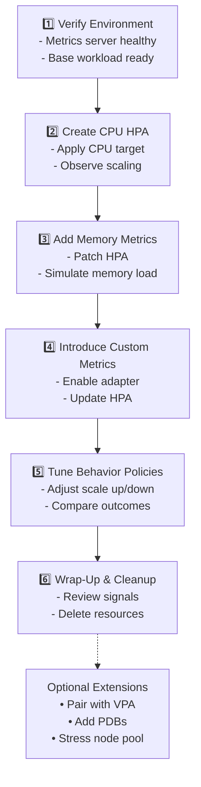

# Kubernetes HPA Interactive Tutorial

## Audience & Prereqs
- Comfortable with `kubectl`, Deployments, and Services
- Metrics server installed and ready to scrape cluster metrics
- Access to deploy manifests and create the `hpa-demo` namespace

## Lab Flow



### 1. Verify Environment (15 min)
- Confirm metrics server is healthy with `kubectl get deployment metrics-server -n kube-system`.
- Deploy the base workload from `k8s/hpa/step-01-base-workload.yaml` and ensure two pods reach `Ready` state.
- Open the dashboard (`kubectl port-forward svc/k8s-demo-app 8080:80 -n hpa-demo`) to monitor live metrics.

```bash
kubectl apply -f k8s/hpa/step-01-base-workload.yaml

# Verify pods are running
kubectl get pods -n hpa-demo -l app=k8s-demo-app

# Check initial resource usage
kubectl top pods -n hpa-demo
```

### 2. Create a CPU Target HPA (25 min)
- Walk through the HPA YAML, highlighting `minReplicas`, `maxReplicas`, and CPU utilization target.
- Apply the manifest, then describe the HPA to review current metrics and scaling thresholds.
- Trigger CPU load through the dashboard or `curl` to `/api/stress/cpu` and watch replicas scale out.

```bash
kubectl apply -f k8s/hpa/step-02-hpa-cpu.yaml

# Check HPA status and current metrics
kubectl get hpa k8s-demo-app -n hpa-demo
kubectl describe hpa k8s-demo-app -n hpa-demo

# Monitor scaling events
kubectl get events -n hpa-demo --field-selector involvedObject.name=k8s-demo-app

# Watch HPA and pods during load test
kubectl get hpa,pods -n hpa-demo -w
```

### 3. Add Memory Metrics (20 min)
- Patch the HPA to include a memory utilization target alongside CPU.
- Use `/api/stress/memory` to simulate pressure; observe stabilization delay and scale-in timing.
- Discuss trade-offs of memory-based scaling in workloads with GC or caching behaviour.

```bash
kubectl apply -f k8s/hpa/step-03-hpa-cpu-memory.yaml

# Compare HPA configurations
kubectl get hpa k8s-demo-app -n hpa-demo -o yaml | grep -A 10 metrics

# Monitor both CPU and memory metrics
kubectl top pods -n hpa-demo --containers
kubectl describe hpa k8s-demo-app -n hpa-demo

# Watch scaling behavior with dual metrics
kubectl get hpa k8s-demo-app -w -n hpa-demo
```

### 4. Introduce Custom Metrics (30 min)
- Enable or point to a Prometheus Adapter that exposes custom metrics (e.g., request backlog).
- Register a sample metric and update the HPA to include it with `type: Object` or `Pods` metric type.
- Use a scripted load (e.g., `hey` or `wrk`) to produce backlog and correlate with HPA decisions.

```bash
kubectl apply -f k8s/hpa/step-04-hpa-custom-metric.yaml

# Verify custom metrics API availability
kubectl get --raw "/apis/custom.metrics.k8s.io/v1beta1" | jq .
kubectl get --raw "/apis/custom.metrics.k8s.io/v1beta1" | grep http_server_active_requests

# Check all three metric types in HPA
kubectl get hpa k8s-demo-app -n hpa-demo -o jsonpath='{.spec.metrics[*].type}'
kubectl describe hpa k8s-demo-app -n hpa-demo | grep -A 5 "Metrics:"

# Monitor custom metric values during load
watch 'kubectl describe hpa k8s-demo-app -n hpa-demo | grep -A 10 "Current metrics"'
```

### 5. Tune Behavior Policies (20 min)
- Demonstrate `behavior.scaleUp` and `behavior.scaleDown` policies to control surge and cooldown.
- Experiment with aggressive vs. conservative policies and note replica counts over time.

```bash
kubectl apply -f k8s/hpa/step-05-hpa-behavior.yaml

# Examine behavior policies
kubectl get hpa k8s-demo-app -n hpa-demo -o jsonpath='{.spec.behavior}' | jq .
kubectl describe hpa k8s-demo-app -n hpa-demo | grep -A 15 "Behavior:"

# Track scaling events with timestamps
kubectl get events -n hpa-demo --field-selector involvedObject.name=k8s-demo-app --sort-by='.firstTimestamp'

# Monitor stabilization windows in action
kubectl get hpa k8s-demo-app -n hpa-demo -o custom-columns=NAME:.metadata.name,REPLICAS:.status.currentReplicas,TARGETS:.status.currentMetrics[*].resource.current.averageUtilization -w
```

### 6. Wrap-Up & Cleanup (10 min)
- Review `kubectl get hpa -w -n hpa-demo` output and identify key signals for production monitoring.
- Remove tutorial resources including the `hpa-demo` namespace, leaving the cluster in the original state.

```bash
# Review final HPA state and history
kubectl describe hpa k8s-demo-app -n hpa-demo
kubectl get events -n hpa-demo --field-selector involvedObject.kind=HorizontalPodAutoscaler

# Check final resource usage
kubectl top pods -n hpa-demo

# Export HPA configuration for reference
kubectl get hpa k8s-demo-app -n hpa-demo -o yaml > hpa-final-config.yaml

# Clean up all resources
kubectl delete -f k8s/hpa/step-06-cleanup.yaml

# Verify namespace deletion
kubectl get ns hpa-demo
```

## Optional Extensions
- Combine with Vertical Pod Autoscaler and evaluate admission recalculation conflicts.
- Pair the HPA with PodDisruptionBudgets and discuss how they influence rollouts and auto-scaling.
- Stress the cluster node pool to illustrate interactions with Cluster Autoscaler.
