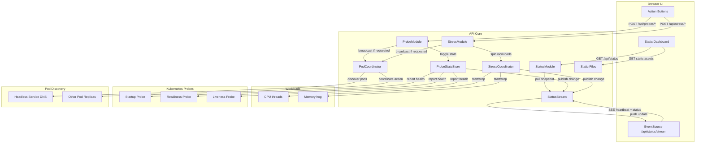

# K8s Demo Time

What we'll learn today:
- The power of probes
  - Demo App with configurable liveness and readiness probes per replica
- the concept behind resource requests and limits
  - Demo app that can increase its CPU and memory consumption per replica
- VPA and how to configure it
  - Demo app that can be vertically scaled
- Horizontal Pod Autoscaler (HPA) and how to configure it
- Bin packing strategies and cost vs. stability trade-offs
  - Progressive journey from static deployments to aggressive optimization
- Cilium Network Policies and Network Observability with AKS

## Application Overview

`K8sDemoApp` is a .NET 10 native AOT Web API designed to showcase probe behaviour and resource pressure inside Kubernetes. Each replica provides:

- A static dashboard (`/`) that displays hostname, uptime, resource requests/limits, live CPU & memory usage, and exposes controls to toggle probes or start stress tests.
- JSON API endpoints under `/api/*` for automation and UI integration.
- Startup, readiness, and liveness probes under `/health/{startup|readiness|liveness}` that you can intentionally fail for N minutes.
- CPU and memory stress endpoints that hold pressure for a configurable duration and release automatically.
- Chaos controls to crash the process or freeze request handling so you can observe probe behaviour and restarts.

The service uses source-generated JSON metadata so the AOT binary stays small and fast to cold-start.

## Local Development

Run the app with the .NET 10 preview SDK installed:

```bash
cd src/K8sDemoApp
dotnet run --urls http://localhost:8080
```

Navigate to <http://localhost:8080> to open the dashboard. Key API routes:

- `GET /api/status` — snapshot of probe health, uptime, hostname, and current stress activity.
- `POST /api/probes/{startup|readiness|liveness}/down` with `{ "minutes": 5, "broadcastToAll": true }` — fail the selected probe for N minutes (optionally on all replicas).
- `POST /api/probes/{startup|readiness|liveness}/up` with `{ "broadcastToAll": true }` — immediately restore the probe (optionally on all replicas).
- `POST /api/stress/cpu` with `{ "minutes": 2, "threads": 8, "broadcastToAll": true }` — run CPU-bound workers (optionally on all replicas).
- `DELETE /api/stress/cpu` — cancel CPU pressure ahead of schedule.
- `POST /api/stress/memory` with `{ "minutes": 1, "targetMegabytes": 1024, "broadcastToAll": true }` — allocate and hold memory (optionally on all replicas).
- `DELETE /api/stress/memory` — release memory pressure early.
- `POST /api/chaos/crash` — schedule an immediate process crash (container exit).
- `POST /api/chaos/freeze` with `{ "minutes": 5, "broadcastToAll": true }` — block request handling for the selected duration (optionally on all replicas).

**New**: All stress, probe, and chaos endpoints support an optional `broadcastToAll` parameter. When set to `true`, the action is coordinated across all replicas using DNS-based service discovery. See [BROADCAST-COORDINATION.md](BROADCAST-COORDINATION.md) for details.

## Container Image

The top-level `Dockerfile` publishes a self-contained native AOT binary using the .NET 10 preview images. After the Azure deployment finishes (next section), use the generated registry to host workshop images:

```bash
# Capture the registry login server output by the deployment
REGISTRY_LOGIN_SERVER=$(az acr show --name $REGISTRY_NAME --query loginServer -o tsv)

# Ensure we emit AMD64 layers (required for AKS nodes)
export DOCKER_DEFAULT_PLATFORM=linux/amd64

# Build and tag the image – use a meaningful tag such as the git SHA or a release version
IMAGE_TAG=$(git rev-parse --short HEAD)
docker build --platform linux/amd64 -t $REGISTRY_LOGIN_SERVER/k8s-demo-app:$IMAGE_TAG .

# Push to ACR (authenticates with the registry first)
az acr login --name $REGISTRY_NAME
docker push $REGISTRY_LOGIN_SERVER/k8s-demo-app:$IMAGE_TAG

# (Optional) Maintain a "latest" tag for demos
docker tag $REGISTRY_LOGIN_SERVER/k8s-demo-app:$IMAGE_TAG \
           $REGISTRY_LOGIN_SERVER/k8s-demo-app:latest
docker push $REGISTRY_LOGIN_SERVER/k8s-demo-app:latest
```

Anonymous pull access is enabled by default in the Bicep template, so workshop clusters can pull without additional credentials. Pushes still require authentication via `az acr login`.

## Azure Deployment (Bicep)

Use `infra/main.bicep` to provision the Azure Container Registry and AKS cluster that back the demo. The template deploys at subscription scope, so make sure you have the right subscription selected.

```bash
az login
az account set --subscription <subscription-id>

# Choose globally unique names for the registry and DNS prefix
PREFIX="anbo" # customise for your own environment; keep it alphanumeric and lowercase
REGISTRY_NAME="k8sdemo$PREFIX"
AKS_DNS_PREFIX="k8sdemo$PREFIX"
DEPLOYMENT_NAME="k8s-demo"
LOCATION="swedencentral" # override if you need a different Azure region
RESOURCE_GROUP_NAME="k8s-demo-rg"
AKS_CLUSTER_ADMIN_ID=$(az ad signed-in-user show --query id -o tsv)

az deployment sub create \
  --location $LOCATION \
  --name $DEPLOYMENT_NAME \
  --template-file infra/main.bicep \
  --parameters \
      location=$LOCATION \
      resourceGroupName=$RESOURCE_GROUP_NAME \
      registryName=$REGISTRY_NAME \
      aksClusterName=k8s-demo-aks \
      aksDnsPrefix=$AKS_DNS_PREFIX \
      clusterAdminPrincipalId=$AKS_CLUSTER_ADMIN_ID

# Grab kubeconfig once the deployment finishes
az aks get-credentials --resource-group $RESOURCE_GROUP_NAME --name k8s-demo-aks

# (Optional) Log in to the new ACR
az acr login --name $REGISTRY_NAME
```

Outputs listed at the end of the deployment include resource IDs for the registry, AKS cluster, and kubelet identity—handy for wiring into downstream pipelines. If you have never deployed AKS in this subscription before, run `az provider register --namespace Microsoft.ContainerService` once so the resource provider is available.

Want to experiment with the preview Node Auto Provisioning feature? Append `enableNodeAutoProvisioning=true` to the `--parameters` list once the feature is enabled in your subscription.

## Kubernetes Deployment

The manifest in `k8s/deployment.yaml` deploys two replicas with startup, readiness, and liveness probes and exposes them via a ClusterIP service. After pushing your image, update `k8s/deployment.yaml` (and the tutorial manifests under `k8s/hpa/`) so the `image:` field points at `${REGISTRY_LOGIN_SERVER}/k8s-demo-app:${IMAGE_TAG}`. Then apply the manifest:

```bash
kubectl apply -f k8s/deployment.yaml
kubectl port-forward svc/k8s-demo-app 8080:80
```

Browse to <http://localhost:8080> to interact with a pod, toggle probes, and trigger stress workloads for autoscaling demos.

## HPA Learning Plan

1. **Foundations (Day 1)** — Review autoscaling terminology, pod resource requests, and how HPA reacts to metrics. Walk through enabling the `metrics-server`, verifying resource requests on deployments, and reading the default HPA behaviour in the Kubernetes docs.
2. **CPU-Based Scaling (Day 2)** — Deploy the demo app with conservative CPU requests and create a simple CPU target-based HPA. Generate CPU pressure with the built-in stress endpoints, observe scaling events via `kubectl describe hpa`, and capture pod replica history.
3. **Memory and Custom Metrics (Day 3)** — Extend the HPA to memory utilization and explore custom metrics with Prometheus Adapter. Wire a sample custom metric (e.g., HTTP queue length) and update the HPA spec to use multiple metrics with stabilization windows.
4. **Advanced Scenarios (Day 4)** — Combine HPA with VPA and cluster autoscaler considerations, experiment with bursty workloads, and add safeguards like min/max replicas, behavior policies, and PodDisruptionBudgets. Discuss rollout strategies and how to monitor cost and performance impacts.

## Mood Lighting for Pods 🎨

Every replica gets its own vibe. When the dashboard loads a hostname it:

1. Hashes the hostname into a 32‑bit integer (cheap DJ name generator).
2. Takes the absolute value modulo 360 to pick an HSL hue.
3. Derives a palette (primary, glow, surface, button) from that hue.
4. Drops the palette into CSS variables so the gradients, buttons, and chips all match.

Same hostname ⇒ same color, different pods ⇒ instant rainbow cluster. Watching a rolling update feels like a disco 🪩.

## Architecture (Mermaid style 🐟)



## Next Steps

- Hook the deployment into VPA/HPA demos using the built-in stress controls.
- Add Cilium network policy examples alongside the existing manifests.
- Extend the dashboard with custom scenarios relevant to your workshop.
  
Bonus idea: project the dashboard on a big screen and run pod bingos. First team to crash liveness wins a sticker pack 🏆.
