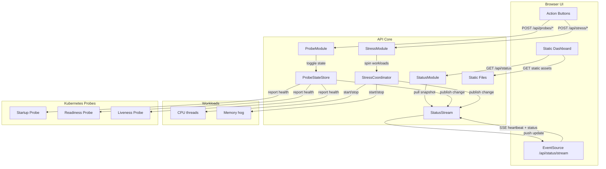

# K8s Demo Time

What we'll learn today:
- The power of probes
  - Demo App with configurable liveness and readiness probes per replica
- the concept behind resource requests and limits
  - Demo app that can increase its CPU and memory consumption per replica
- VPA and how to configure it
  - Demo app that can be vertically scaled
- Horizontal Pod Autoscaler (HPA) and how to configure it
- Cilium Network Policies and Network Observability with AKS

## Application Overview

`K8sDemoApp` is a .NET 10 native AOT Web API designed to showcase probe behaviour and resource pressure inside Kubernetes. Each replica provides:

- A static dashboard (`/`) that displays hostname, uptime, resource requests/limits, live CPU & memory usage, and exposes controls to toggle probes or start stress tests.
- JSON API endpoints under `/api/*` for automation and UI integration.
- Startup, readiness, and liveness probes under `/health/{startup|readiness|liveness}` that you can intentionally fail for N minutes.
- CPU and memory stress endpoints that hold pressure for a configurable duration and release automatically.
- Chaos controls to crash the process or freeze request handling so you can observe probe behaviour and restarts.

The service uses source-generated JSON metadata so the AOT binary stays small and fast to cold-start.

## Local Development

Run the app with the .NET 10 preview SDK installed:

```bash
cd src/K8sDemoApp
dotnet run --urls http://localhost:8080
```

Navigate to <http://localhost:8080> to open the dashboard. Key API routes:

- `GET /api/status` — snapshot of probe health, uptime, hostname, and current stress activity.
- `POST /api/probes/{startup|readiness|liveness}/down` with `{ "minutes": 5 }` — fail the selected probe for N minutes.
- `POST /api/probes/{startup|readiness|liveness}/up` — immediately restore the probe.
- `POST /api/stress/cpu` with `{ "minutes": 2, "threads": 8 }` — run CPU-bound workers.
- `DELETE /api/stress/cpu` — cancel CPU pressure ahead of schedule.
- `POST /api/stress/memory` with `{ "minutes": 1, "targetMegabytes": 1024 }` — allocate and hold memory.
- `DELETE /api/stress/memory` — release memory pressure early.
- `POST /api/chaos/crash` — schedule an immediate process crash (container exit).
- `POST /api/chaos/freeze` with `{ "minutes": 5 }` — block request handling for the selected duration.

## Container Image

The top-level `Dockerfile` publishes a self-contained native AOT binary using the .NET 10 preview images.

```bash
docker build -t ghcr.io/your-org/k8s-demo-app:latest .
docker run --rm -p 8080:8080 ghcr.io/your-org/k8s-demo-app:latest
```

Update the image tag to match your own registry before pushing.

## Kubernetes Deployment

The manifest in `k8s/deployment.yaml` deploys two replicas with startup, readiness, and liveness probes and exposes them via a ClusterIP service. After pushing your image and updating the manifest:

```bash
kubectl apply -f k8s/deployment.yaml
kubectl port-forward svc/k8s-demo-app 8080:80
```

Browse to <http://localhost:8080> to interact with a pod, toggle probes, and trigger stress workloads for autoscaling demos.

## HPA Learning Plan

1. **Foundations (Day 1)** — Review autoscaling terminology, pod resource requests, and how HPA reacts to metrics. Walk through enabling the `metrics-server`, verifying resource requests on deployments, and reading the default HPA behaviour in the Kubernetes docs.
2. **CPU-Based Scaling (Day 2)** — Deploy the demo app with conservative CPU requests and create a simple CPU target-based HPA. Generate CPU pressure with the built-in stress endpoints, observe scaling events via `kubectl describe hpa`, and capture pod replica history.
3. **Memory and Custom Metrics (Day 3)** — Extend the HPA to memory utilization and explore custom metrics with Prometheus Adapter. Wire a sample custom metric (e.g., HTTP queue length) and update the HPA spec to use multiple metrics with stabilization windows.
4. **Advanced Scenarios (Day 4)** — Combine HPA with VPA and cluster autoscaler considerations, experiment with bursty workloads, and add safeguards like min/max replicas, behavior policies, and PodDisruptionBudgets. Discuss rollout strategies and how to monitor cost and performance impacts.

## Mood Lighting for Pods 🎨

Every replica gets its own vibe. When the dashboard loads a hostname it:

1. Hashes the hostname into a 32‑bit integer (cheap DJ name generator).
2. Takes the absolute value modulo 360 to pick an HSL hue.
3. Derives a palette (primary, glow, surface, button) from that hue.
4. Drops the palette into CSS variables so the gradients, buttons, and chips all match.

Same hostname ⇒ same color, different pods ⇒ instant rainbow cluster. Watching a rolling update feels like a disco 🪩.

## Architecture (Mermaid style 🐟)



## Next Steps

- Hook the deployment into VPA/HPA demos using the built-in stress controls.
- Add Cilium network policy examples alongside the existing manifests.
- Extend the dashboard with custom scenarios relevant to your workshop.
  
Bonus idea: project the dashboard on a big screen and run pod bingos. First team to crash liveness wins a sticker pack 🏆.
