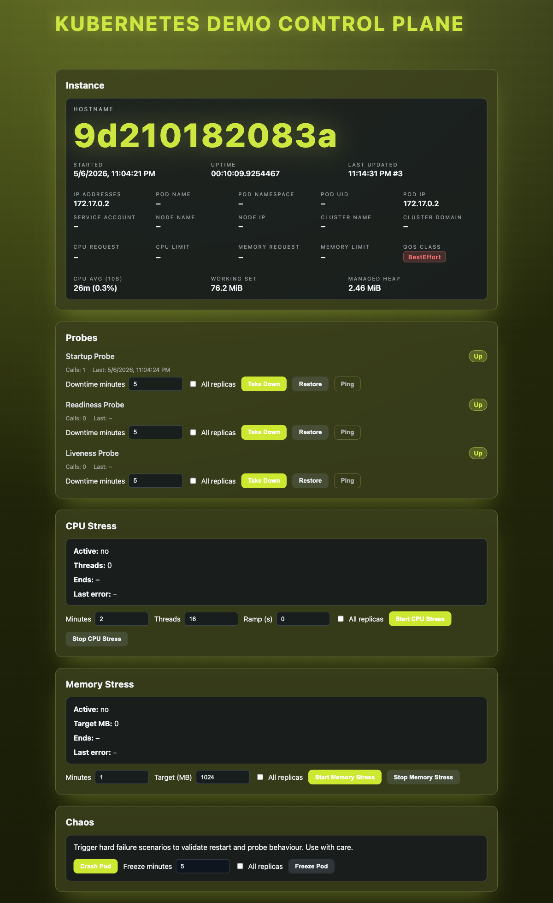
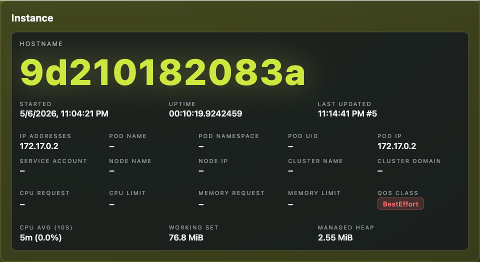
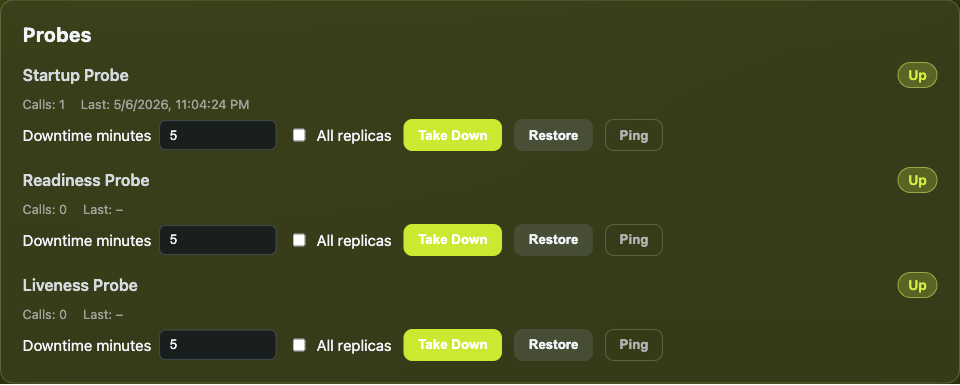
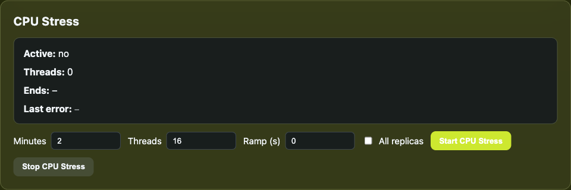
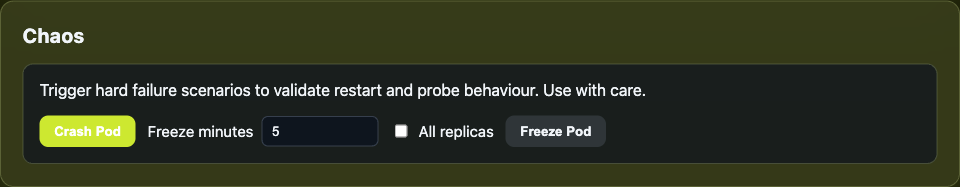
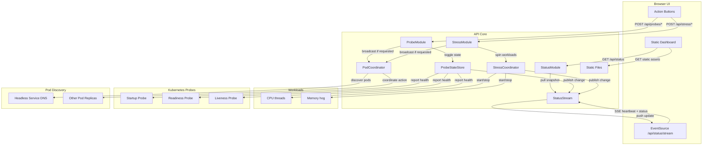

# K8s Demo Time

What we'll learn today:
- The power of probes
  - Demo App with configurable liveness and readiness probes per replica
- the concept behind resource requests and limits
  - Demo app that can increase its CPU and memory consumption per replica
- VPA and how to configure it
  - Demo app that can be vertically scaled
- Horizontal Pod Autoscaler (HPA) and how to configure it
- Bin packing strategies and cost vs. stability trade-offs
  - Progressive journey from static deployments to aggressive optimization
- Cilium Network Policies and Network Observability with AKS

## Application Overview

`K8sDemoApp` is a .NET 10 native AOT Web API designed to showcase probe behaviour and resource pressure inside Kubernetes. Each replica provides:

- A static dashboard (`/`) that displays hostname, uptime, resource requests/limits, live CPU & memory usage, and exposes controls to toggle probes or start stress tests.
- JSON API endpoints under `/api/*` for automation and UI integration.
- Startup, readiness, and liveness probes under `/health/{startup|readiness|liveness}` that you can intentionally fail for N minutes.
- CPU and memory stress endpoints that hold pressure for a configurable duration and release automatically.
- Chaos controls to crash the process or freeze request handling so you can observe probe behaviour and restarts.

The service uses source-generated JSON metadata so the AOT binary stays small and fast to cold-start.

## Local Development

Run the app with the .NET 10 preview SDK installed:

```bash
cd src/K8sDemoApp
dotnet run --urls http://localhost:8080
```

Navigate to <http://localhost:8080> to open the dashboard. Key API routes:

- `GET /api/status` — snapshot of probe health, uptime, hostname, and current stress activity.
- `POST /api/probes/{startup|readiness|liveness}/down` with `{ "minutes": 5, "broadcastToAll": true }` — fail the selected probe for N minutes (optionally on all replicas).
- `POST /api/probes/{startup|readiness|liveness}/up` with `{ "broadcastToAll": true }` — immediately restore the probe (optionally on all replicas).
- `POST /api/stress/cpu` with `{ "minutes": 2, "threads": 8, "broadcastToAll": true }` — run CPU-bound workers (optionally on all replicas).
- `DELETE /api/stress/cpu` — cancel CPU pressure ahead of schedule.
- `POST /api/stress/memory` with `{ "minutes": 1, "targetMegabytes": 1024, "broadcastToAll": true }` — allocate and hold memory (optionally on all replicas).
- `DELETE /api/stress/memory` — release memory pressure early.
- `POST /api/chaos/crash` — schedule an immediate process crash (container exit).
- `POST /api/chaos/freeze` with `{ "minutes": 5, "broadcastToAll": true }` — block request handling for the selected duration (optionally on all replicas).

**New**: All stress, probe, and chaos endpoints support an optional `broadcastToAll` parameter. When set to `true`, the action is coordinated across all replicas using DNS-based service discovery. See [BROADCAST-COORDINATION.md](BROADCAST-COORDINATION.md) for details.

## Dashboard

The built-in web dashboard at `/` provides real-time controls for all features:



### Instance Info
Shows hostname, uptime, pod metadata, resource requests/limits, QoS class, and live CPU/memory metrics.



### Probe Controls
Toggle startup, readiness, and liveness probes on/off with configurable downtime. Supports broadcast to all replicas.



### Stress Testing
Generate CPU and memory pressure with configurable duration, threads, and ramp-up time.



### Chaos Engineering
Crash the process or freeze request handling to observe probe behaviour and restarts.



## Container Image

The image is published to **GitHub Container Registry** as a public multi-arch image (amd64 + arm64):

```
ghcr.io/abossard/k8s-demo-app:latest
```

A [GitHub Actions workflow](.github/workflows/docker-publish.yml) automatically builds and pushes on every push to `main` and on version tags (`v*`).

### Run Locally

```bash
docker run -d -p 8080:8080 ghcr.io/abossard/k8s-demo-app:latest
```

Browse to <http://localhost:8080> to open the dashboard.

### Build Locally

```bash
docker build -t k8s-demo-app:local .
docker run -d -p 8080:8080 k8s-demo-app:local
```

### Custom Registry (ACR)

If you prefer Azure Container Registry, push the GHCR image or build your own:

```bash
REGISTRY_LOGIN_SERVER=$(az acr show --name $REGISTRY_NAME --query loginServer -o tsv)
IMAGE_TAG=$(git rev-parse --short HEAD)
docker build --platform linux/amd64 -t $REGISTRY_LOGIN_SERVER/k8s-demo-app:$IMAGE_TAG .
az acr login --name $REGISTRY_NAME
docker push $REGISTRY_LOGIN_SERVER/k8s-demo-app:$IMAGE_TAG
```

## Environment Variables

All environment variables are **optional**. When running outside Kubernetes, fields populated by the Downward API will show as `–` in the dashboard.

### Application Configuration

| Variable | Description | Default |
|----------|-------------|---------|
| `ASPNETCORE_URLS` | Bind address for the web server | `http://+:8080` |
| `HOLD_STARTUP_SECONDS` | Delay startup probe success by N seconds (simulates slow init) | `0` |
| `SERVICE_NAME` | Headless service name used for DNS-based pod discovery | `k8s-demo-app-headless` |

### Pod Identity (Kubernetes Downward API)

These are typically injected via `fieldRef` in the deployment manifest:

| Variable | Downward API Field | Shown in Dashboard |
|----------|-------------------|-------------------|
| `POD_NAME` | `metadata.name` | Pod Name |
| `POD_NAMESPACE` | `metadata.namespace` | Pod Namespace (also used for broadcast DNS) |
| `POD_UID` | `metadata.uid` | Pod UID |
| `POD_IP` | `status.podIP` | Pod IP |
| `POD_SERVICE_ACCOUNT` | `spec.serviceAccountName` | Service Account |
| `NODE_NAME` | `spec.nodeName` | Node Name |
| `NODE_IP` | `status.hostIP` | Node IP |

### Cluster Metadata

| Variable | Description |
|----------|-------------|
| `CLUSTER_NAME` | Display name for the cluster |
| `CLUSTER_DOMAIN` | Cluster DNS domain (e.g., `cluster.local`) |

### Resource Metrics (Kubernetes resourceFieldRef)

These power the QoS class detection and resource display:

| Variable | resourceFieldRef | Shown in Dashboard |
|----------|-----------------|-------------------|
| `RESOURCE_REQUEST_CPU` | `requests.cpu` | CPU Request |
| `RESOURCE_REQUEST_MEMORY` | `requests.memory` | Memory Request |
| `RESOURCE_LIMIT_CPU` | `limits.cpu` | CPU Limit |
| `RESOURCE_LIMIT_MEMORY` | `limits.memory` | Memory Limit |

## Azure Deployment (Bicep)

Use `infra/main.bicep` to provision the Azure Container Registry and AKS cluster that back the demo. The template deploys at subscription scope, so make sure you have the right subscription selected.

```bash
az login
az account set --subscription <subscription-id>

# Choose globally unique names for the registry and DNS prefix
PREFIX="anbo" # customise for your own environment; keep it alphanumeric and lowercase
REGISTRY_NAME="k8sdemo$PREFIX"
AKS_DNS_PREFIX="k8sdemo$PREFIX"
DEPLOYMENT_NAME="k8s-demo"
LOCATION="swedencentral" # override if you need a different Azure region
RESOURCE_GROUP_NAME="k8s-demo-rg"
AKS_CLUSTER_ADMIN_ID=$(az ad signed-in-user show --query id -o tsv)

az deployment sub create \
  --location $LOCATION \
  --name $DEPLOYMENT_NAME \
  --template-file infra/main.bicep \
  --parameters \
      location=$LOCATION \
      resourceGroupName=$RESOURCE_GROUP_NAME \
      registryName=$REGISTRY_NAME \
      aksClusterName=k8s-demo-aks \
      aksDnsPrefix=$AKS_DNS_PREFIX \
      clusterAdminPrincipalId=$AKS_CLUSTER_ADMIN_ID

# Grab kubeconfig once the deployment finishes
az aks get-credentials --resource-group $RESOURCE_GROUP_NAME --name k8s-demo-aks

# (Optional) Log in to the new ACR
az acr login --name $REGISTRY_NAME
```

Outputs listed at the end of the deployment include resource IDs for the registry, AKS cluster, and kubelet identity—handy for wiring into downstream pipelines. If you have never deployed AKS in this subscription before, run `az provider register --namespace Microsoft.ContainerService` once so the resource provider is available.

Want to experiment with the preview Node Auto Provisioning feature? Append `enableNodeAutoProvisioning=true` to the `--parameters` list once the feature is enabled in your subscription.

## Kubernetes Deployment

The manifest in `k8s/deployment.yaml` deploys two replicas with startup, readiness, and liveness probes and exposes them via a LoadBalancer service and a headless service for broadcast coordination.

### Quick Start

```bash
kubectl apply -f k8s/deployment.yaml
kubectl port-forward svc/k8s-demo-app 8080:80
```

Browse to <http://localhost:8080> to interact with a pod, toggle probes, and trigger stress workloads for autoscaling demos.

### Example Deployment

Below is a minimal standalone deployment you can customise. It includes the Downward API env vars that populate the dashboard and the three probe types:

```yaml
apiVersion: apps/v1
kind: Deployment
metadata:
  name: k8s-demo-app
  labels:
    app: k8s-demo-app
spec:
  replicas: 2
  selector:
    matchLabels:
      app: k8s-demo-app
  template:
    metadata:
      labels:
        app: k8s-demo-app
    spec:
      containers:
        - name: k8s-demo-app
          image: ghcr.io/abossard/k8s-demo-app:latest
          ports:
            - name: http
              containerPort: 8080
          env:
            # --- Application config ---
            - name: ASPNETCORE_URLS
              value: http://+:8080
            - name: HOLD_STARTUP_SECONDS
              value: "5"
            - name: SERVICE_NAME
              value: "k8s-demo-app-headless"
            # --- Pod identity (Downward API) ---
            - name: POD_NAME
              valueFrom:
                fieldRef:
                  fieldPath: metadata.name
            - name: POD_NAMESPACE
              valueFrom:
                fieldRef:
                  fieldPath: metadata.namespace
            - name: POD_UID
              valueFrom:
                fieldRef:
                  fieldPath: metadata.uid
            - name: POD_IP
              valueFrom:
                fieldRef:
                  fieldPath: status.podIP
            - name: POD_SERVICE_ACCOUNT
              valueFrom:
                fieldRef:
                  fieldPath: spec.serviceAccountName
            - name: NODE_NAME
              valueFrom:
                fieldRef:
                  fieldPath: spec.nodeName
            - name: NODE_IP
              valueFrom:
                fieldRef:
                  fieldPath: status.hostIP
            # --- Cluster metadata ---
            - name: CLUSTER_NAME
              value: "my-cluster"
            - name: CLUSTER_DOMAIN
              value: "cluster.local"
            # --- Resource metrics (for QoS display) ---
            - name: RESOURCE_REQUEST_CPU
              valueFrom:
                resourceFieldRef:
                  containerName: k8s-demo-app
                  resource: requests.cpu
            - name: RESOURCE_REQUEST_MEMORY
              valueFrom:
                resourceFieldRef:
                  containerName: k8s-demo-app
                  resource: requests.memory
            - name: RESOURCE_LIMIT_CPU
              valueFrom:
                resourceFieldRef:
                  containerName: k8s-demo-app
                  resource: limits.cpu
            - name: RESOURCE_LIMIT_MEMORY
              valueFrom:
                resourceFieldRef:
                  containerName: k8s-demo-app
                  resource: limits.memory
          resources:
            requests:
              cpu: "200m"
              memory: "256Mi"
            limits:
              cpu: "1"
              memory: "1Gi"
          startupProbe:
            httpGet:
              path: /health/startup
              port: http
            failureThreshold: 20
            periodSeconds: 3
          readinessProbe:
            httpGet:
              path: /health/readiness
              port: http
            periodSeconds: 5
            failureThreshold: 2
          livenessProbe:
            httpGet:
              path: /health/liveness
              port: http
            periodSeconds: 10
            failureThreshold: 3
---
apiVersion: v1
kind: Service
metadata:
  name: k8s-demo-app
spec:
  selector:
    app: k8s-demo-app
  ports:
    - port: 80
      targetPort: http
  type: LoadBalancer
---
# Headless service for cross-replica broadcast coordination
apiVersion: v1
kind: Service
metadata:
  name: k8s-demo-app-headless
spec:
  clusterIP: None
  selector:
    app: k8s-demo-app
  ports:
    - port: 8080
      targetPort: http
```

## HPA Learning Plan

1. **Foundations (Day 1)** — Review autoscaling terminology, pod resource requests, and how HPA reacts to metrics. Walk through enabling the `metrics-server`, verifying resource requests on deployments, and reading the default HPA behaviour in the Kubernetes docs.
2. **CPU-Based Scaling (Day 2)** — Deploy the demo app with conservative CPU requests and create a simple CPU target-based HPA. Generate CPU pressure with the built-in stress endpoints, observe scaling events via `kubectl describe hpa`, and capture pod replica history.
3. **Memory and Custom Metrics (Day 3)** — Extend the HPA to memory utilization and explore custom metrics with Prometheus Adapter. Wire a sample custom metric (e.g., HTTP queue length) and update the HPA spec to use multiple metrics with stabilization windows.
4. **Advanced Scenarios (Day 4)** — Combine HPA with VPA and cluster autoscaler considerations, experiment with bursty workloads, and add safeguards like min/max replicas, behavior policies, and PodDisruptionBudgets. Discuss rollout strategies and how to monitor cost and performance impacts.

## Mood Lighting for Pods 🎨

Every replica gets its own vibe. When the dashboard loads a hostname it:

1. Hashes the hostname into a 32‑bit integer (cheap DJ name generator).
2. Takes the absolute value modulo 360 to pick an HSL hue.
3. Derives a palette (primary, glow, surface, button) from that hue.
4. Drops the palette into CSS variables so the gradients, buttons, and chips all match.

Same hostname ⇒ same color, different pods ⇒ instant rainbow cluster. Watching a rolling update feels like a disco 🪩.

## Architecture (Mermaid style 🐟)


```mermaid
flowchart TD
    subgraph "Browser UI"
        A[Static Dashboard]
        B[EventSource /api/status/stream]
        C[Action Buttons]
    end

    subgraph "API Core"
        D[StatusModule]
        E[ProbeModule]
        F[StressModule]
        G[StatusStream]
        H[ProbeStateStore]
        I[StressCoordinator]
        P[PodCoordinator]
        S[Static Files]
    end

    subgraph "Workloads"
        J[CPU threads]
        K[Memory hog]
    end

    subgraph "Kubernetes Probes"
        L[Startup Probe]
        M[Readiness Probe]
        N[Liveness Probe]
    end
    
    subgraph "Pod Discovery"
        O[Headless Service DNS]
        Q[Other Pod Replicas]
    end

    A -->|GET static assets| S
    A -->|GET /api/status| D
    B -->|SSE heartbeat + status| G
    C -->|POST /api/probes/*| E
    C -->|POST /api/stress/*| F

    D -->|pull snapshot| G
    G -->|push update| B
    E -->|toggle state| H
    E -->|broadcast if requested| P
    F -->|spin workloads| I
    F -->|broadcast if requested| P
    H -->|publish change| G
    I -->|publish change| G

    I -->|start/stop| J
    I -->|start/stop| K

    H -->|report health| L
    H -->|report health| M
    H -->|report health| N
    
    P -->|discover pods| O
    P -->|coordinate action| Q
```

## Tutorials and Examples

### 📚 Biometric Stateful Shards - VM-Style Workload Tutorial

A comprehensive tutorial demonstrating how to operate a **stateful VM-like workload** on Kubernetes with cost-efficient SKU optimization using Karpenter.

**Use Case:** 10 fixed biometric index shards (32Gi RAM each) where any single failure makes the system unavailable.

**What You'll Learn:**
- VM-like behavior: Guaranteed QoS, manual updates (OnDelete), stable identity
- Two-phase optimization: Explore SKUs → Observe packing → Pin to stable nodes
- Cost analysis with aks-node-viewer and node packing strategies
- PodDisruptionBudget constraints and operational trade-offs
- Karpenter NodePool configuration (YAML-only, no Terraform)

**Get Started:**
```bash
cd examples/biometric-stateful-shards
./scripts/deploy-explore.sh
```

[📖 Read the full tutorial](examples/biometric-stateful-shards/README.md) | [⚡ Quick Reference](examples/biometric-stateful-shards/QUICK-REFERENCE.md)

---

## Next Steps

- Hook the deployment into VPA/HPA demos using the built-in stress controls.
- Add Cilium network policy examples alongside the existing manifests.
- Extend the dashboard with custom scenarios relevant to your workshop.
  
Bonus idea: project the dashboard on a big screen and run pod bingos. First team to crash liveness wins a sticker pack 🏆.
