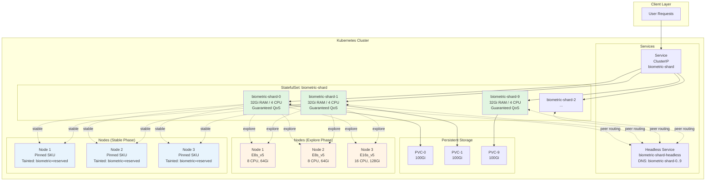
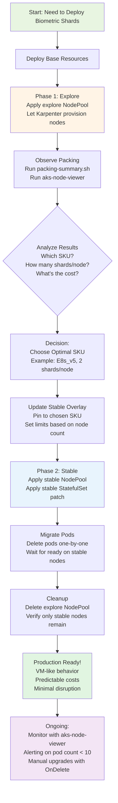

# Biometric Stateful Shards: VM-Style Workload on Kubernetes

This tutorial demonstrates how to operate a **VM-style stateful workload** on Kubernetes with cost-efficient SKU optimization using **AKS Node Auto Provisioning (NAP)** (Karpenter-compatible) on Azure AKS. The example models a biometric index/shard system where:

- **10 fixed shards** are required (no dynamic scaling)
- Each shard needs **32Gi RAM** with Guaranteed QoS
- Shards route requests between each other (peer-to-peer communication)
- **Any single shard failure makes the system unavailable**
- VM-like behavior is critical: stable identity, minimal restarts, controlled updates

## Architecture Overview



## What Makes This "VM-Like"?

Traditional Kubernetes workloads are ephemeral and cattle-like. This tutorial demonstrates **pet-like** workload patterns:

| Aspect | Traditional K8s | VM-Like (This Tutorial) |
|--------|----------------|------------------------|
| **Identity** | Ephemeral pod names | Stable DNS: `biometric-shard-0` through `biometric-shard-9` |
| **Storage** | Often stateless | Dedicated PVC per instance (100Gi each) |
| **Updates** | Rolling updates | Manual `OnDelete` - explicit one-by-one upgrade |
| **Restarts** | Frequent (liveness probe) | No liveness probe - avoid kubelet restarts |
| **Eviction** | Allowed by default | PDB: minAvailable=10, NAP: do-not-disrupt |
| **QoS** | Burstable | Guaranteed (requests = limits) |
| **Scheduling** | Best-effort spread | Topology spread + node affinity |
| **Tolerance** | Quick reschedule | Long tolerations (5min) for node issues |

## Prerequisites

Before starting this tutorial, ensure you have:

- **Kubernetes cluster**: AKS 1.28+ with **Node Auto Provisioning (NAP)** enabled
- **kubectl**: Configured to access your cluster
- **AKS Node Auto Provisioning (NAP)**: Enabled and configured ([AKS Node Auto Provisioning](https://learn.microsoft.com/en-us/azure/aks/node-autoprovision))
- **AKSNodeClass**: Default node class available (`default`)
- **Metrics Server**: For `kubectl top` commands (optional)
- **Demo App Image**: K8sDemoApp built and pushed to your ACR

### Build and Push Demo App Image

This tutorial uses the K8sDemoApp from this repository. Build and push it to your ACR:

```bash
# Set your registry name (from infra deployment)
REGISTRY_NAME="k8sdemoanbo"  # e.g., k8sdemoanbo
REGISTRY_LOGIN_SERVER=$(az acr show --name $REGISTRY_NAME --query loginServer -o tsv)

# Build and push with ACR Tasks (server-side build)
cd /path/to/k8s-demo-time
IMAGE_TAG=$(git rev-parse --short HEAD)

# Trigger ACR Task build and push
az acr build --registry $REGISTRY_NAME \
  --image k8s-demo-app:$IMAGE_TAG \
  --image k8s-demo-app:latest \
  --platform linux/amd64 \
  .
```

Then update the image reference in `k8s/base/04-statefulset.yaml`:

```yaml
containers:
  - name: biometric-shard
    image: your-registry.azurecr.io/k8s-demo-app:1.0.0  # Update this (avoid :latest for AKS policy)
```

### Verify Prerequisites

```bash
# Check NAP (Karpenter-compatible) CRDs are installed
kubectl get crd nodepools.karpenter.sh
kubectl get crd aksnodeclasses.karpenter.azure.com

# Check AKSNodeClass exists
kubectl get aksnodeclass

# Verify metrics-server (optional)
kubectl get deployment -n kube-system metrics-server

# Validate all manifests (recommended before deployment)
cd examples/biometric-stateful-shards
./scripts/validate-manifests.sh
```

**Manifest Validation:**

Before deploying, you can validate all Kubernetes manifests:

```bash
# Automated validation script (installs kubeconform if needed)
./scripts/validate-manifests.sh

# Manual validation with kubectl (requires cluster connection)
kubectl apply --dry-run=server -f k8s/base/
kubectl apply --dry-run=server -f k8s/overlays/explore/nodepool.yaml
kubectl apply --dry-run=server -f k8s/overlays/explore/vpa.yaml

# Manual validation with kubeconform (no cluster needed)
kubeconform -summary k8s/base/*.yaml
```

The validation script checks:
- ✅ All base manifests for schema compliance
- ✅ YAML syntax for CRDs (NodePool, VPA)
- ⏭️ Skips patch files (meant for strategic merge, not standalone)


## Phase 1: Explore - SKU Optimization

In the **explore phase**, we deploy the workload and let AKS Node Auto Provisioning (NAP) provision nodes from a broad range of SKUs. This allows us to observe which instance types provide the best cost/performance balance.

### Step 1: Deploy Base Resources

```bash
# Navigate to the tutorial directory
cd examples/biometric-stateful-shards

# Apply base manifests (namespace, services, PDB, priority class)
kubectl apply -f k8s/base/00-namespace.yaml
kubectl apply -f k8s/base/01-priorityclass.yaml
kubectl apply -f k8s/base/02-services.yaml
kubectl apply -f k8s/base/03-poddisruptionbudget.yaml
```

**What this creates:**
- Namespace: `biometric-shards`
- PriorityClass: `biometric-critical` (value: 1000000)
- Headless Service: `biometric-shard-headless` (for peer discovery)
- ClusterIP Service: `biometric-shard` (for external access)
- PodDisruptionBudget: `minAvailable: 10` (all shards must be available)

### Step 2: Deploy Explore Overlay

```bash
# Apply explore overlay (NodePool + StatefulSet with affinity)
kubectl apply -f k8s/overlays/explore/nodepool.yaml
kubectl apply -f k8s/base/04-statefulset.yaml
kubectl patch statefulset biometric-shard -n biometric-shards \
  --type=merge --patch-file k8s/overlays/explore/statefulset-patch.yaml
```

**What this does:**
- Creates a NAP (Karpenter-compatible) NodePool `biometric-explore` with:
  - SKU requirements: E-series or D-series, 64Gi+ memory, 8+ CPUs
  - Allows NAP to choose from multiple SKUs
  - Conservative disruption: `WhenEmpty` only, no budget for disruption
- Deploys StatefulSet with 10 replicas, each requiring 32Gi RAM (Guaranteed QoS)
- Patches StatefulSet to schedule on `nodepool=biometric-explore` nodes

### Step 3: Verify Deployment

```bash
# Wait for all pods to be ready (may take 5-10 minutes for node provisioning)
kubectl wait --for=condition=ready pod -l app.kubernetes.io/component=shard -n biometric-shards --timeout=600s

# Run verification script
./scripts/verify-cluster.sh
```

Expected output:
```
✅ Namespace exists
✅ StatefulSet exists
✅ All 10 replicas are ready
✅ PDB is satisfied
```

### Step 4: Observe Packing and Costs

```bash
# Analyze node packing efficiency
./scripts/packing-summary.sh
```

Example output:
```
NODE NAME                                    INSTANCE TYPE        SHARDS     MEMORY ALLOC    CPU ALLOC       MEMORY %
========================================     ====================  ==========  =============== =============== ==========
aks-biometric-12345678-vmss000000           Standard_E8s_v5       2          64.0Gi / 61.2Gi 8.0 / 7.8       52%
aks-biometric-12345678-vmss000001           Standard_E8s_v5       2          64.0Gi / 61.2Gi 8.0 / 7.8       52%
aks-biometric-12345678-vmss000002           Standard_E16s_v5      3          96.0Gi / 123.4Gi 12.0 / 15.8    78%
...

Summary:
  • Total nodes: 5
  • Total shards: 10
  • Average shards per node: 2.0

💡 Suggestions for stable phase:
  1. Most used instance type: Standard_E8s_v5
  2. Average packing: 2 shards per node
  3. Estimated node count for stable: 5 nodes
```

### Step 5: Test Routing

```bash
# Test shard-to-shard routing
./scripts/test-routing.sh
```

This script verifies:
- Individual shard health endpoints respond
- DNS resolution works for peer discovery
- Routing via ClusterIP service distributes requests

### Step 6: Cost Analysis

```bash
# View cost observation guide
./scripts/observe-costs.sh

# Install and run aks-node-viewer (recommended)
go install github.com/Azure/aks-node-viewer@latest
aks-node-viewer --node-selector nodepool=biometric-explore
```

**aks-node-viewer** shows real-time:
- Cost per hour and per month for each node
- CPU and memory utilization
- Pod distribution
- Resource pressure indicators

**Record your findings:**
- Which SKU was most commonly used?
- How many shards fit per node?
- What is the monthly cost estimate?

### Step 6a: Optional - VPA Resource Optimization

**What is VPA?** Vertical Pod Autoscaler (VPA) analyzes actual resource usage and provides recommendations for right-sizing CPU and memory requests.

**Why use VPA for this workload?** While we use fixed resources (Guaranteed QoS), VPA in "Off" mode can help discover the *optimal* resource values during the explore phase.

**Deploy VPA (optional but recommended):**

```bash
# Apply VPA in "Off" mode (recommendations only, no auto-updates)
kubectl apply -f k8s/overlays/explore/vpa.yaml

# Wait 5-10 minutes for VPA to collect metrics
# Generate some load to ensure realistic usage data
kubectl port-forward -n biometric-shards svc/biometric-shard 8080:80

# In another terminal, trigger some stress (optional)
curl -X POST http://localhost:8080/api/stress/cpu \
  -H "Content-Type: application/json" \
  -d '{"minutes": 3, "threads": 4, "broadcastToAll": true}'

# Check VPA recommendations
./scripts/check-vpa-recommendations.sh
```

**What the VPA script shows:**
- **Lower Bound**: Minimum safe resources
- **Target**: Recommended "just right" value ⭐
- **Upper Bound**: Conservative maximum
- Comparison with current configuration
- Suggestions for stable phase

**Using VPA with Goldilocks (optional):**

[Goldilocks](https://github.com/FairwindsOps/goldilocks) is a dashboard tool that visualizes VPA recommendations for all workloads in a namespace.

```bash
# Install Goldilocks (Helm)
helm repo add fairwinds-stable https://charts.fairwinds.com/stable
helm install goldilocks fairwinds-stable/goldilocks --namespace goldilocks --create-namespace

# Enable Goldilocks for biometric-shards namespace
kubectl label namespace biometric-shards goldilocks.fairwinds.com/enabled=true

# Access the dashboard
kubectl port-forward -n goldilocks svc/goldilocks-dashboard 8080:80

# Open http://localhost:8080 to see VPA recommendations in a visual dashboard
```

**Important Notes:**
- ⚠️ **Do NOT use VPA Auto mode** for this workload
- This is a VM-like workload with manual updates (OnDelete)
- VPA Auto mode would conflict with Guaranteed QoS and controlled updates
- Use VPA recommendations to manually adjust resources in stable phase
- Always keep `requests == limits` for Guaranteed QoS

**Example: Applying VPA recommendations to stable phase:**

If VPA recommends:
- CPU Target: 3500m (3.5 cores)
- Memory Target: 28Gi

Update `k8s/overlays/stable/statefulset-patch.yaml`:

```yaml
spec:
  template:
    spec:
      containers:
        - name: biometric-shard
          resources:
            requests:
              cpu: "3500m"      # From VPA target
              memory: "28Gi"    # From VPA target
            limits:
              cpu: "3500m"      # Same for Guaranteed QoS
              memory: "28Gi"    # Same for Guaranteed QoS
```

Then recalculate node requirements and update the stable NodePool accordingly.

### Step 7: Decide on Stable SKU

Based on your observations, decide on the optimal SKU for the stable phase. Consider:

- **Cost efficiency**: Fewer larger nodes vs. more smaller nodes
- **Fault tolerance**: More nodes = better distribution, but higher cost
- **Memory overhead**: Ensure at least 2-4Gi headroom per node for system processes

**Example decision matrix:**

| SKU | vCPU | Memory | Shards/Node | Nodes Needed | Monthly Cost | Fault Tolerance |
|-----|------|--------|-------------|--------------|--------------|-----------------|
| E8s_v5 | 8 | 64Gi | 2 | 5 | ~$1,835 | ⭐⭐⭐⭐ |
| E16s_v5 | 16 | 128Gi | 3 | 4 | ~$2,940 | ⭐⭐⭐ |
| D16s_v5 | 16 | 64Gi | 2 | 5 | ~$2,800 | ⭐⭐⭐⭐ |

*Prices are approximate and vary by region*

## Phase 2: Stable - Pin to Optimal SKU

Once you've identified the optimal SKU, transition to the **stable phase** where nodes are pinned to that SKU and protected from disruption.

### Step 1: Update Stable Overlay Configuration

Edit `k8s/overlays/stable/nodepool.yaml` based on your exploration findings:

```yaml
# Example: Pin to Standard_E8s_v5 (8 vCPU, 64Gi)
requirements:
  - key: karpenter.azure.com/sku-family
    operator: In
    values:
      - E
  
  - key: karpenter.azure.com/sku-memory
    operator: In
    values:
      - "65536"  # 64Gi in MiB
  
  - key: karpenter.azure.com/sku-cpu
    operator: In
    values:
      - "8"

# Adjust limits based on node count needed
limits:
  cpu: "40"      # 5 nodes * 8 vCPUs
  memory: 320Gi  # 5 nodes * 64Gi
```

### Step 2: Apply Stable Overlay

```bash
# Apply stable NodePool (replaces explore NodePool)
kubectl apply -f k8s/overlays/stable/nodepool.yaml

# Apply stable StatefulSet patch (adds tolerations and stable node affinity)
kubectl patch statefulset biometric-shard -n biometric-shards \
  --type=merge --patch-file k8s/overlays/stable/statefulset-patch.yaml
```

**Note:** Existing pods won't be rescheduled automatically due to `OnDelete` update strategy. Nodes will be gradually replaced as Karpenter provisions stable nodes.

### Step 3: Migrate Pods to Stable Nodes

Because we use `updateStrategy: OnDelete`, pods must be manually deleted to trigger migration:

```bash
# Delete pods one at a time (respecting PDB)
# This allows orderly migration to stable nodes

for i in {0..9}; do
  echo "Deleting biometric-shard-$i..."
  kubectl delete pod biometric-shard-$i -n biometric-shards
  
  # Wait for pod to be ready before proceeding
  kubectl wait --for=condition=ready pod/biometric-shard-$i -n biometric-shards --timeout=300s
  
  echo "✅ biometric-shard-$i ready on stable node"
  sleep 10
done
```

**Why manual migration?**
- Ensures controlled, one-at-a-time upgrade
- Respects PDB (minAvailable: 10)
- Allows verification at each step
- Prevents accidental simultaneous disruption

### Step 4: Verify Stable Deployment

```bash
# Verify all pods are on stable nodes
kubectl get pods -n biometric-shards -o wide

# Check that nodes have the stable label
kubectl get nodes -l nodepool=biometric-stable

# Verify packing on stable nodes
./scripts/packing-summary.sh

# Verify cluster health
./scripts/verify-cluster.sh
```

### Step 5: Clean Up Explore Resources

```bash
# Delete explore NodePool (Karpenter will drain empty explore nodes)
kubectl delete nodepool biometric-explore

# Verify only stable nodes remain
kubectl get nodes -l workload-type=biometric-shards
```

## Operations and Maintenance

### Upgrading Shards (Manual with OnDelete)

The StatefulSet uses `updateStrategy: OnDelete`, meaning updates **do not roll out automatically**. This is intentional for VM-like control.

To upgrade to a new image:

```bash
# Update the StatefulSet image
kubectl set image statefulset/biometric-shard biometric-shard=<registry>/k8s-demo-app:<new-tag> -n biometric-shards

# Pods will NOT restart automatically - you must delete them manually
# Delete one ordinal at a time, starting from the highest

for i in {9..0}; do
  echo "Upgrading biometric-shard-$i..."
  
  # Delete the pod
  kubectl delete pod biometric-shard-$i -n biometric-shards
  
  # Wait for it to come back ready
  kubectl wait --for=condition=ready pod/biometric-shard-$i -n biometric-shards --timeout=300s
  
  # Verify health
  kubectl exec -n biometric-shards biometric-shard-$i -- curl -f http://localhost:8080/health/startup || exit 1
  
  echo "✅ biometric-shard-$i upgraded successfully"
  sleep 30  # Allow shard to rejoin cluster before upgrading next
done
```

**Why upgrade in reverse order (9 → 0)?**
- StatefulSet controller maintains ordinals in order (0 → N)
- Reverse upgrade ensures ordinal 0 (often the "leader" or primary) is last
- Minimizes disruption to cluster coordination

### Handling PDB Constraints

With `minAvailable: 10`, the PDB **blocks** any operation that would reduce available pods below 10:

**What's blocked:**
- Node drains (unless all 10 pods can fit on remaining nodes)
- Evictions (Karpenter consolidation, cluster autoscaler)
- kubectl drain (will fail unless you use --disable-eviction)

**Implications:**
- Node maintenance is difficult - you cannot drain nodes normally
- Emergency maintenance may require relaxing PDB temporarily
- Plan maintenance windows carefully

**To drain a node for maintenance:**

```bash
# Option 1: Temporarily relax PDB (not recommended for production)
kubectl patch pdb biometric-shard -n biometric-shards --type merge -p '{"spec":{"minAvailable":9}}'

# Drain the node
kubectl drain <node-name> --ignore-daemonsets --delete-emptydir-data

# Restore PDB
kubectl patch pdb biometric-shard -n biometric-shards --type merge -p '{"spec":{"minAvailable":10}}'

# Option 2: Use cordon + manual pod deletion (preferred)
kubectl cordon <node-name>

# Manually delete pods on that node one at a time
kubectl delete pod biometric-shard-X -n biometric-shards
kubectl wait --for=condition=ready pod/biometric-shard-X -n biometric-shards --timeout=300s

# Uncordon when ready
kubectl uncordon <node-name>
```

### Detecting System Unavailability

Because **any single shard failure means system is down**, monitoring must be strict:

```bash
# Check if exactly 10 pods are ready
READY=$(kubectl get statefulset biometric-shard -n biometric-shards -o jsonpath='{.status.readyReplicas}')

if [ "$READY" != "10" ]; then
  echo "❌ SYSTEM DOWN: Only $READY/10 shards ready"
  # Trigger alert
fi

# Check PDB status
kubectl get pdb biometric-shard -n biometric-shards -o jsonpath='{.status.currentHealthy}/{.status.desiredHealthy}'
```

**Alerting recommendations:**
- Alert if `readyReplicas < 10`
- Alert if any pod is in CrashLoopBackOff
- Alert if PDB is not satisfied
- Monitor startup time for each shard (should be < 2 minutes)

### Graceful Shutdown

Each pod has a `preStop` hook that sleeps for 30 seconds. In production, this should:

1. **Deregister from cluster** - Mark shard as unavailable
2. **Drain in-flight requests** - Allow requests to complete
3. **Flush data** - Persist any pending writes
4. **Signal readiness to terminate** - Exit preStop hook

Example custom preStop script:

```yaml
lifecycle:
  preStop:
    exec:
      command:
        - /bin/sh
        - -c
        - |
          # Deregister shard from cluster
          curl -X POST http://localhost:8080/api/shard/deregister
          
          # Wait for in-flight requests to complete
          sleep 10
          
          # Flush data to disk
          curl -X POST http://localhost:8080/api/shard/flush
          
          # Final grace period
          sleep 20
```

### Storage Management

Each shard has a 100Gi PVC. These PVCs **persist even if the StatefulSet is deleted**.

**To clean up PVCs:**

```bash
# List PVCs
kubectl get pvc -n biometric-shards

# Delete a specific PVC (CAUTION: Data loss!)
kubectl delete pvc biometric-data-biometric-shard-0 -n biometric-shards

# Delete all PVCs for the StatefulSet (CAUTION!)
kubectl delete pvc -l app.kubernetes.io/component=shard-storage -n biometric-shards
```

**Storage class considerations:**
- Use Premium SSD (`managed-csi-premium`) for production (low latency)
- Use Standard SSD (`managed-csi`) for dev/test (cost savings)
- Consider using Azure Ultra Disk for extremely low latency requirements

## Troubleshooting

### Pods Stuck in Pending

**Symptom:** Pods remain in Pending state

**Possible causes:**
1. No nodes match the affinity rules
2. Insufficient resources on available nodes
3. Karpenter not provisioning nodes

**Diagnosis:**

```bash
# Check pod events
kubectl describe pod biometric-shard-0 -n biometric-shards

# Check Karpenter logs
kubectl logs -n kube-system -l app.kubernetes.io/name=karpenter --tail=100

# Verify NodePool exists and is valid
kubectl get nodepool biometric-explore -o yaml
kubectl get nodepool biometric-stable -o yaml
```

**Resolution:**
- Verify NodePool requirements aren't too restrictive
- Check Karpenter limits (cpu/memory caps)
- Ensure AKSNodeClass `default` exists

### PDB Blocking Drains

**Symptom:** `kubectl drain` fails with "Cannot evict pod as it would violate the pod's disruption budget"

**Cause:** PDB requires minAvailable: 10, but draining the node would leave < 10 pods

**Resolution:**
- Use manual pod deletion instead of drain (see "Handling PDB Constraints" above)
- Temporarily relax PDB (not recommended for production)
- Ensure remaining nodes have capacity for all 10 shards before draining

### DNS Resolution Failures

**Symptom:** Pods cannot resolve peer DNS names

**Diagnosis:**

```bash
# Test DNS from inside a pod
kubectl exec -n biometric-shards biometric-shard-0 -- nslookup biometric-shard-headless.biometric-shards.svc.cluster.local

# Check CoreDNS logs
kubectl logs -n kube-system -l k8s-app=kube-dns --tail=50
```

**Resolution:**
- Verify headless service has `clusterIP: None`
- Check service selector matches pod labels
- Ensure CoreDNS is running and healthy

### Out of Memory (OOM) Kills

**Symptom:** Pods are OOMKilled (exit code 137)

**Diagnosis:**

```bash
# Check pod status
kubectl get pod biometric-shard-0 -n biometric-shards -o jsonpath='{.status.containerStatuses[0].lastState.terminated}'

# Check node memory pressure
kubectl describe node <node-name> | grep -A 5 "Conditions:"
```

**Resolution:**
- Verify memory limits are set correctly (32Gi)
- Check for memory leaks in application
- Ensure Guaranteed QoS (requests = limits)
- Verify node has sufficient allocatable memory

### Nodes Being Consolidated/Replaced

**Symptom:** Nodes are being replaced unexpectedly, causing pod churn

**Diagnosis:**

```bash
# Check Karpenter events
kubectl get events -n kube-system --sort-by='.lastTimestamp' | grep -i karpenter

# Check pod annotations
kubectl get pod biometric-shard-0 -n biometric-shards -o jsonpath='{.metadata.annotations}'
```

**Resolution:**
- Verify `karpenter.sh/do-not-disrupt: "true"` annotation is present
- Check NodePool disruption settings (should be `consolidateAfter: Never` for stable)
- Ensure PDB is enforced (Karpenter respects PDBs)

## Cost Optimization Tips

### Using aks-node-viewer

```bash
# Install aks-node-viewer
go install github.com/Azure/aks-node-viewer@latest

# Run with node filter
aks-node-viewer --node-selector nodepool=biometric-stable

# Key features:
# - Real-time cost per hour/month
# - CPU/memory utilization
# - Pod distribution
# - Color-coded resource pressure
```

### Reserved Instances

For stable production workloads, Azure Reserved Instances can save up to 72%:

1. Go to Azure Portal → Reservations
2. Select "Virtual Machine"
3. Choose region, SKU (e.g., Standard_E8s_v5), and term (1 or 3 years)
4. Purchase reservation

**Savings example (East US):**
- Standard_E8s_v5 Pay-as-you-go: ~$0.504/hour = $367/month
- 1-year reserved: ~$0.353/hour = $257/month (30% savings)
- 3-year reserved: ~$0.252/hour = $184/month (50% savings)

### Spot VMs (Dev/Test Only)

For non-production environments, Spot VMs can save up to 90%:

```yaml
# In NodePool requirements, change capacity type:
- key: karpenter.sh/capacity-type
  operator: In
  values:
    - spot  # Instead of on-demand
```

⚠️ **Warning:** Spot VMs can be evicted with 30 seconds notice. Only use for dev/test!

### Right-Sizing

After running in production for a few weeks:

1. Monitor actual memory usage with `kubectl top pods`
2. If consistently under-utilized, consider smaller per-shard allocation
3. Adjust `resources.requests.memory` in StatefulSet
4. Re-run explore phase to find optimal SKU for new size

## Advanced Scenarios

### Multi-Zone Deployment

For high availability, spread shards across Azure Availability Zones:

```yaml
# Add to StatefulSet.spec.template.spec.topologySpreadConstraints
- maxSkew: 1
  topologyKey: topology.kubernetes.io/zone
  whenUnsatisfiable: DoNotSchedule  # Strict enforcement
  labelSelector:
    matchLabels:
      app.kubernetes.io/component: shard
```

**Trade-offs:**
- Better fault tolerance (zone failure doesn't take down entire cluster)
- Higher latency for cross-zone shard communication
- May require more nodes if zones are imbalanced

### Integration with Azure Monitor

Set up alerts for shard availability:

```bash
# Example Azure Monitor alert rule (via Azure CLI)
az monitor metrics alert create \
  --name "biometric-shard-unavailable" \
  --resource-group <rg-name> \
  --scopes <aks-resource-id> \
  --condition "avg Percentage CPU > 90" \
  --description "Alert when any biometric shard is unavailable"
```

Or use Prometheus + Alertmanager deployed in-cluster.

### Backup and Disaster Recovery

**PVC Snapshots:**

```bash
# Create VolumeSnapshot (requires CSI snapshot controller)
kubectl create -f - <<EOF
apiVersion: snapshot.storage.k8s.io/v1
kind: VolumeSnapshot
metadata:
  name: biometric-shard-0-snapshot
  namespace: biometric-shards
spec:
  volumeSnapshotClassName: csi-azuredisk-vsc
  source:
    persistentVolumeClaimName: biometric-data-biometric-shard-0
EOF

# List snapshots
kubectl get volumesnapshot -n biometric-shards
```

**Restore from snapshot:**

```yaml
# Create new PVC from snapshot
apiVersion: v1
kind: PersistentVolumeClaim
metadata:
  name: biometric-data-biometric-shard-0-restored
  namespace: biometric-shards
spec:
  dataSource:
    name: biometric-shard-0-snapshot
    kind: VolumeSnapshot
    apiGroup: snapshot.storage.k8s.io
  accessModes:
    - ReadWriteOnce
  resources:
    requests:
      storage: 100Gi
```

## Two-Phase Workflow Summary



### Key Differences Between Phases

| Aspect | Explore Phase | Stable Phase |
|--------|---------------|--------------|
| **NodePool Name** | `biometric-explore` | `biometric-stable` |
| **SKU Constraints** | Broad (E-series, D-series, 64Gi+) | Pinned (specific SKU, e.g., E8s_v5) |
| **Node Labels** | `nodepool=biometric-explore` | `nodepool=biometric-stable` |
| **Node Taints** | None | `biometric=reserved:NoSchedule` |
| **Disruption Policy** | `WhenEmpty`, 5min wait | `WhenEmpty`, Never consolidate |
| **Limits** | None (let Karpenter decide) | Set based on required node count |
| **Goal** | Discover optimal SKU | Run in production with known SKU |

## Learning Outcomes

After completing this tutorial, you will understand:

✅ How to design StatefulSets for VM-like behavior  
✅ How to use Karpenter NodePools for SKU exploration (YAML-only, no Terraform)  
✅ How to protect workloads from disruption with PDBs and annotations  
✅ How to implement Guaranteed QoS for predictable performance  
✅ How to use `OnDelete` update strategy for manual, controlled upgrades  
✅ How to analyze node packing and cost-efficiency  
✅ How to transition from explore to stable phase  
✅ How to operate a stateful workload where "any shard down = system down"  

## References

- [Karpenter on AKS Documentation](https://learn.microsoft.com/en-us/azure/aks/node-autoprovision)
- [Karpenter v1 API Reference](https://karpenter.sh/docs/concepts/nodepools/)
- [AKS Node Auto Provisioning](https://learn.microsoft.com/en-us/azure/aks/node-autoprovision)
- [Azure VM Pricing](https://azure.microsoft.com/pricing/details/virtual-machines/linux/)
- [StatefulSet Documentation](https://kubernetes.io/docs/concepts/workloads/controllers/statefulset/)
- [PodDisruptionBudget Best Practices](https://kubernetes.io/docs/tasks/run-application/configure-pdb/)
- [QoS Classes](https://kubernetes.io/docs/tasks/configure-pod-container/quality-service-pod/)
- [aks-node-viewer GitHub](https://github.com/Azure/aks-node-viewer)

## Next Steps

- Integrate with Azure Monitor for production alerting
- Implement automated backup snapshots for PVCs
- Deploy to multiple AKS clusters for geo-redundancy
- Explore Velero for cluster-level backup and restore
- Test disaster recovery procedures (full cluster rebuild)

---

**Questions or issues?** Open an issue in the repository or consult the [main README](../../README.md) for more Kubernetes patterns and tutorials.
