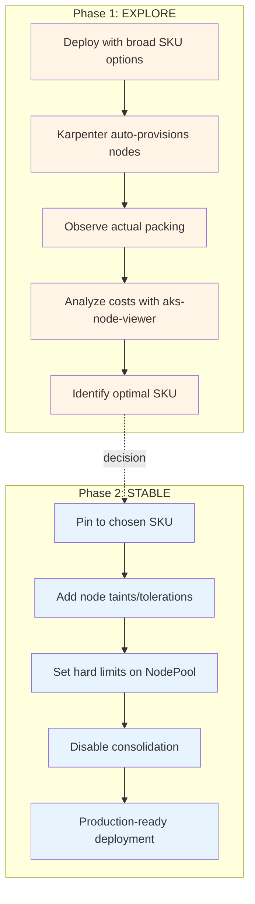

# Visual Guide: Explore vs Stable Phases

This document provides a visual comparison of the two phases in the biometric stateful shards deployment.

## Phase Comparison Overview



## Detailed Feature Comparison

| Feature | Explore Phase | Stable Phase |
|---------|---------------|--------------|
| **Purpose** | SKU discovery and cost analysis | Production deployment with known SKU |
| **NodePool Name** | `biometric-explore` | `biometric-stable` |
| **SKU Selection** | Broad (E-series, D-series, 64Gi+) | Pinned (e.g., only E8s_v5) |
| **Node Labels** | `nodepool=biometric-explore` | `nodepool=biometric-stable` |
| **Node Taints** | None | `biometric=reserved:NoSchedule` |
| **Resource Limits** | None (let Karpenter decide) | Hard limits (e.g., 40 CPU, 320Gi) |
| **Consolidation** | `WhenEmpty` after 5 minutes | `Never` |
| **Disruption Budget** | `nodes: "0"` (no disruption) | `nodes: "0"` (no disruption) |
| **Node Expiration** | `Never` | `Never` |
| **Capacity Type** | On-demand | On-demand |
| **Pod Tolerations** | Node issues only | Node issues + biometric taint |
| **Pod Affinity** | Required: nodepool=explore | Required: nodepool=stable |
| **Expected Duration** | 1-2 hours (observation period) | Indefinite (production) |
| **Cost Predictability** | Variable (different SKUs tested) | Fixed (known SKU) |
| **Isolation** | None (shares with other workloads) | Full (tainted nodes for biometric only) |

## Node Provisioning Timeline

### Explore Phase

```
Time: 0min
├─ Apply NodePool (biometric-explore)
├─ Apply StatefulSet
└─ Karpenter detects pending pods

Time: 1-2min
├─ Karpenter provisions first node (e.g., E8s_v5)
├─ Node joins cluster
├─ 2 pods scheduled on this node
└─ Pods start (startup probe: ~60s)

Time: 3-4min
├─ Karpenter provisions second node (e.g., E8s_v5)
├─ 2 more pods scheduled
└─ Total: 4/10 pods running

Time: 5-10min
├─ Karpenter provisions 3rd, 4th, 5th nodes
├─ All 10 pods scheduled and ready
└─ Observation phase begins

Time: 10-60min
├─ Run packing-summary.sh
├─ Run aks-node-viewer
├─ Analyze costs and utilization
└─ Decision: Which SKU to use?
```

### Stable Phase

```
Time: 0min
├─ Update NodePool YAML (pin to chosen SKU)
├─ Apply stable NodePool (biometric-stable)
├─ Apply stable StatefulSet patch
└─ Existing pods continue running (OnDelete strategy)

Time: 0-5min
├─ Karpenter provisions first stable node
├─ Node has taint: biometric=reserved
└─ No pods scheduled yet (need tolerations)

Time: 5-10min
├─ Manually delete biometric-shard-0
├─ Pod recreated with new tolerations
├─ Schedules on stable node
└─ Wait for ready

Time: 10-100min
├─ Repeat for shards 1-9 (one at a time)
├─ Each migration takes ~5-10 minutes
├─ Gradual shift from explore to stable nodes
└─ All 10 pods on stable nodes

Time: 100-120min
├─ Delete explore NodePool
├─ Karpenter drains empty explore nodes
├─ Only stable nodes remain
└─ Migration complete
```

## Cost Analysis Examples

### Example 1: Standard_E8s_v5 (Most Common)

**Specifications:**
- vCPUs: 8
- Memory: 64 GiB (~61 GiB allocatable)
- Shards per node: 2 (32Gi each = 64Gi total)
- Nodes needed: 5

**Cost (East US):**
- Hourly: $0.504 per node × 5 = $2.52/hour
- Monthly: $0.504 × 730 × 5 = **$1,840/month**

**Packing efficiency:**
- Memory utilization: 64Gi / 61Gi = 105% (tight fit)
- CPU utilization: 8 cores / 7.8 cores = 103% (tight fit)
- Headroom: Minimal (~1-2Gi for system)

### Example 2: Standard_E16s_v5 (Fewer Nodes)

**Specifications:**
- vCPUs: 16
- Memory: 128 GiB (~123 GiB allocatable)
- Shards per node: 3 (32Gi each = 96Gi total)
- Nodes needed: 4 (10 shards / 3 per node, rounded up)

**Cost (East US):**
- Hourly: $1.008 per node × 4 = $4.03/hour
- Monthly: $1.008 × 730 × 4 = **$2,944/month**

**Packing efficiency:**
- Memory utilization: 96Gi / 123Gi = 78%
- CPU utilization: 12 cores / 15.8 cores = 76%
- Headroom: Better (~27Gi for system and bursts)

**Trade-off:**
- 60% more expensive per month
- Better headroom and burst capacity
- Fewer nodes = fewer points of failure (but larger blast radius)

### Example 3: Standard_D16s_v5 (General Purpose)

**Specifications:**
- vCPUs: 16
- Memory: 64 GiB (~61 GiB allocatable)
- Shards per node: 2 (32Gi each = 64Gi total)
- Nodes needed: 5

**Cost (East US):**
- Hourly: $0.768 per node × 5 = $3.84/hour
- Monthly: $0.768 × 730 × 5 = **$2,804/month**

**Packing efficiency:**
- Memory utilization: 64Gi / 61Gi = 105% (tight fit)
- CPU utilization: 8 cores / 15.8 cores = 51% (underutilized)
- Headroom: Minimal memory, excess CPU

**Trade-off:**
- 52% more expensive than E8s_v5
- CPU overprovisioned (wasted)
- Same memory packing as E8s_v5

## Decision Matrix

| SKU | Cost/Month | Nodes | Shards/Node | Memory Util | CPU Util | Fault Tolerance | Recommendation |
|-----|-----------|-------|-------------|-------------|----------|-----------------|----------------|
| E8s_v5 | $1,840 | 5 | 2 | 105% | 103% | ⭐⭐⭐⭐ | ✅ Best balance |
| E16s_v5 | $2,944 | 4 | 3 | 78% | 76% | ⭐⭐⭐ | 💰 If budget allows |
| D8s_v5 | $1,920 | 5 | 2 | 105% | 51% | ⭐⭐⭐⭐ | ⚠️ CPU waste |
| D16s_v5 | $2,804 | 5 | 2 | 105% | 51% | ⭐⭐⭐⭐ | ❌ Expensive + CPU waste |

**Recommended Choice:** Standard_E8s_v5
- Lowest cost
- Good fault tolerance (5 nodes)
- Tight but acceptable resource utilization
- E-series optimized for memory workloads

## Visual: Node Packing Comparison

```
E8s_v5 (8 vCPU, 64Gi) - RECOMMENDED
┌─────────────────────────────┐
│ Node 1                      │
│ ┌──────────┐ ┌──────────┐  │
│ │ Shard 0  │ │ Shard 1  │  │
│ │ 32Gi     │ │ 32Gi     │  │ 64Gi used / 61Gi allocatable
│ │ 4 CPU    │ │ 4 CPU    │  │ 8 CPU used / 7.8 allocatable
│ └──────────┘ └──────────┘  │
│ [System: ~1Gi]              │
└─────────────────────────────┘
5 nodes total, 2 shards each


E16s_v5 (16 vCPU, 128Gi)
┌───────────────────────────────────────┐
│ Node 1                                │
│ ┌──────────┐ ┌──────────┐ ┌─────────┐│
│ │ Shard 0  │ │ Shard 1  │ │ Shard 2 ││
│ │ 32Gi     │ │ 32Gi     │ │ 32Gi    ││ 96Gi used / 123Gi allocatable
│ │ 4 CPU    │ │ 4 CPU    │ │ 4 CPU   ││ 12 CPU used / 15.8 allocatable
│ └──────────┘ └──────────┘ └─────────┘│
│ [System: ~5Gi] [Headroom: ~22Gi]     │
└───────────────────────────────────────┘
4 nodes total, 3 shards each (last node has 1 shard)
```

## Pod Distribution Example (Explore Phase)

**After Karpenter provisions nodes:**

```
Node                              Instance Type    Zone    Shards   Status
================================  ===============  ======  =======  ======
aks-biometric-12345678-vmss000000 E8s_v5          zone-1  2        Ready
  ├─ biometric-shard-0
  └─ biometric-shard-1

aks-biometric-12345678-vmss000001 E8s_v5          zone-2  2        Ready
  ├─ biometric-shard-2
  └─ biometric-shard-3

aks-biometric-12345678-vmss000002 E16s_v5         zone-1  3        Ready
  ├─ biometric-shard-4
  ├─ biometric-shard-5
  └─ biometric-shard-6

aks-biometric-12345678-vmss000003 E8s_v5          zone-2  2        Ready
  ├─ biometric-shard-7
  └─ biometric-shard-8

aks-biometric-12345678-vmss000004 E8s_v5          zone-1  1        Ready
  └─ biometric-shard-9

Total: 5 nodes, 10 shards
Mixed SKUs: 4x E8s_v5, 1x E16s_v5
→ Decision: Pin to E8s_v5 for stable phase (most common, lowest cost)
```

## Migration Visualization

```mermaid
gantt
    title Explore → Stable Migration Timeline
    dateFormat HH:mm
    axisFormat %H:%M
    
    section Explore Phase
    Deploy explore NodePool      :00:00, 1m
    Provision explore nodes      :00:01, 9m
    All pods ready               :00:10, 50m
    Observe and analyze          :01:00, 60m
    
    section Stable Phase
    Deploy stable NodePool       :02:00, 5m
    Provision stable nodes       :02:05, 5m
    Migrate shard-0             :02:10, 5m
    Migrate shard-1             :02:15, 5m
    Migrate shard-2             :02:20, 5m
    Migrate shard-3             :02:25, 5m
    Migrate shard-4             :02:30, 5m
    Migrate shard-5             :02:35, 5m
    Migrate shard-6             :02:40, 5m
    Migrate shard-7             :02:45, 5m
    Migrate shard-8             :02:50, 5m
    Migrate shard-9             :02:55, 5m
    Cleanup explore NodePool     :03:00, 10m
```



## VPA Resource Optimization

### Why VPA for VM-like Workloads?

While this workload uses **fixed resources** (Guaranteed QoS) and **manual updates** (OnDelete), VPA in "Off" mode is valuable during the explore phase:

**Benefits:**
- Discovers optimal resource values based on **actual usage**
- Complements node packing analysis
- Helps right-size resources before stable phase
- No conflict with VM-like behavior (recommendations only)

**Why NOT VPA Auto mode:**
- ❌ Conflicts with Guaranteed QoS (requests == limits)
- ❌ Breaks manual update control (OnDelete)
- ❌ Causes pod restarts (not VM-like)
- ❌ Incompatible with PDB minAvailable=10

### VPA Workflow

```
1. Deploy VPA in "Off" mode (explore phase)
   ↓
2. Wait 5-10 minutes for metric collection
   ↓
3. Optional: Generate load for realistic data
   ↓
4. Check recommendations with script
   ↓
5. Analyze: Lower Bound | Target | Upper Bound
   ↓
6. Apply recommendations to stable phase manually
   ↓
7. Keep requests == limits (Guaranteed QoS)
```

### Example VPA Recommendations

**Initial Configuration:**
- CPU: 4 cores (4000m)
- Memory: 32Gi

**VPA Analysis After 1 Hour:**
```
Resource    Lower Bound    Target         Upper Bound    Uncapped
=======================================================================
CPU         2800m          3500m          4200m          3600m
Memory      26.5Gi         28.0Gi         30.5Gi         28.2Gi
```

**Interpretation:**
- Actual usage is **below** initial 32Gi memory request
- Can reduce to **28Gi** (Target) for cost savings
- Lower Bound (26.5Gi) is aggressive, Target (28Gi) is safer

**Impact on Node Packing:**

**Before (32Gi per shard):**
- Standard_E8s_v5 (64Gi): Fits 2 shards, ~2Gi headroom
- Requires 5 nodes for 10 shards

**After (28Gi per shard):**
- Standard_E8s_v5 (64Gi): Still fits 2 shards, ~8Gi headroom
- Still requires 5 nodes, but more headroom for system processes
- Alternative: Could try Standard_D8s_v5 (32Gi allocatable) - barely fits 1 shard

**Cost Savings:**
- Reduced memory per shard: 32Gi → 28Gi (12.5% reduction)
- Node count unchanged, but more headroom
- Potential to switch to D-series (cheaper) if 2 shards fit

### Using Goldilocks Dashboard

Goldilocks provides a visual interface for VPA recommendations across all workloads:

**Install:**
```bash
helm repo add fairwinds-stable https://charts.fairwinds.com/stable
helm install goldilocks fairwinds-stable/goldilocks -n goldilocks --create-namespace
kubectl label namespace biometric-shards goldilocks.fairwinds.com/enabled=true
```

**Access:**
```bash
kubectl port-forward -n goldilocks svc/goldilocks-dashboard 8080:80
# Open http://localhost:8080
```

**Dashboard Shows:**
- All containers in labeled namespaces
- VPA recommendations (Lower/Target/Upper) in table format
- Color-coded indicators for over/under-provisioned resources
- Direct links to VPA objects

**Workflow:**
1. Review biometric-shard container in dashboard
2. Compare current vs. recommended values
3. Copy Target recommendations
4. Apply to stable phase manifests
5. Verify new packing with packing-summary.sh

## Key Takeaways

### Explore Phase
✅ **Do:**
- Let Karpenter try different SKUs
- Run packing-summary.sh to analyze
- Use aks-node-viewer for real-time costs
- Take notes on utilization patterns
- Test for at least 30-60 minutes

❌ **Don't:**
- Rush the decision
- Ignore memory headroom needs
- Forget to check cross-zone distribution
- Skip cost analysis

### Stable Phase
✅ **Do:**
- Pin to a single SKU
- Set hard limits on NodePool
- Use taints for workload isolation
- Migrate pods one at a time
- Verify each migration step
- Delete explore NodePool after migration

❌ **Don't:**
- Allow automatic consolidation
- Skip pod readiness checks
- Delete multiple pods simultaneously
- Forget to update PDB if scaling
- Leave old explore nodes running

## Cost Optimization Strategies

### 1. Reserved Instances (Production)
```
Standard_E8s_v5 Pay-as-you-go: $1,840/month
  ↓ 1-year reserved: $1,288/month (30% savings)
  ↓ 3-year reserved: $920/month (50% savings)
```

### 2. Spot Instances (Dev/Test Only)
```
Standard_E8s_v5 Pay-as-you-go: $1,840/month
  ↓ Spot pricing: $184/month (90% savings)
  ⚠️ Can be evicted with 30 seconds notice!
```

### 3. Right-Sizing
```
If actual memory usage is only 24Gi per shard:
  → Reduce to 24Gi requests
  → Can fit 2 shards on D8s_v3 (32Gi allocatable)
  → Potential 40% cost savings
```

### 4. Fewer Larger Nodes vs More Smaller Nodes
```
Option A: 5x E8s_v5 = $1,840/month (recommended)
Option B: 4x E16s_v5 = $2,944/month (60% more expensive)

Trade-off: Option B has better headroom but costs more.
Recommendation: Use Option A unless you need the extra headroom.
```

---

For the full tutorial, see [README.md](README.md)
