# Bin Packing Tutorial: How to Save Money Until the Card House Crashes Down

## Overview

This tutorial demonstrates the journey from conservative, VM-like Kubernetes deployments to aggressive bin packing strategies. You'll learn how to progressively optimize resource utilization to reduce costs, while understanding the trade-offs between efficiency and stability.

**Key Question:** How much can you squeeze into your cluster before the whole system becomes too fragile?

## What is Bin Packing?

**Bin packing** is the problem of packing items (pods) of different sizes into a finite number of bins (nodes) in a way that minimizes the number of bins used. In Kubernetes:

- **Items** = Pods with their resource requests
- **Bins** = Nodes with their available resources (CPU, memory)
- **Goal** = Maximize node utilization to minimize infrastructure costs

The Kubernetes scheduler uses bin packing algorithms to place pods on nodes based on their resource requests. Better bin packing means:
- ✅ Fewer nodes needed = Lower costs
- ✅ Higher resource utilization = Better ROI
- ⚠️ Less headroom for spikes = Higher risk
- ⚠️ More resource contention = Potential instability

## Tutorial Philosophy

This tutorial takes you through **7 iterations**, each making your deployment more cost-efficient but potentially less stable:

```mermaid
flowchart LR
    A["Step 1:<br/>Static VM-like<br/>💰💰💰💰<br/>🟢🟢🟢🟢"] --> B["Step 2:<br/>QoS Aware<br/>💰💰💰<br/>🟢🟢🟢"]
    B --> C["Step 3:<br/>With Limits<br/>💰💰💰<br/>🟢🟢🟢"]
    C --> D["Step 4:<br/>Add HPA<br/>💰💰<br/>🟢🟢"]
    D --> E["Step 5:<br/>Add VPA<br/>💰💰<br/>🟢🟢"]
    E --> F["Step 6:<br/>Mixed QoS<br/>💰<br/>🟡"]
    F --> G["Step 7:<br/>Extreme<br/>💰<br/>🔴"]
    
    style A fill:#e8f5e9
    style B fill:#c8e6c9
    style C fill:#a5d6a7
    style D fill:#ffecb3
    style E fill:#ffe082
    style F fill:#ffab91
    style G fill:#ef9a9a
```



**Legend:**
- 💰 = Cost (fewer = cheaper)
- 🟢 = Stability (more = better)
- 🟡 = Moderate risk
- 🔴 = High risk

## Prerequisites

- Kubernetes cluster (1.25+)
- kubectl configured
- Metrics server installed
- VPA installed (for steps 5+)
- At least 3 nodes with 4 CPUs and 8GB RAM each
- The k8s-demo-app image available

## Lab Flow

### Architecture Progression

Each step builds on the previous one, introducing new concepts that allow denser packing:

```mermaid
flowchart TD
    A["🎯 Goal: Reduce Infrastructure Costs"] --> B["Step 1: Static Baseline<br/>Conservative, predictable"]
    B --> C["Step 2: Introduce QoS<br/>Differentiate criticality"]
    C --> D["Step 3: Add Resource Limits<br/>Allow controlled bursting"]
    D --> E["Step 4: Enable HPA<br/>Scale horizontally on demand"]
    E --> F["Step 5: Enable VPA<br/>Right-size automatically"]
    F --> G["Step 6: Mixed QoS Strategy<br/>Balance cost vs. priority"]
    G --> H["Step 7: Extreme Bin Packing<br/>Push to the limits"]
    H --> I["🎓 Understanding: Balance is Key"]
```



## Step-by-Step Guide

### Step 1: Static VM-like Deployment (30 min)

**Concept:** Traditional approach where each pod is treated like a VM with fixed, generous resources.

**Characteristics:**
- Fixed number of replicas (no autoscaling)
- Guaranteed QoS (requests = limits)
- Very conservative resource allocation
- Predictable but expensive

```bash
kubectl apply -f k8s/bin-packing/step-01-static-vm-like.yaml
```

**Observe:**
- Check node utilization: `kubectl top nodes`
- Count pods per node: `kubectl get pods -n bin-packing-demo -o wide`
- Calculate wasted resources

**Key Metrics:**
- Pods per node: ~2-3
- Node utilization: ~30-40%
- Cost: Highest (baseline)
- Stability: Highest

---

### Step 2: Introduce QoS Classes (30 min)

**Concept:** Not all workloads are equally critical. Use QoS classes to signal priority.

**Changes from Step 1:**
- Keep critical services as Guaranteed
- Move less critical services to Burstable
- Allows scheduler to pack more efficiently

```bash
kubectl apply -f k8s/bin-packing/step-02-qos-aware.yaml
```

**Observe:**
- QoS class assignment: `kubectl get pods -n bin-packing-demo -o custom-columns=NAME:.metadata.name,QOS:.status.qosClass`
- Improved node density

**Key Metrics:**
- Pods per node: ~3-4
- Node utilization: ~40-50%
- Cost: 15% reduction
- Stability: Still high

---

### Step 3: Add Resource Limits for Bursting (30 min)

**Concept:** Set requests lower than limits to allow bursting when node has capacity.

**Changes from Step 2:**
- Requests reflect typical usage
- Limits allow temporary spikes
- Enables better bin packing during normal operation

```bash
kubectl apply -f k8s/bin-packing/step-03-with-limits.yaml
```

**Demonstrate:**
```bash
# Port-forward to service
kubectl port-forward svc/frontend -n bin-packing-demo 8080:80

# Trigger CPU burst
curl -X POST http://localhost:8080/api/stress/cpu \
  -H "Content-Type: application/json" \
  -d '{"minutes": 2, "threads": 4}'

# Watch resource usage
kubectl top pods -n bin-packing-demo -w
```

**Key Metrics:**
- Pods per node: ~4-5
- Node utilization: ~50-60%
- Cost: 30% reduction
- Stability: Good (some burst capacity)

---

### Step 4: Introduce HPA (Horizontal Pod Autoscaler) (45 min)

**Concept:** Scale out during load, scale in during idle periods.

**Changes from Step 3:**
- Add HPA for CPU and memory
- Start with fewer replicas
- Let HPA adjust based on actual demand

```bash
kubectl apply -f k8s/bin-packing/step-04-with-hpa.yaml

# Watch HPA in action
kubectl get hpa -n bin-packing-demo -w
```

**Demonstrate:**
```bash
# Generate sustained load
curl -X POST http://localhost:8080/api/stress/cpu \
  -H "Content-Type: application/json" \
  -d '{"minutes": 10, "threads": 8, "broadcastToAll": true}'

# Watch scaling
watch 'kubectl get hpa,pods -n bin-packing-demo'
```

**Key Metrics:**
- Pods per node: Variable (2-6)
- Node utilization: ~55-70% (dynamic)
- Cost: 45% reduction (during off-peak)
- Stability: Good (scales to meet demand)

---

### Step 5: Add VPA (Vertical Pod Autoscaler) (45 min)

**Concept:** Let VPA right-size requests based on actual usage patterns.

**Changes from Step 4:**
- Add VPA in Auto mode
- Start with lower initial requests
- VPA adjusts over time

```bash
kubectl apply -f k8s/bin-packing/step-05-with-vpa.yaml

# Check VPA recommendations
kubectl describe vpa -n bin-packing-demo
```

**Observe:**
```bash
# Watch VPA adjust resources over time
watch 'kubectl describe vpa -n bin-packing-demo | grep -A 20 "Recommendation:"'

# Monitor pod resource changes
kubectl get pods -n bin-packing-demo -o custom-columns=NAME:.metadata.name,CPU_REQ:.spec.containers[0].resources.requests.cpu,MEM_REQ:.spec.containers[0].resources.requests.memory -w
```

**Key Metrics:**
- Pods per node: Variable (3-7)
- Node utilization: ~60-75%
- Cost: 55% reduction
- Stability: Good (but more pod restarts)

---

### Step 6: Mixed QoS Strategy for Aggressive Packing (45 min)

**Concept:** Combine Guaranteed, Burstable, and BestEffort pods on same nodes.

**Changes from Step 5:**
- Critical services: Guaranteed QoS
- Standard services: Burstable QoS
- Background jobs: BestEffort QoS
- Much denser packing

```bash
kubectl apply -f k8s/bin-packing/step-06-mixed-qos.yaml
```

**Demonstrate Resource Pressure:**
```bash
# Generate memory pressure
kubectl port-forward svc/frontend -n bin-packing-demo 8080:80

curl -X POST http://localhost:8080/api/stress/memory \
  -H "Content-Type: application/json" \
  -d '{"minutes": 5, "targetMegabytes": 2048, "broadcastToAll": true}'

# Watch evictions
kubectl get events -n bin-packing-demo --field-selector reason=Evicted -w

# Check which pods got evicted (should be BestEffort first)
kubectl get pods -n bin-packing-demo --field-selector status.phase=Failed
```

**Key Metrics:**
- Pods per node: 6-10
- Node utilization: ~75-85%
- Cost: 65% reduction
- Stability: Moderate (occasional evictions)

---

### Step 7: Extreme Bin Packing - When Growth Evicts Others (60 min)

**Concept:** Demonstrate aggressive bin packing where the system works normally but when core services need to scale, low-priority pods get evicted. This is a realistic cost-optimized scenario showing that "the core still works, but growth kicks others out."

**Changes from Step 6:**
- Core services (frontend) remain stable with Guaranteed QoS
- Supporting services (backend) use minimal requests but can burst
- Many low-priority BestEffort pods (workers, cache, analytics) fill available space
- Aggressive HPA settings for frontend to trigger scaling
- When frontend scales under load, low-priority pods are evicted to make room

```bash
kubectl apply -f k8s/bin-packing/step-07-extreme-packing.yaml
```

---

## 🎤 PRESENTER GUIDE: Step 7 Demonstration

This section provides detailed click-by-click instructions for presenting this tutorial.

### Setup Phase (5 minutes)

**1. Deploy the extreme configuration:**
```bash
kubectl apply -f k8s/bin-packing/step-07-extreme-packing.yaml
```
**What to say:** "We're deploying an aggressive bin-packing configuration. The frontend is Guaranteed QoS and will stay up, backend is Burstable with minimal requests, and we have many BestEffort pods filling all available space."

**2. Wait for all pods to be ready:**
```bash
watch kubectl get pods -n bin-packing-demo
```
**What to look for:** All pods should reach Running state within 1-2 minutes. Count the pods - you should see:
- 2 frontend pods (Guaranteed)
- 3 backend pods (Burstable)
- 6 worker pods (BestEffort)
- 5 cache pods (BestEffort)
- 4 analytics pods (BestEffort)
**Total: ~20 pods**

Press `Ctrl+C` when all are Running.

**3. Check QoS classes:**
```bash
kubectl get pods -n bin-packing-demo -o custom-columns=\
NAME:.metadata.name,\
QOS:.status.qosClass,\
PRIORITY:.spec.priorityClassName
```
**What to say:** "Notice the QoS classes - frontend is Guaranteed (highest priority), backend is Burstable (medium), and workers/cache/analytics are BestEffort (lowest priority, will be evicted first)."

**What to look for:**
- Frontend pods: `Guaranteed` / `high-priority`
- Backend pods: `Burstable` / `normal-priority`
- Worker/cache/analytics: `BestEffort` / `low-priority`

**4. Check initial node utilization:**
```bash
kubectl top nodes
```
**What to say:** "Look at the node utilization - we're already running at 60-75% capacity with all these pods packed in."

**What to look for:** CPU and memory usage should be moderate (60-75%)

**5. Check pod distribution:**
```bash
kubectl get pods -n bin-packing-demo -o wide | awk '{print $7}' | sort | uniq -c
```
**What to say:** "Pods are distributed across nodes. The BestEffort pods take up space but don't reserve resources, allowing dense packing."

---

### Demonstration Phase (20 minutes)

**6. Open the dashboard in terminal 1:**
```bash
kubectl port-forward svc/frontend -n bin-packing-demo 8080:80
```
**What to say:** "Let me forward the frontend service so we can trigger load on it."

Then open browser to: `http://localhost:8080`

**What to show:** The k8s-demo-app dashboard showing:
- Current resource usage
- Pod information
- Stress test controls

**7. In terminal 2, watch pods:**
```bash
watch -n 2 'kubectl get pods -n bin-packing-demo -o wide | grep -E "NAME|frontend|worker|cache|analytics" | head -15'
```
**What to say:** "I'm going to watch the pods in real-time to see what happens when we apply load."

**8. In terminal 3, watch HPA:**
```bash
watch -n 2 'kubectl get hpa -n bin-packing-demo'
```
**What to say:** "And here we can see the HPA metrics and current replica counts."

**9. In terminal 4, watch events (crucial!):**
```bash
kubectl get events -n bin-packing-demo --sort-by='.lastTimestamp' -w
```
**What to say:** "This terminal will show us eviction events as they happen."

**10. Trigger CPU load on frontend (via browser or curl):**

**Option A - Browser (recommended for presentation):**
- Click "Stress Test" section in the dashboard
- Set "Duration (minutes)" to: `5`
- Set "CPU Threads" to: `4`
- Check "Broadcast to all pods"
- Click "Start CPU Stress"

**Option B - Command line:**
```bash
curl -X POST http://localhost:8080/api/stress/cpu \
  -H "Content-Type: application/json" \
  -d '{"minutes": 5, "threads": 4, "broadcastToAll": true}'
```

**What to say:** "I'm starting CPU stress on all frontend pods. This will drive up CPU utilization and trigger the HPA to scale out."

---

### Observation Phase (15 minutes)

**11. Watch HPA trigger (30-60 seconds after load starts):**
**What to look for in terminal 3:**
```
NAME           REFERENCE           TARGETS         MINPODS   MAXPODS   REPLICAS
frontend-hpa   Deployment/frontend  85%/70%        2         8         2
```
**What to say:** "Notice the CPU target is now above threshold (85% vs 70% target). The HPA will scale up."

**12. Watch HPA scale decision (~1 minute):**
**What to look for in terminal 3:**
```
frontend-hpa   Deployment/frontend  88%/70%        2         8         4
```
**What to say:** "The HPA has decided to scale from 2 to 4 replicas to handle the load."

**13. Watch for evictions in terminal 4:**
**What to look for in events terminal:**
```
2m ago   Normal    Evicted   Pod   Evicting pod due to node memory pressure
2m ago   Normal    Killing   Pod   Stopping container k8s-demo-app
```
**What to say:** "HERE IT IS! The scheduler needs space for new frontend pods. BestEffort pods are being evicted to make room. This is expected - the low-priority workers are being kicked out so the critical frontend can scale."

**14. Check which pods were evicted in terminal 2:**
**What to look for:**
- Some worker/cache/analytics pods show `Evicted` or `Pending` status
- Frontend pods show `Running` with new pods being created
- Backend pods should remain stable

**What to say:** "See how the frontend scaled successfully to handle load, but several worker and cache pods were evicted. The CORE SERVICE WORKS and scaled, but it kicked out the less important batch jobs."

**15. Check node utilization:**
```bash
kubectl top nodes
```
**What to say:** "Node utilization is now higher (75-85%) because frontend pods are using their allocated resources, and low-priority pods were evicted."

**16. View evicted pods:**
```bash
kubectl get pods -n bin-packing-demo --field-selector=status.phase=Failed
```
**What to say:** "These are the pods that were evicted. Notice they're all BestEffort (worker, cache, analytics) - never the critical frontend."

**17. Check frontend service is still working:**
```bash
curl http://localhost:8080/api/status
```
**What to say:** "The frontend is still responding perfectly. From a user perspective, the service works great. But behind the scenes, we sacrificed batch jobs to make room."

---

### Analysis Phase (10 minutes)

**18. Show pod distribution after scaling:**
```bash
kubectl get pods -n bin-packing-demo -o custom-columns=\
NAME:.metadata.name,\
STATUS:.status.phase,\
QOS:.status.qosClass,\
NODE:.spec.nodeName | grep -E "NAME|Running|Evicted"
```

**What to say:** "Let's analyze what happened. All Guaranteed frontend pods are running. Backend Burstable pods are still running. But several BestEffort pods were evicted."

**19. Check HPA after load subsides (wait 5+ minutes):**
```bash
kubectl get hpa frontend-hpa -n bin-packing-demo
```
**What to look for:** CPU should drop back below 70%, replica count should start to decrease

**What to say:** "Now that the load is subsiding, the HPA will scale back down. But those evicted BestEffort pods? They're waiting in Pending state until there's room again, or they're just gone."

**20. View the full picture:**
```bash
kubectl get all,hpa,vpa -n bin-packing-demo
```

---

### Key Takeaways to Emphasize (10 minutes)

**What to say:**

"This demonstrates the reality of aggressive bin packing:

✅ **The Good:**
- Core services (frontend) remained 100% operational
- System scaled successfully to meet demand
- No user-facing impact
- Significant cost savings from dense packing

⚠️ **The Trade-offs:**
- Low-priority batch jobs were evicted
- BestEffort pods are sacrificed when system needs to grow
- Batch processing may be delayed or interrupted
- Some pods may never restart if there's no room

🎯 **The Key Insight:**
This is what 'aggressive bin packing' looks like in reality - it's not a complete failure, but a conscious trade-off. You save money by packing tight, but when you need to grow, you kick out the less important workloads.

💡 **The Balance:**
This works if:
- You can identify which workloads are expendable (batch jobs, caches)
- You're okay with batch jobs being interrupted
- You monitor and alert on eviction rates
- You have a plan for rescheduling evicted workloads

This DOESN'T work if:
- All your workloads are critical
- You can't tolerate any interruption
- You have no clear priority hierarchy
- You're not monitoring eviction patterns"

---

### Commands for Monitoring (Reference)

**Quick status check:**
```bash
kubectl get pods -n bin-packing-demo --field-selector=status.phase!=Running | wc -l
# Shows count of non-running pods
```

**See eviction reasons:**
```bash
kubectl get events -n bin-packing-demo --field-selector reason=Evicted
```

**Watch specific pod types:**
```bash
watch 'kubectl get pods -n bin-packing-demo -l qos-class=besteffort'
```

**Check HPA history:**
```bash
kubectl describe hpa frontend-hpa -n bin-packing-demo | grep -A 10 Events
```

**Check node pressure:**
```bash
kubectl describe nodes | grep -A 5 "Conditions:"
# Look for MemoryPressure or DiskPressure
```

---

### Troubleshooting Tips

**If nothing gets evicted:**
- Check if cluster has too much spare capacity
- Try increasing load: `{"minutes": 10, "threads": 8, "broadcastToAll": true}`
- Or reduce node count to create more pressure

**If frontend pods don't scale:**
- Check HPA: `kubectl describe hpa frontend-hpa -n bin-packing-demo`
- Verify metrics server is running: `kubectl get deployment metrics-server -n kube-system`
- Check if maxReplicas was reached

**If too many pods get evicted:**
- This means you've truly hit resource limits
- Good for demonstration! Shows the extreme case
- Explain: "This is what happens when you push too far"

---

**Key Metrics:**
- Pods per node: 8-12 (initially) → 5-8 (after evictions)
- Node utilization: ~70% (stable) → ~80-85% (under load)
- Cost: 70% reduction from baseline
- Stability: **Core works, periphery fails** - acceptable trade-off for cost-sensitive environments
- Eviction rate: 5-10 pods evicted when frontend scales

---

### Step 8: Cleanup

Remove all resources:

```bash
kubectl apply -f k8s/bin-packing/step-08-cleanup.yaml
```

## Key Learnings

### 1. **Cost vs. Stability Trade-off**

There's no free lunch. Every optimization comes with trade-offs:

| Strategy | Cost Savings | Stability | Complexity | When to Use |
|----------|--------------|-----------|------------|-------------|
| Static VM-like | 0% | ⭐⭐⭐⭐⭐ | Low | Critical systems, compliance |
| QoS Classes | 15% | ⭐⭐⭐⭐⭐ | Low | All production systems |
| With Limits | 30% | ⭐⭐⭐⭐ | Medium | Standard workloads |
| With HPA | 45% | ⭐⭐⭐⭐ | Medium | Variable load patterns |
| With VPA | 55% | ⭐⭐⭐ | High | Mature, monitored systems |
| Mixed QoS | 65% | ⭐⭐⭐ | High | Cost-conscious environments |
| Extreme | 75% | ⭐ | Very High | **Don't do this in production!** |

### 2. **The Bin Packing Paradox**

Maximizing bin packing can actually **increase** costs:
- More evictions → more pod restarts → higher latency
- Resource thrashing → degraded performance → customer churn
- System instability → incident response costs → opportunity cost

**Sweet spot:** Aim for 60-70% node utilization with proper safeguards.

### 3. **Essential Safeguards**

When implementing aggressive bin packing, always include:

1. **PodDisruptionBudgets (PDBs)**
   - Prevent too many pods from being evicted simultaneously
   - Ensure minimum availability during voluntary disruptions

2. **Resource Quotas**
   - Limit namespace resource consumption
   - Prevent runaway applications from affecting others

3. **LimitRanges**
   - Set default and maximum limits
   - Prevent unbounded resource requests

4. **Monitoring and Alerts**
   - Node resource pressure alerts
   - Pod eviction rate monitoring
   - OOMKill tracking

5. **Cluster Autoscaler**
   - Add nodes when scheduling fails
   - Remove underutilized nodes
   - Acts as a safety valve

### 4. **When Bin Packing Goes Wrong**

Common failure modes:

- **OOM Thrashing:** Pods repeatedly OOMKilled and restarted
- **Eviction Storms:** Cascade of evictions triggering more pressure
- **Scheduling Deadlock:** New pods can't be scheduled anywhere
- **Resource Starvation:** Critical pods starved by greedy neighbors
- **Node Instability:** Kubelet becomes unresponsive under pressure

### 5. **Best Practices**

✅ **DO:**
- Use QoS classes appropriately
- Set realistic resource requests based on monitoring
- Use HPA for predictable horizontal scaling
- Test under load before production
- Monitor node and pod metrics continuously
- Leave 20-30% headroom for spikes

❌ **DON'T:**
- Set requests = 0 (creates BestEffort pods)
- Use extreme packing in production
- Ignore eviction events
- Skip load testing
- Optimize only for cost
- Forget about blast radius

## Practical Recommendations

### For Development/Test Environments
- Step 3-4 (With Limits + HPA) is usually sufficient
- Prioritize fast iteration over perfect efficiency
- BestEffort pods are acceptable for non-critical services

### For Production Environments
- Start with Step 2-3 (QoS + Limits)
- Add HPA for services with variable load (Step 4)
- Consider VPA only after establishing good monitoring (Step 5)
- Never go beyond Step 6 in production
- Always maintain at least 25-30% node headroom

### For Cost-Sensitive Environments
- Step 5-7 (VPA + Mixed QoS + Aggressive Packing) with careful monitoring
- Clearly identify expendable workloads (batch jobs, caches)
- Implement comprehensive alerting for eviction rates
- Use Cluster Autoscaler as safety net
- Accept that non-critical workloads may be interrupted
- Budget for incident response and rescheduling logic

## Related Tutorials

- **[QoS Tutorial](../qos/README.md)** - Deep dive into Quality of Service classes
- **[HPA Tutorial](../../HPA-Interactive-Tutorial.md)** - Horizontal Pod Autoscaler details
- **[VPA Tutorial](../vpa/README.md)** - Vertical Pod Autoscaler guide
- **[Autoscaling Guide](../../AUTOSCALING-GUIDE.md)** - Combining autoscaling strategies

## Conclusion

Bin packing in Kubernetes is a balancing act between cost efficiency and system reliability. This tutorial demonstrated that:

1. **Conservative approaches** (Steps 1-3) provide stability but at higher cost
2. **Moderate optimization** (Steps 4-5) offers good balance for most workloads
3. **Aggressive packing** (Step 6) requires sophisticated monitoring and operations
4. **Extreme optimization** (Step 7) shows that the core can work, but growth evicts non-critical workloads

**The goal isn't to pack as tightly as possible—it's to find the right balance for your specific needs, risk tolerance, and operational maturity.**

Step 7 demonstrates a key insight: You CAN achieve 70% cost savings with aggressive bin packing, BUT you must accept that:
- Non-critical workloads will be sacrificed when core services need to scale
- Batch jobs and caches are expendable
- The system remains functional for critical services
- You need excellent prioritization and monitoring

Remember: The cheapest cluster is the one that doesn't cause an outage to CRITICAL services. 💡
