# Bin Packing Tutorial: How to Save Money Until the Card House Crashes Down

## Overview

This tutorial demonstrates the journey from conservative, VM-like Kubernetes deployments to aggressive bin packing strategies. You'll learn how to progressively optimize resource utilization to reduce costs, while understanding the trade-offs between efficiency and stability.

**Key Question:** How much can you squeeze into your cluster before the whole system becomes too fragile?

## What is Bin Packing?

**Bin packing** is the problem of packing items (pods) of different sizes into a finite number of bins (nodes) in a way that minimizes the number of bins used. In Kubernetes:

- **Items** = Pods with their resource requests
- **Bins** = Nodes with their available resources (CPU, memory)
- **Goal** = Maximize node utilization to minimize infrastructure costs

The Kubernetes scheduler uses bin packing algorithms to place pods on nodes based on their resource requests. Better bin packing means:
- ✅ Fewer nodes needed = Lower costs
- ✅ Higher resource utilization = Better ROI
- ⚠️ Less headroom for spikes = Higher risk
- ⚠️ More resource contention = Potential instability

## Tutorial Philosophy

This tutorial takes you through **7 iterations**, each making your deployment more cost-efficient but potentially less stable:

```mermaid
flowchart LR
    A["Step 1:<br/>Static VM-like<br/>💰💰💰💰<br/>🟢🟢🟢🟢"] --> B["Step 2:<br/>QoS Aware<br/>💰💰💰<br/>🟢🟢🟢"]
    B --> C["Step 3:<br/>With Limits<br/>💰💰💰<br/>🟢🟢🟢"]
    C --> D["Step 4:<br/>Add HPA<br/>💰💰<br/>🟢🟢"]
    D --> E["Step 5:<br/>Add VPA<br/>💰💰<br/>🟢🟢"]
    E --> F["Step 6:<br/>Mixed QoS<br/>💰<br/>🟡"]
    F --> G["Step 7:<br/>Extreme<br/>💰<br/>🔴"]
    
    style A fill:#e8f5e9
    style B fill:#c8e6c9
    style C fill:#a5d6a7
    style D fill:#ffecb3
    style E fill:#ffe082
    style F fill:#ffab91
    style G fill:#ef9a9a
```



**Legend:**
- 💰 = Cost (fewer = cheaper)
- 🟢 = Stability (more = better)
- 🟡 = Moderate risk
- 🔴 = High risk

## Prerequisites

- Kubernetes cluster (1.25+)
- kubectl configured
- Metrics server installed
- VPA installed (for steps 5+)
- At least 3 nodes with 4 CPUs and 8GB RAM each
- The k8s-demo-app image available

## Lab Flow

### Architecture Progression

Each step builds on the previous one, introducing new concepts that allow denser packing:

```mermaid
flowchart TD
    A["🎯 Goal: Reduce Infrastructure Costs"] --> B["Step 1: Static Baseline<br/>Conservative, predictable"]
    B --> C["Step 2: Introduce QoS<br/>Differentiate criticality"]
    C --> D["Step 3: Add Resource Limits<br/>Allow controlled bursting"]
    D --> E["Step 4: Enable HPA<br/>Scale horizontally on demand"]
    E --> F["Step 5: Enable VPA<br/>Right-size automatically"]
    F --> G["Step 6: Mixed QoS Strategy<br/>Balance cost vs. priority"]
    G --> H["Step 7: Extreme Bin Packing<br/>Push to the limits"]
    H --> I["🎓 Understanding: Balance is Key"]
```



## Step-by-Step Guide

### Step 1: Static VM-like Deployment (30 min)

**Concept:** Traditional approach where each pod is treated like a VM with fixed, generous resources.

**Characteristics:**
- Fixed number of replicas (no autoscaling)
- Guaranteed QoS (requests = limits)
- Very conservative resource allocation
- Predictable but expensive

```bash
kubectl apply -f k8s/bin-packing/step-01-static-vm-like.yaml
```

**Observe:**
- Check node utilization: `kubectl top nodes`
- Count pods per node: `kubectl get pods -n bin-packing-demo -o wide`
- Calculate wasted resources

**Key Metrics:**
- Pods per node: ~2-3
- Node utilization: ~30-40%
- Cost: Highest (baseline)
- Stability: Highest

---

### Step 2: Introduce QoS Classes (30 min)

**Concept:** Not all workloads are equally critical. Use QoS classes to signal priority.

**Changes from Step 1:**
- Keep critical services as Guaranteed
- Move less critical services to Burstable
- Allows scheduler to pack more efficiently

```bash
kubectl apply -f k8s/bin-packing/step-02-qos-aware.yaml
```

**Observe:**
- QoS class assignment: `kubectl get pods -n bin-packing-demo -o custom-columns=NAME:.metadata.name,QOS:.status.qosClass`
- Improved node density

**Key Metrics:**
- Pods per node: ~3-4
- Node utilization: ~40-50%
- Cost: 15% reduction
- Stability: Still high

---

### Step 3: Add Resource Limits for Bursting (30 min)

**Concept:** Set requests lower than limits to allow bursting when node has capacity.

**Changes from Step 2:**
- Requests reflect typical usage
- Limits allow temporary spikes
- Enables better bin packing during normal operation

```bash
kubectl apply -f k8s/bin-packing/step-03-with-limits.yaml
```

**Demonstrate:**
```bash
# Port-forward to service
kubectl port-forward svc/frontend -n bin-packing-demo 8080:80

# Trigger CPU burst
curl -X POST http://localhost:8080/api/stress/cpu \
  -H "Content-Type: application/json" \
  -d '{"minutes": 2, "threads": 4}'

# Watch resource usage
kubectl top pods -n bin-packing-demo -w
```

**Key Metrics:**
- Pods per node: ~4-5
- Node utilization: ~50-60%
- Cost: 30% reduction
- Stability: Good (some burst capacity)

---

### Step 4: Introduce HPA (Horizontal Pod Autoscaler) (45 min)

**Concept:** Scale out during load, scale in during idle periods.

**Changes from Step 3:**
- Add HPA for CPU and memory
- Start with fewer replicas
- Let HPA adjust based on actual demand

```bash
kubectl apply -f k8s/bin-packing/step-04-with-hpa.yaml

# Watch HPA in action
kubectl get hpa -n bin-packing-demo -w
```

**Demonstrate:**
```bash
# Generate sustained load
curl -X POST http://localhost:8080/api/stress/cpu \
  -H "Content-Type: application/json" \
  -d '{"minutes": 10, "threads": 8, "broadcastToAll": true}'

# Watch scaling
watch 'kubectl get hpa,pods -n bin-packing-demo'
```

**Key Metrics:**
- Pods per node: Variable (2-6)
- Node utilization: ~55-70% (dynamic)
- Cost: 45% reduction (during off-peak)
- Stability: Good (scales to meet demand)

---

### Step 5: Add VPA (Vertical Pod Autoscaler) (45 min)

**Concept:** Let VPA right-size requests based on actual usage patterns.

**Changes from Step 4:**
- Add VPA in Auto mode
- Start with lower initial requests
- VPA adjusts over time

```bash
kubectl apply -f k8s/bin-packing/step-05-with-vpa.yaml

# Check VPA recommendations
kubectl describe vpa -n bin-packing-demo
```

**Observe:**
```bash
# Watch VPA adjust resources over time
watch 'kubectl describe vpa -n bin-packing-demo | grep -A 20 "Recommendation:"'

# Monitor pod resource changes
kubectl get pods -n bin-packing-demo -o custom-columns=NAME:.metadata.name,CPU_REQ:.spec.containers[0].resources.requests.cpu,MEM_REQ:.spec.containers[0].resources.requests.memory -w
```

**Key Metrics:**
- Pods per node: Variable (3-7)
- Node utilization: ~60-75%
- Cost: 55% reduction
- Stability: Good (but more pod restarts)

---

### Step 6: Mixed QoS Strategy for Aggressive Packing (45 min)

**Concept:** Combine Guaranteed, Burstable, and BestEffort pods on same nodes.

**Changes from Step 5:**
- Critical services: Guaranteed QoS
- Standard services: Burstable QoS
- Background jobs: BestEffort QoS
- Much denser packing

```bash
kubectl apply -f k8s/bin-packing/step-06-mixed-qos.yaml
```

**Demonstrate Resource Pressure:**
```bash
# Generate memory pressure
kubectl port-forward svc/frontend -n bin-packing-demo 8080:80

curl -X POST http://localhost:8080/api/stress/memory \
  -H "Content-Type: application/json" \
  -d '{"minutes": 5, "targetMegabytes": 2048, "broadcastToAll": true}'

# Watch evictions
kubectl get events -n bin-packing-demo --field-selector reason=Evicted -w

# Check which pods got evicted (should be BestEffort first)
kubectl get pods -n bin-packing-demo --field-selector status.phase=Failed
```

**Key Metrics:**
- Pods per node: 6-10
- Node utilization: ~75-85%
- Cost: 65% reduction
- Stability: Moderate (occasional evictions)

---

### Step 7: Extreme Bin Packing - The Card House (60 min)

**Concept:** Push bin packing to the extreme to see when and how systems fail.

**Changes from Step 6:**
- Minimal resource requests
- Aggressive HPA settings
- Very tight VPA bounds
- Mixed QoS with many BestEffort pods
- Simulates "cost optimization at all costs"

```bash
kubectl apply -f k8s/bin-packing/step-07-extreme-packing.yaml
```

**The Demonstration - Watch It Collapse:**

```bash
# Check initial state (should be packed tight)
kubectl get nodes -o custom-columns=NAME:.metadata.name,CPU_ALLOC:.status.allocatable.cpu,MEM_ALLOC:.status.allocatable.memory
kubectl top nodes

# Trigger multi-pod stress
kubectl port-forward svc/frontend -n bin-packing-demo 8080:80

# In another terminal: Stress CPU on all replicas
curl -X POST http://localhost:8080/api/stress/cpu \
  -H "Content-Type: application/json" \
  -d '{"minutes": 10, "threads": 16, "broadcastToAll": true}'

# Wait 2 minutes, then add memory stress
curl -X POST http://localhost:8080/api/stress/memory \
  -H "Content-Type: application/json" \
  -d '{"minutes": 10, "targetMegabytes": 3072, "broadcastToAll": true}'

# Watch the cascade of failures
kubectl get events -n bin-packing-demo --sort-by='.lastTimestamp' -w
kubectl get pods -n bin-packing-demo -w
kubectl top nodes -w
```

**What to Observe (The Collapse):**

1. **Initial Response** (0-2 min):
   - HPA tries to scale out
   - Node CPU/memory pressure builds
   - Some pods start throttling

2. **First Wave** (2-4 min):
   - BestEffort pods start getting evicted
   - Burstable pods exceeding requests get OOMKilled
   - HPA can't schedule new pods (no node capacity)

3. **Cascade Effect** (4-8 min):
   - Node memory pressure triggers more evictions
   - Pod restarts fail due to lack of resources
   - Guaranteed pods might even get affected
   - CrashLoopBackOff for some pods

4. **System Instability** (8+ min):
   - Scheduler can't place pods
   - Thrashing (constant evict/restart cycles)
   - Service degradation or outage
   - The "card house" has collapsed

**Key Metrics:**
- Pods per node: 10-15+ (initially)
- Node utilization: ~90-98%
- Cost: 75% reduction
- Stability: **Poor** - system failure under load

---

### Step 8: Cleanup

Remove all resources:

```bash
kubectl apply -f k8s/bin-packing/step-08-cleanup.yaml
```

## Key Learnings

### 1. **Cost vs. Stability Trade-off**

There's no free lunch. Every optimization comes with trade-offs:

| Strategy | Cost Savings | Stability | Complexity | When to Use |
|----------|--------------|-----------|------------|-------------|
| Static VM-like | 0% | ⭐⭐⭐⭐⭐ | Low | Critical systems, compliance |
| QoS Classes | 15% | ⭐⭐⭐⭐⭐ | Low | All production systems |
| With Limits | 30% | ⭐⭐⭐⭐ | Medium | Standard workloads |
| With HPA | 45% | ⭐⭐⭐⭐ | Medium | Variable load patterns |
| With VPA | 55% | ⭐⭐⭐ | High | Mature, monitored systems |
| Mixed QoS | 65% | ⭐⭐⭐ | High | Cost-conscious environments |
| Extreme | 75% | ⭐ | Very High | **Don't do this in production!** |

### 2. **The Bin Packing Paradox**

Maximizing bin packing can actually **increase** costs:
- More evictions → more pod restarts → higher latency
- Resource thrashing → degraded performance → customer churn
- System instability → incident response costs → opportunity cost

**Sweet spot:** Aim for 60-70% node utilization with proper safeguards.

### 3. **Essential Safeguards**

When implementing aggressive bin packing, always include:

1. **PodDisruptionBudgets (PDBs)**
   - Prevent too many pods from being evicted simultaneously
   - Ensure minimum availability during voluntary disruptions

2. **Resource Quotas**
   - Limit namespace resource consumption
   - Prevent runaway applications from affecting others

3. **LimitRanges**
   - Set default and maximum limits
   - Prevent unbounded resource requests

4. **Monitoring and Alerts**
   - Node resource pressure alerts
   - Pod eviction rate monitoring
   - OOMKill tracking

5. **Cluster Autoscaler**
   - Add nodes when scheduling fails
   - Remove underutilized nodes
   - Acts as a safety valve

### 4. **When Bin Packing Goes Wrong**

Common failure modes:

- **OOM Thrashing:** Pods repeatedly OOMKilled and restarted
- **Eviction Storms:** Cascade of evictions triggering more pressure
- **Scheduling Deadlock:** New pods can't be scheduled anywhere
- **Resource Starvation:** Critical pods starved by greedy neighbors
- **Node Instability:** Kubelet becomes unresponsive under pressure

### 5. **Best Practices**

✅ **DO:**
- Use QoS classes appropriately
- Set realistic resource requests based on monitoring
- Use HPA for predictable horizontal scaling
- Test under load before production
- Monitor node and pod metrics continuously
- Leave 20-30% headroom for spikes

❌ **DON'T:**
- Set requests = 0 (creates BestEffort pods)
- Use extreme packing in production
- Ignore eviction events
- Skip load testing
- Optimize only for cost
- Forget about blast radius

## Practical Recommendations

### For Development/Test Environments
- Step 3-4 (With Limits + HPA) is usually sufficient
- Prioritize fast iteration over perfect efficiency
- BestEffort pods are acceptable for non-critical services

### For Production Environments
- Start with Step 2-3 (QoS + Limits)
- Add HPA for services with variable load (Step 4)
- Consider VPA only after establishing good monitoring (Step 5)
- Never go beyond Step 6 in production
- Always maintain at least 25-30% node headroom

### For Cost-Sensitive Environments
- Step 5-6 (VPA + Mixed QoS) with careful monitoring
- Implement comprehensive alerting
- Use Cluster Autoscaler as safety net
- Accept higher operational complexity
- Budget for incident response

## Related Tutorials

- **[QoS Tutorial](../qos/README.md)** - Deep dive into Quality of Service classes
- **[HPA Tutorial](../../HPA-Interactive-Tutorial.md)** - Horizontal Pod Autoscaler details
- **[VPA Tutorial](../vpa/README.md)** - Vertical Pod Autoscaler guide
- **[Autoscaling Guide](../../AUTOSCALING-GUIDE.md)** - Combining autoscaling strategies

## Conclusion

Bin packing in Kubernetes is a balancing act between cost efficiency and system reliability. This tutorial demonstrated that:

1. **Conservative approaches** (Steps 1-3) provide stability but at higher cost
2. **Moderate optimization** (Steps 4-5) offers good balance for most workloads
3. **Aggressive packing** (Step 6) requires sophisticated monitoring and operations
4. **Extreme optimization** (Step 7) inevitably leads to system failure

**The goal isn't to pack as tightly as possible—it's to find the right balance for your specific needs, risk tolerance, and operational maturity.**

Remember: The cheapest cluster is the one that doesn't cause an outage. 💡
