# Bin Packing Tutorial: How to Save Money Until the Card House Crashes Down

## Overview

This tutorial demonstrates the journey from conservative, VM-like Kubernetes deployments to aggressive bin packing strategies. You'll learn how to progressively optimize resource utilization to reduce costs, while understanding the trade-offs between efficiency and stability.

**Key Question:** How much can you squeeze into your cluster before the whole system becomes too fragile?

## What is Bin Packing?

**Bin packing** is the problem of packing items (pods) of different sizes into a finite number of bins (nodes) in a way that minimizes the number of bins used. In Kubernetes:

- **Items** = Pods with their resource requests
- **Bins** = Nodes with their available resources (CPU, memory)
- **Goal** = Maximize node utilization to minimize infrastructure costs

The Kubernetes scheduler uses bin packing algorithms to place pods on nodes based on their resource requests. Better bin packing means:
- ✅ Fewer nodes needed = Lower costs
- ✅ Higher resource utilization = Better ROI
- ⚠️ Less headroom for spikes = Higher risk
- ⚠️ More resource contention = Potential instability

## Tutorial Philosophy

This tutorial takes you through **7 iterations**, each making your deployment more cost-efficient but potentially less stable:

```mermaid
flowchart LR
    A["Step 1:<br/>Static VM-like<br/>💰💰💰💰<br/>🟢🟢🟢🟢"] --> B["Step 2:<br/>QoS Aware<br/>💰💰💰<br/>🟢🟢🟢"]
    B --> C["Step 3:<br/>With Limits<br/>💰💰💰<br/>🟢🟢🟢"]
    C --> D["Step 4:<br/>Manual scale-out<br/>💰💰<br/>🟢🟢"]
    D --> E["Step 5:<br/>Add VPA<br/>💰💰<br/>🟢🟢"]
    E --> F["Step 6:<br/>Mixed QoS<br/>💰<br/>🟡"]
    F --> G["Step 7:<br/>Extreme<br/>💰<br/>🔴"]
    
    style A fill:#e8f5e9
    style B fill:#c8e6c9
    style C fill:#a5d6a7
    style D fill:#ffecb3
    style E fill:#ffe082
    style F fill:#ffab91
    style G fill:#ef9a9a
```



**Legend:**
- 💰 = Cost (fewer = cheaper)
- 🟢 = Stability (more = better)
- 🟡 = Moderate risk
- 🔴 = High risk

## Prerequisites

- Kubernetes cluster (1.25+)
- kubectl configured
- Metrics server installed
- VPA installed (for steps 5+)
- At least 3 nodes with 4 CPUs and 8GB RAM each
- The k8s-demo-app image available

## Lab Flow

### Architecture Progression

Each step builds on the previous one, introducing new concepts that allow denser packing:

```mermaid
flowchart TD
    A["🎯 Goal: Reduce Infrastructure Costs"] --> B["Step 1: Static Baseline<br/>Conservative, predictable"]
    B --> C["Step 2: Introduce QoS<br/>Differentiate criticality"]
    C --> D["Step 3: Add Resource Limits<br/>Allow controlled bursting"]
    D --> E["Step 4: Manual Scaling (simulate autoscaler)\nSimple, explicit"]
    E --> F["Step 5: Enable VPA<br/>Right-size automatically"]
    F --> G["Step 6: Mixed QoS Strategy<br/>Balance cost vs. priority"]
    G --> H["Step 7: Extreme Bin Packing<br/>Push to the limits"]
    H --> I["🎓 Understanding: Balance is Key"]
```



## Step-by-Step Guide

### Step 1: Static VM-like Deployment (30 min)

**Concept:** Traditional approach where each pod is treated like a VM with fixed, generous resources.

**Characteristics:**
- Fixed number of replicas (no autoscaling)
- Guaranteed QoS (requests = limits)
- Very conservative resource allocation
- Predictable but expensive

```bash
kubectl apply -f k8s/bin-packing/step-01-static-vm-like.yaml
```

**Observe:**
- Check node utilization: `kubectl top nodes`
- Count pods per node: `kubectl get pods -n bin-packing-demo -o wide`
- Calculate wasted resources

**Key Metrics:**
- Pods per node: ~2-3
- Node utilization: ~30-40%
- Cost: Highest (baseline)
- Stability: Highest

---

### Step 2: Introduce QoS Classes (30 min)

**Concept:** Not all workloads are equally critical. Use QoS classes to signal priority.

**Changes from Step 1:**
- Keep critical services as Guaranteed
- Move less critical services to Burstable
- Allows scheduler to pack more efficiently

```bash
kubectl apply -f k8s/bin-packing/step-02-qos-aware.yaml
```

**Observe:**
- QoS class assignment: `kubectl get pods -n bin-packing-demo -o custom-columns=NAME:.metadata.name,QOS:.status.qosClass`
- Improved node density

**Key Metrics:**
- Pods per node: ~3-4
- Node utilization: ~40-50%
- Cost: 15% reduction
- Stability: Still high

---

### Step 3: Add Resource Limits for Bursting (30 min)

**Concept:** Set requests lower than limits to allow bursting when node has capacity.

**Changes from Step 2:**
- Requests reflect typical usage
- Limits allow temporary spikes
- Enables better bin packing during normal operation

```bash
kubectl apply -f k8s/bin-packing/step-03-with-limits.yaml
```

**Demonstrate:**
```bash
# Trigger CPU burst
kubectl run curl-test -n bin-packing-demo --rm -it --restart=Never --image=curlimages/curl:latest \
  -- curl -X POST http://frontend/api/stress/cpu \
  -H "Content-Type: application/json" \
  -d '{"minutes": 2, "threads": 4}'

# Watch resource usage
kubectl top pods -n bin-packing-demo -w
```

**Key Metrics:**
- Pods per node: ~4-5
- Node utilization: ~50-60%
- Cost: 30% reduction
- Stability: Good (some burst capacity)

---

### Step 4: Manual Scale-Out (simulate an autoscaler) (30 min)

**Concept:** Keep the workload lean by default and deliberately scale replicas up/down with `kubectl scale` to show what an autoscaler would do—without waiting for HPA polling and cooldowns.

**Changes from Step 3:**
- Lower the default replica counts
- Use `kubectl scale deployment/<name> --replicas=<N>` during the demo to add/remove pods instantly
- Emphasize that a production scaler would automate these replica bumps

```bash
kubectl apply -f k8s/bin-packing/step-04-with-hpa.yaml

# Simulate the scaler adding capacity quickly
kubectl scale deployment/frontend -n bin-packing-demo --replicas=4
kubectl scale deployment/backend -n bin-packing-demo --replicas=3

# Scale back down to show bin packing tension
kubectl scale deployment/frontend -n bin-packing-demo --replicas=2
kubectl scale deployment/backend -n bin-packing-demo --replicas=2
```

**Observe:**
- Pods start/stop immediately, making the bin-packing effect easy to see
- `kubectl get pods -n bin-packing-demo -w` shows placement and Pending/Evicted states as nodes fill

**Key Metrics:**
- Pods per node: Variable (2-6) depending on your manual scale
- Node utilization: ~55-70% (dynamic)
- Cost: 45% reduction (during off-peak)
- Stability: Good (you control the headroom)

---

### Step 5: Add VPA (Vertical Pod Autoscaler) (45 min)

**Concept:** Let VPA right-size requests based on actual usage patterns.

**Changes from Step 4:**
- Add VPA in Auto mode
- Start with lower initial requests
- VPA adjusts over time

```bash
kubectl apply -f k8s/bin-packing/step-05-with-vpa.yaml

# Check VPA recommendations
kubectl describe vpa -n bin-packing-demo
```

**Observe:**
```bash
# Watch VPA adjust resources over time
watch 'kubectl describe vpa -n bin-packing-demo | grep -A 20 "Recommendation:"'

# Monitor pod resource changes
kubectl get pods -n bin-packing-demo -o custom-columns=NAME:.metadata.name,CPU_REQ:.spec.containers[0].resources.requests.cpu,MEM_REQ:.spec.containers[0].resources.requests.memory -w
```

**Key Metrics:**
- Pods per node: Variable (3-7)
- Node utilization: ~60-75%
- Cost: 55% reduction
- Stability: Good (but more pod restarts)

---

### Step 6: Mixed QoS Strategy for Aggressive Packing (45 min)

**Concept:** Combine Guaranteed, Burstable, and BestEffort pods on same nodes.

**Changes from Step 5:**
- Critical services: Guaranteed QoS
- Standard services: Burstable QoS
- Background jobs: BestEffort QoS
- Much denser packing

```bash
kubectl apply -f k8s/bin-packing/step-06-mixed-qos.yaml
```

**Demonstrate Resource Pressure:**
```bash
# Generate memory pressure
kubectl run curl-test -n bin-packing-demo --rm -it --restart=Never --image=curlimages/curl:latest \
  -- curl -X POST http://frontend/api/stress/memory \
  -H "Content-Type: application/json" \
  -d '{"minutes": 5, "targetMegabytes": 2048, "broadcastToAll": true}'

# Generate CPU pressure (shows throttling, not eviction)
kubectl run curl-test -n bin-packing-demo --rm -it --restart=Never --image=curlimages/curl:latest \
  -- curl -X POST http://frontend/api/stress/cpu \
  -H "Content-Type: application/json" \
  -d '{"minutes": 5, "threads": 4, "broadcastToAll": true}'

# Watch evictions
kubectl get events -n bin-packing-demo --field-selector reason=Evicted -w

# Check which pods got evicted (should be BestEffort first)
kubectl get pods -n bin-packing-demo --field-selector status.phase=Failed
```

**What Kubernetes does under pressure:**
- **Memory pressure:** Kubelet evicts BestEffort first, then Burstable; Guaranteed last. Evicted pods restart and may reschedule on other nodes. [Docs: node pressure eviction](https://kubernetes.io/docs/concepts/scheduling-eviction/node-pressure-eviction/)
- **CPU pressure:** Pods are throttled when they hit limits; they are not evicted. Latency rises but pods stay Running. [Docs: CPU management](https://kubernetes.io/docs/tasks/administer-cluster/cpu-management-policies/)
- **Priority/preemption:** Higher-priority pods can preempt lower-priority ones if resources are scarce. [Docs](https://kubernetes.io/docs/concepts/scheduling-eviction/pod-priority-preemption/)

**Key Metrics:**
- Pods per node: 6-10
- Node utilization: ~75-85%
- Cost: 65% reduction
- Stability: Moderate (occasional evictions)

---

### Step 7: Extreme Bin Packing - When Growth Evicts Others (60 min)

**Concept:** Demonstrate aggressive bin packing where the system works normally but when core services need to scale, low-priority pods get evicted. This is a realistic cost-optimized scenario showing that "the core still works, but growth kicks others out."

**Changes from Step 6:**
- Core services (frontend) remain stable with Guaranteed QoS
- Supporting services (backend) use minimal requests but can burst
- Many low-priority BestEffort pods (workers, cache, analytics) fill available space
- Manual scale bumps (simulating an external scaler) grow frontend replicas fast when traffic rises
- When frontend scales under load, low-priority pods are evicted to make room

```bash
kubectl apply -f k8s/bin-packing/step-07-extreme-packing.yaml
```

**Scale to create pressure (simulating a fast scaler):**
```bash
kubectl scale deployment/frontend -n bin-packing-demo --replicas=4
kubectl scale deployment/backend -n bin-packing-demo --replicas=4
```

---

## 🎤 PRESENTER GUIDE: Step 7 Demonstration

This section provides detailed click-by-click instructions for presenting this tutorial.

### Setup Phase (5 minutes)

**1. Deploy the extreme configuration:**
```bash
kubectl apply -f k8s/bin-packing/step-07-extreme-packing.yaml
```
**What to say:** "We're deploying an aggressive bin-packing configuration. The frontend is Guaranteed QoS and will stay up, backend is Burstable with minimal requests, and we have many BestEffort pods filling all available space."

**2. Wait for all pods to be ready:**
```bash
watch kubectl get pods -n bin-packing-demo
```
**What to look for:** All pods should reach Running state within 1-2 minutes. Count the pods - you should see:
- 2 frontend pods (Guaranteed)
- 3 backend pods (Burstable)
- 6 worker pods (BestEffort)
- 5 cache pods (BestEffort)
- 4 analytics pods (BestEffort)
**Total: ~20 pods**

Press `Ctrl+C` when all are Running.

**3. Check QoS classes:**
```bash
kubectl get pods -n bin-packing-demo -o custom-columns=\
NAME:.metadata.name,\
QOS:.status.qosClass,\
PRIORITY:.spec.priorityClassName
```
**What to say:** "Notice the QoS classes - frontend is Guaranteed (highest priority), backend is Burstable (medium), and workers/cache/analytics are BestEffort (lowest priority, will be evicted first)."

**What to look for:**
- Frontend pods: `Guaranteed` / `high-priority`
- Backend pods: `Burstable` / `normal-priority`
- Worker/cache/analytics: `BestEffort` / `low-priority`

**4. Check initial node utilization:**
```bash
kubectl top nodes
```
**What to say:** "Look at the node utilization - we're already running at 60-75% capacity with all these pods packed in."

**What to look for:** CPU and memory usage should be moderate (60-75%)

**5. Check pod distribution:**
```bash
kubectl get pods -n bin-packing-demo -o wide | awk '{print $7}' | sort | uniq -c
```
**What to say:** "Pods are distributed across nodes. The BestEffort pods take up space but don't reserve resources, allowing dense packing."

---

### Demonstration Phase (20 minutes)

**6. Open the dashboard in terminal 1:**
```bash
kubectl port-forward svc/frontend -n bin-packing-demo 8080:80
```
**What to say:** "Let me forward the frontend service so we can trigger load on it."

Then open browser to: `http://localhost:8080`

**What to show:** The k8s-demo-app dashboard showing:
- Current resource usage
- Pod information
- Stress test controls

**7. In terminal 2, watch pods:**
```bash
watch -n 2 'kubectl get pods -n bin-packing-demo -o wide | grep -E "NAME|frontend|worker|cache|analytics" | head -15'
```
**What to say:** "I'm going to watch the pods in real-time to see what happens when we apply load."

**8. In terminal 3, watch HPA:**
```bash
watch -n 2 'kubectl get hpa -n bin-packing-demo'
```
**What to say:** "And here we can see the HPA metrics and current replica counts."

**9. In terminal 4, watch events (crucial!):**
```bash
kubectl get events -n bin-packing-demo --sort-by='.lastTimestamp' -w
```
**What to say:** "This terminal will show us eviction events as they happen."

**10. Trigger CPU load on frontend (via browser or curl):**

**Option A - Browser (recommended for presentation):**
- Click "Stress Test" section in the dashboard
- Set "Duration (minutes)" to: `5`
- Set "CPU Threads" to: `4`
- Check "Broadcast to all pods"
- Click "Start CPU Stress"

**Option B - Command line:**
```bash
kubectl run curl-test -n bin-packing-demo --rm -it --restart=Never --image=curlimages/curl:latest \
  -- curl -X POST http://frontend/api/stress/cpu \
  -H "Content-Type: application/json" \
  -d '{"minutes": 5, "threads": 4, "broadcastToAll": true}'
```

**What to say:** "I'm starting CPU stress on all frontend pods. This drives up CPU utilization; in production an external scaler or HPA would react. We'll simulate that manually so it happens instantly."

---

### Observation Phase (15 minutes)

**11. Manually bump replicas to mimic a fast scaler:**
**What to run in terminal 3:**
```bash
kubectl scale deployment/frontend -n bin-packing-demo --replicas=4
kubectl scale deployment/backend -n bin-packing-demo --replicas=4
```
**What to say:** "Pretend our scaler decided to add capacity. With `kubectl scale` we see the bin-packing effect immediately."

**12. Watch new pods schedule and pressure events:**
**What to look for in events terminal:**
```
2m ago   Normal    Evicted   Pod   Evicting pod due to node memory pressure
2m ago   Normal    Killing   Pod   Stopping container k8s-demo-app
```
**What to say:** "HERE IT IS! The scheduler needs space for new frontend pods. BestEffort pods are being evicted to make room. This is expected - the low-priority workers are being kicked out so the critical frontend can scale."

**13. Check which pods were evicted in terminal 2:**
**What to look for:**
- Some worker/cache/analytics pods show `Evicted` or `Pending` status
- Frontend pods show `Running` with new pods being created
- Backend pods should remain stable

**What to say:** "See how the frontend scaled successfully to handle load, but several worker and cache pods were evicted. The CORE SERVICE WORKS and scaled, but it kicked out the less important batch jobs."

**14. Check node utilization:**
```bash
kubectl top nodes
```
**What to say:** "Node utilization is now higher (75-85%) because frontend pods are using their allocated resources, and low-priority pods were evicted."

**15. View evicted pods:**
```bash
kubectl get pods -n bin-packing-demo --field-selector=status.phase=Failed
```
**What to say:** "These are the pods that were evicted. Notice they're all BestEffort (worker, cache, analytics) - never the critical frontend."

**16. Check frontend service is still working:**
```bash
kubectl run curl-test -n bin-packing-demo --rm -it --restart=Never --image=curlimages/curl:latest \
  -- curl http://frontend/api/status
```
**What to say:** "The frontend is still responding perfectly. From a user perspective, the service works great. But behind the scenes, we sacrificed batch jobs to make room."

---

### Analysis Phase (10 minutes)

**18. Show pod distribution after scaling:**
```bash
kubectl get pods -n bin-packing-demo -o custom-columns=\
NAME:.metadata.name,\
STATUS:.status.phase,\
QOS:.status.qosClass,\
NODE:.spec.nodeName | grep -E "NAME|Running|Evicted"
```

**What to say:** "Let's analyze what happened. All Guaranteed frontend pods are running. Backend Burstable pods are still running. But several BestEffort pods were evicted."

**17. Scale back down to steady state (optional):**
```bash
kubectl scale deployment/frontend -n bin-packing-demo --replicas=2
kubectl scale deployment/backend -n bin-packing-demo --replicas=3
```
**What to say:** "After the spike, we can dial replicas back down. Those evicted BestEffort pods only come back if there's room—another reason to monitor Pending/Evicted counts."

**18. View the full picture:**
```bash
kubectl get all,vpa -n bin-packing-demo
```

---

### Key Takeaways to Emphasize (10 minutes)

**What to say:**

"This demonstrates the reality of aggressive bin packing:

✅ **The Good:**
- Core services (frontend) remained 100% operational
- System scaled successfully to meet demand
- No user-facing impact
- Significant cost savings from dense packing

⚠️ **The Trade-offs:**
- Low-priority batch jobs were evicted
- BestEffort pods are sacrificed when system needs to grow
- Batch processing may be delayed or interrupted
- Some pods may never restart if there's no room

🎯 **The Key Insight:**
This is what 'aggressive bin packing' looks like in reality - it's not a complete failure, but a conscious trade-off. You save money by packing tight, but when you need to grow, you kick out the less important workloads.

💡 **The Balance:**
This works if:
- You can identify which workloads are expendable (batch jobs, caches)
- You're okay with batch jobs being interrupted
- You monitor and alert on eviction rates
- You have a plan for rescheduling evicted workloads

This DOESN'T work if:
- All your workloads are critical
- You can't tolerate any interruption
- You have no clear priority hierarchy
- You're not monitoring eviction patterns"

---

### Commands for Monitoring (Reference)

**Quick status check:**
```bash
kubectl get pods -n bin-packing-demo --field-selector=status.phase!=Running | wc -l
# Shows count of non-running pods
```

**See eviction reasons:**
```bash
kubectl get events -n bin-packing-demo --field-selector reason=Evicted
```

**Watch specific pod types:**
```bash
watch 'kubectl get pods -n bin-packing-demo -l qos-class=besteffort'
```

**Check recent scale events:**
```bash
kubectl describe deployment frontend -n bin-packing-demo | grep -A 10 Events
```

**Check node pressure:**
```bash
kubectl describe nodes | grep -A 5 "Conditions:"
# Look for MemoryPressure or DiskPressure
```

---

### Troubleshooting Tips

**If nothing gets evicted:**
- Check if cluster has too much spare capacity
- Try increasing load: `{"minutes": 10, "threads": 8, "broadcastToAll": true}`
- Or reduce node count to create more pressure

**If frontend pods don't scale:**
- Check HPA: `kubectl describe hpa frontend-hpa -n bin-packing-demo`
- Verify metrics server is running: `kubectl get deployment metrics-server -n kube-system`
- Check if maxReplicas was reached

**If too many pods get evicted:**
- This means you've truly hit resource limits
- Good for demonstration! Shows the extreme case
- Explain: "This is what happens when you push too far"

---

**Key Metrics:**
- Pods per node: 8-12 (initially) → 5-8 (after evictions)
- Node utilization: ~70% (stable) → ~80-85% (under load)
- Cost: 70% reduction from baseline
- Stability: **Core works, periphery fails** - acceptable trade-off for cost-sensitive environments
- Eviction rate: 5-10 pods evicted when frontend scales

---

## 🖥️ Live Monitoring Dashboard: CLI Commands for Continuous Investigation

During the demo, keep these commands running in separate terminals to provide a constant view of cluster events and eviction decisions. This setup exposes the eviction decision process in real-time.

### Recommended Terminal Layout (4 panes)

```
┌────────────────────────────────┬────────────────────────────────┐
│  Terminal 1: Events Stream     │  Terminal 2: Pod Status        │
│  (eviction/scheduling)         │  (watch running/pending)       │
├────────────────────────────────┼────────────────────────────────┤
│  Terminal 3: Node Pressure     │  Terminal 4: QoS Summary       │
│  (memory/disk conditions)      │  (who gets evicted first)      │
└────────────────────────────────┴────────────────────────────────┘
```

---

### Terminal 1: Real-Time Events (Eviction Focus)

Stream all cluster events with eviction and scheduling details:

```bash
# Watch all events in real-time (sorted by timestamp)
kubectl events -n bin-packing-demo --watch

# Alternative: Filter for warnings only (evictions appear as warnings)
kubectl get events -n bin-packing-demo --field-selector type=Warning --watch

# Show eviction-specific events with reason
kubectl get events -n bin-packing-demo --field-selector reason=Evicted -w

# Comprehensive event stream with all namespaces (useful for node-level events)
kubectl events --all-namespaces --watch --types=Warning
```

**What to look for:**
- `Evicted` reason: Pod was evicted due to node pressure
- `FailedScheduling` reason: Scheduler couldn't find a node for the pod
- `Killing` reason: Container is being terminated
- `NodeNotReady`: Node is under pressure or unhealthy

---

### Terminal 2: Pod Status with QoS Visibility

Show pods with their QoS class and priority (who gets evicted first):

```bash
# Watch pods with QoS class and status
watch -n 2 'kubectl get pods -n bin-packing-demo -o custom-columns=NAME:.metadata.name,STATUS:.status.phase,QOS:.status.qosClass,PRIORITY:.spec.priorityClassName,NODE:.spec.nodeName'

# Simpler: Just watch pod status
kubectl get pods -n bin-packing-demo -w

# Count pods by status (useful metric)
watch -n 2 "kubectl get pods -n bin-packing-demo --no-headers | awk '{print \$3}' | sort | uniq -c"
```

**What to look for:**
- Pods transitioning from `Running` → `Evicted` → `Pending`
- BestEffort pods should be evicted first
- Guaranteed pods should remain Running

---

### Terminal 3: Node Pressure Conditions

Monitor node conditions that trigger evictions:

```bash
# Watch node conditions (MemoryPressure, DiskPressure, PIDPressure)
watch -n 5 'kubectl get nodes -o custom-columns=\
NAME:.metadata.name,\
CPU%:.status.allocatable.cpu,\
MEM%:.status.allocatable.memory,\
MEM_PRESSURE:.status.conditions[?(@.type==\"MemoryPressure\")].status,\
DISK_PRESSURE:.status.conditions[?(@.type==\"DiskPressure\")].status'

# Detailed node pressure check
kubectl describe nodes | grep -A 10 "Conditions:"

# Resource usage on nodes
watch -n 3 'kubectl top nodes'
```

**What to look for:**
- `MemoryPressure: True` triggers evictions
- `DiskPressure: True` triggers evictions
- High CPU% doesn't trigger evictions (just throttling)

---

### Terminal 4: Eviction Decision Summary

Track the eviction order (BestEffort → Burstable → Guaranteed):

```bash
# Show current pod QoS distribution
watch -n 3 'echo "=== QoS Distribution ===" && \
kubectl get pods -n bin-packing-demo -o jsonpath="{range .items[*]}{.status.qosClass}{\"\\n\"}{end}" \
  | sort | uniq -c && \
echo "" && \
echo "=== Evicted Pods ===" && \
kubectl get pods -n bin-packing-demo --field-selector=status.phase=Failed --no-headers 2>/dev/null | wc -l'

# See which pods were recently evicted with their QoS
kubectl get pods -n bin-packing-demo --field-selector=status.phase=Failed \
  -o custom-columns=NAME:.metadata.name,QOS:.status.qosClass,REASON:.status.reason
```

---

### One-Liner Dashboard (Single Terminal)

If you only have one terminal, use this combined view:

```bash
watch -n 3 '
echo "=== NODE CONDITIONS ==="
kubectl get nodes -o wide --no-headers | head -3
echo ""
echo "=== POD STATUS SUMMARY ==="
kubectl get pods -n bin-packing-demo --no-headers | awk '"'"'{print $3}'"'"' | sort | uniq -c
echo ""
echo "=== RECENT EVENTS (last 5) ==="
kubectl get events -n bin-packing-demo --sort-by=".lastTimestamp" | tail -5
echo ""
echo "=== EVICTED PODS ==="
kubectl get pods -n bin-packing-demo --field-selector=status.phase=Failed --no-headers 2>/dev/null | wc -l
'
```

---

### Understanding Eviction Decisions

The kubelet evicts pods in this priority order when node memory pressure occurs:

```
┌─────────────────────────────────────────────────────────────────┐
│                    EVICTION PRIORITY ORDER                       │
├─────────────────────────────────────────────────────────────────┤
│  1. BestEffort pods (no requests/limits)         ← First out    │
│  2. Burstable pods exceeding their requests      ← Second out   │
│  3. Burstable pods within their requests         ← Third out    │
│  4. Guaranteed pods (only if critical)           ← Last resort  │
└─────────────────────────────────────────────────────────────────┘
```

**Key differences:**
- **Memory pressure** → Evictions (pods are killed and rescheduled)
- **CPU pressure** → Throttling (pods stay Running but slow down)

**CLI to verify eviction reason:**
```bash
# Describe an evicted pod to see the reason
kubectl describe pod <evicted-pod-name> -n bin-packing-demo | grep -A 5 "Status:"

# Check kubelet eviction thresholds on a node
kubectl get node <node-name> -o yaml | grep -A 20 "eviction"
```

---

### References

- [Node-pressure Eviction (Official Docs)](https://kubernetes.io/docs/concepts/scheduling-eviction/node-pressure-eviction/)
- [Pod Priority and Preemption](https://kubernetes.io/docs/concepts/scheduling-eviction/pod-priority-preemption/)
- [A Guide to Kubernetes Pod Eviction](https://opensource.com/article/21/12/kubernetes-pod-eviction)
- [Every Pod Eviction in Kubernetes, Explained](https://ahmet.im/blog/kubernetes-evictions/)
- [Surviving Kubernetes Pod Evictions](https://dev.to/nurudeen_kamilu/surviving-kubernetes-pod-evictions-managing-resources-priorities-and-stability-3jj1)

---

## 📊 K9s Monitoring Guide (Xray/Pulse Style)

[k9s](https://k9scli.io/) is a terminal-based UI for Kubernetes that provides real-time visualization of cluster resources. It's perfect for observing evictions and scheduler behavior during the bin packing demonstration.

### Installing k9s

```bash
# macOS
brew install k9s

# Linux
curl -sS https://webinstall.dev/k9s | bash

# Windows
scoop install k9s

# Or download binary from: https://github.com/derailed/k9s/releases
```

### Quick Start for Step 7 Demo

**1. Launch k9s with namespace filter:**
```bash
k9s -n bin-packing-demo
```

**2. Essential k9s keyboard shortcuts:**
```
:pods          # View pods (or just type :po)
:events        # View events in real-time
:nodes         # View node resources
:hpa           # View Horizontal Pod Autoscalers
:deployments   # View deployments (or :dp)
/              # Filter resources by name
Ctrl+A         # Show all namespaces
d              # Describe resource (when item selected)
l              # View logs (when pod selected)
?              # Show all keyboard shortcuts
```

---

### Step-by-Step k9s Observation Guide

#### Phase 1: Pre-Load State (Before triggering stress)

**View 1: Pods Overview**
```bash
k9s -n bin-packing-demo
:pods
```
**What to observe:**
- All pods should show `Running` status in green
- Look at the `Ready` column: should show `1/1`
- Note the `Restarts` column: should be 0 or low
- Check `Age`: all pods should be roughly the same age
- **QoS indicator**: k9s shows QoS class in the labels

**Pro tip:** Press `0` to show labels column, look for `qos-class` label

**What to say:** "Here we see all 20 pods running. The frontend and backend are stable, and we have many worker, cache, and analytics pods filling available space."

---

**View 2: Nodes - Resource Allocation**
```bash
:nodes
# Then press '1' to toggle resource usage columns
```
**What to observe:**
- `CPU%` column: Should show ~60-75% usage
- `MEM%` column: Should show ~60-75% usage
- `CPU/R` and `CPU/L`: Requests vs Limits allocation
- `MEM/R` and `MEM/L`: Requests vs Limits allocation

**What to look for:**
- High allocation % but moderate actual usage %
- This shows aggressive bin packing: lots of requests allocated, but not all used

**What to say:** "Notice the difference between allocated (requests) and actual usage. This is the bin packing opportunity - we've reserved space efficiently."

---

**View 3: HPA Status**
```bash
:hpa
```
**What to observe:**
- `MINPODS` / `MAXPODS` / `REPLICAS`: Should show 2/8/2 for frontend
- `TARGETS`: Should show current vs target utilization (e.g., `15%/70%`)
- Status should be green/OK

**What to say:** "HPA is watching CPU and memory metrics. Currently well below threshold."

---

#### Phase 2: During Load (After triggering CPU stress)

**Open k9s in split-screen mode or multiple terminals:**

**Terminal 1 - Watch Pods:**
```bash
k9s -n bin-packing-demo
:pods
# Press 's' to toggle auto-refresh speed (faster updates)
```

**Terminal 2 - Watch Events:**
```bash
k9s -n bin-packing-demo
:events
# Events appear at the top (newest first)
```

**Terminal 3 - Watch Nodes:**
```bash
k9s
:nodes
# Press '1' to show resource utilization
```

---

**View 4: Watching HPA Scale Decision (30-60 seconds after load)**

In pods view (`:pods`):
**What to observe:**
- **Color changes**: Frontend pods may turn yellow (warning) if CPU is high
- **Status updates**: Watch for `Pending` status as HPA creates new pods
- **CPU column** (press `Shift+C` to sort by CPU): Frontend pods climb to 80-90%

**What to say:** "See the frontend pods' CPU usage climbing. k9s shows this in real-time with color coding - yellow means high utilization."

In HPA view (`:hpa`):
**What to observe:**
- `TARGETS` column updates: `85%/70%` (current over target)
- `REPLICAS` column changes: `2` → `4`
- Color may change to indicate scaling action

**What to say:** "The HPA has detected high CPU and decided to scale. Watch the replica count increase."

---

**View 5: Observing Pod Evictions (KEY MOMENT!)**

In events view (`:events`):
**What to observe - The critical eviction sequence:**

```
TYPE     REASON              OBJECT                           MESSAGE
Warning  FailedScheduling    Pod/frontend-xxx-yyy            0/3 nodes available: insufficient cpu
Normal   TriggeredScaleUp    HorizontalPodAutoscaler/frontend Scaled up from 2 to 4
Warning  Evicted             Pod/worker-xxx                   Pod evicted due to node resource pressure
Normal   Killing             Pod/worker-xxx                   Stopping container k8s-demo-app
Normal   Scheduled           Pod/frontend-xxx-zzz            Successfully assigned to node-2
Normal   Pulling             Pod/frontend-xxx-zzz            Pulling image...
Normal   Started             Pod/frontend-xxx-zzz            Started container
```

**Key events to highlight:**
1. `FailedScheduling` - Scheduler can't place new frontend pod (no space)
2. `Evicted` - Worker/cache pod gets kicked out (BestEffort QoS)
3. `Scheduled` - New frontend pod gets the freed-up space
4. `Killing` - Old low-priority pod is terminated

**What to say:** "HERE'S THE MAGIC! The scheduler couldn't place new frontend pods, so it evicted low-priority BestEffort pods to make room. This is bin packing in action - we prioritized critical services."

**Pro tip:** Press `Enter` on an event to see full details

---

**View 6: Pod Status Changes**

In pods view (`:pods`), press `/` and filter by `worker` or `cache`:
**What to observe:**
- Some pods transition to `Evicted` status (red)
- Status shows: `Evicted` reason
- Age resets when pods are recreated
- `Restarts` count may increase

**Visual indicators in k9s:**
- 🟢 Green: Running normally
- 🟡 Yellow: Warning state (high resource usage)
- 🔴 Red: Failed/Evicted
- ⚪ White: Pending/Creating

**What to say:** "Notice the color changes - red pods are evicted. But look at the frontend - all green, all running. The core service is stable."

---

**View 7: Node Pressure Indicators**

In nodes view (`:nodes`), press `d` on a node with evictions:
**What to observe in the Description:**
```
Conditions:
  Type             Status  Reason
  ----             ------  ------
  MemoryPressure   False   KubeletHasSufficientMemory
  DiskPressure     False   KubeletHasNoDiskPressure
  PIDPressure      False   KubeletHasSufficientPID
  Ready            True    KubeletReady

Allocated resources:
  (Total limits may be over 100%)
  Resource           Requests     Limits
  --------           --------     ------
  cpu                2500m (62%)  8000m (200%)
  memory             4Gi (50%)    12Gi (150%)
```

**What to look for:**
- `Requests` vs `Limits` show overcommitment
- CPU/Memory `Limits` may exceed 100% (overcommitted)
- Conditions show node health

**What to say:** "The node is healthy, but notice the overcommitment: 200% CPU limits means we're packing more than physically possible. This works because most pods don't use their limits simultaneously."

---

#### Phase 3: Post-Eviction Analysis

**View 8: Checking Which Pods Were Evicted**

```bash
:pods
# Press '/' and filter: evicted
# Or sort by status: press 'Shift+S'
```

**What to observe:**
- List of evicted pods (all should be BestEffort QoS)
- None should be frontend (Guaranteed) or backend (Burstable)
- Pods stuck in `Pending` state waiting for resources

**Commands in k9s:**
- Press `d` on an evicted pod to see detailed reason
- Press `l` to see logs (if container ran before eviction)
- Press `y` to see YAML definition

**What to say:** "All evicted pods are low-priority workers and caches. The system protected critical services and sacrificed expendable workloads."

---

**View 9: Verify Frontend Service Stability**

```bash
:pods
# Filter by 'frontend' 
```
**What to observe:**
- All frontend pods: `Running` and green
- `Ready` column: `1/1`
- `Restarts`: 0 (no restarts during scale-up)
- CPU % should be lower now (load distributed across 4 pods)

In deployments view (`:dp`):
```bash
:deployments
```
**What to observe:**
- `DESIRED` vs `CURRENT` vs `READY`: Should all match (e.g., 4/4/4)
- `UP-TO-DATE`: Shows all pods are on latest spec
- `AVAILABLE`: Shows how many are serving traffic

**What to say:** "Frontend scaled successfully from 2 to 4 pods, all healthy. Service is responding perfectly despite the chaos behind the scenes."

---

### Advanced k9s Features for Deep Analysis

**Xray View - Cluster Resource Topology:**
```bash
# From any view, press 'Shift+X' for Xray mode
:xray deployments
:xray nodes
```
**What this shows:**
- Visual tree of resource relationships
- Deployment → ReplicaSet → Pods
- Node → Pods mapping
- Great for seeing which pods are on which nodes

**What to say:** "Xray view shows the pod distribution across nodes. See how evictions created space for frontend pods."

---

**Pulse View - Real-time Metrics:**
```bash
# In pods view, press 'Shift+P' for pulse view
:pods
# Then 'Shift+P'
```
**What this shows:**
- Live CPU/Memory graphs per pod
- Color-coded bars showing resource usage over time
- Spikes and trends visible

**What to say:** "Pulse view gives us live metrics. Watch the frontend pods' CPU spike when we trigger load, then HPA scales and distributes the load."

---

**PortForward from k9s:**
```bash
# In pods view, select a frontend pod
# Press 'Shift+F' to create port-forward
# Enter local port: 8080
# Enter container port: 8080
```
**Use case:** Quickly access the dashboard without separate kubectl command

---

**Logs Streaming:**
```bash
# In pods view, select any pod
# Press 'l' for logs
# Press 'w' to toggle wrap
# Press '0' to show timestamps
# Press 's' to toggle auto-follow
```
**What to observe during stress:**
- Application logs showing stress test starting/ending
- Health check responses
- Resource allocation messages

---

### k9s Color Legend

Understanding k9s status colors:
- 🟢 **Green**: Healthy, running normally
- 🟡 **Yellow**: Warning (high resource usage, not ready yet)
- 🔴 **Red**: Failed, evicted, crashed
- 🔵 **Blue**: Selected/highlighted item
- ⚪ **White/Gray**: Pending, creating, terminating

---

### k9s Cheat Sheet for This Demo

| View | Command | What to Watch |
|------|---------|---------------|
| **Pods** | `:pods` | Status changes, evictions (red), new pods (creating) |
| **Events** | `:events` | Eviction events, scheduling failures, scale events |
| **Nodes** | `:nodes` + `1` | CPU/Memory %, allocation vs usage |
| **HPA** | `:hpa` | Target metrics, replica count changes |
| **Deployments** | `:dp` | Desired vs current replicas |
| **Xray** | `Shift+X` | Resource topology and relationships |
| **Pulse** | `Shift+P` | Real-time CPU/Memory graphs |

**Filtering tips:**
- `/frontend` - Show only frontend resources
- `/qos-class=besteffort` - Show only BestEffort pods (those that will be evicted)
- `:events evicted` - Show only eviction events

---

### Presenter Tips for k9s Demo

**Best setup for live demo:**

**Monitor 1 - Main screen (projector):**
- Browser with k8s-demo-app dashboard for triggering load
- Shows the "control panel" to audience

**Monitor 2 - Side screen (optional but impressive):**
- Split terminal with 4 k9s views:
  - Top-left: `:pods` view (watch evictions)
  - Top-right: `:events` view (see eviction events)
  - Bottom-left: `:hpa` view (watch scaling)
  - Bottom-right: `:nodes` view with `1` pressed (resource usage)

**Narration flow:**
1. "Let me show you our packed cluster in k9s..."
2. "Watch these terminal windows as I trigger load..."
3. "There! The HPA is scaling up..."
4. "And now - see the red pods? Those are evictions happening in real-time..."
5. "But notice - all frontend pods stay green, healthy, serving traffic..."

**Pro tip:** Practice the demo once to know which k9s views to have open when. The visual impact of seeing evictions in real-time with color coding is powerful.

---

### Alternative: k9s Recording for Documentation

Record your k9s session for documentation:
```bash
# Install asciinema
brew install asciinema  # macOS
apt-get install asciinema  # Linux

# Record your k9s session
asciinema rec k9s-bin-packing-demo.cast
k9s -n bin-packing-demo
# Perform your demo
# Press Ctrl+D to stop recording

# Play it back
asciinema play k9s-bin-packing-demo.cast
```

This creates a terminal recording you can share with others or embed in documentation.

---

### Step 8: Cleanup

Remove all resources:

```bash
kubectl apply -f k8s/bin-packing/step-08-cleanup.yaml
```

## Key Learnings

### 1. **Cost vs. Stability Trade-off**

There's no free lunch. Every optimization comes with trade-offs:

| Strategy | Cost Savings | Stability | Complexity | When to Use |
|----------|--------------|-----------|------------|-------------|
| Static VM-like | 0% | ⭐⭐⭐⭐⭐ | Low | Critical systems, compliance |
| QoS Classes | 15% | ⭐⭐⭐⭐⭐ | Low | All production systems |
| With Limits | 30% | ⭐⭐⭐⭐ | Medium | Standard workloads |
| With HPA | 45% | ⭐⭐⭐⭐ | Medium | Variable load patterns |
| With VPA | 55% | ⭐⭐⭐ | High | Mature, monitored systems |
| Mixed QoS | 65% | ⭐⭐⭐ | High | Cost-conscious environments |
| Extreme | 75% | ⭐ | Very High | **Don't do this in production!** |

### 2. **The Bin Packing Paradox**

Maximizing bin packing can actually **increase** costs:
- More evictions → more pod restarts → higher latency
- Resource thrashing → degraded performance → customer churn
- System instability → incident response costs → opportunity cost

**Sweet spot:** Aim for 60-70% node utilization with proper safeguards.

### 3. **Essential Safeguards**

When implementing aggressive bin packing, always include:

1. **PodDisruptionBudgets (PDBs)**
   - Prevent too many pods from being evicted simultaneously
   - Ensure minimum availability during voluntary disruptions

2. **Resource Quotas**
   - Limit namespace resource consumption
   - Prevent runaway applications from affecting others

3. **LimitRanges**
   - Set default and maximum limits
   - Prevent unbounded resource requests

4. **Monitoring and Alerts**
   - Node resource pressure alerts
   - Pod eviction rate monitoring
   - OOMKill tracking

5. **Cluster Autoscaler**
   - Add nodes when scheduling fails
   - Remove underutilized nodes
   - Acts as a safety valve

### 4. **When Bin Packing Goes Wrong**

Common failure modes:

- **OOM Thrashing:** Pods repeatedly OOMKilled and restarted
- **Eviction Storms:** Cascade of evictions triggering more pressure
- **Scheduling Deadlock:** New pods can't be scheduled anywhere
- **Resource Starvation:** Critical pods starved by greedy neighbors
- **Node Instability:** Kubelet becomes unresponsive under pressure

### 5. **Best Practices**

✅ **DO:**
- Use QoS classes appropriately
- Set realistic resource requests based on monitoring
- Use HPA for predictable horizontal scaling
- Test under load before production
- Monitor node and pod metrics continuously
- Leave 20-30% headroom for spikes

❌ **DON'T:**
- Set requests = 0 (creates BestEffort pods)
- Use extreme packing in production
- Ignore eviction events
- Skip load testing
- Optimize only for cost
- Forget about blast radius

## Practical Recommendations

### For Development/Test Environments
- Step 3-4 (With Limits + HPA) is usually sufficient
- Prioritize fast iteration over perfect efficiency
- BestEffort pods are acceptable for non-critical services

### For Production Environments
- Start with Step 2-3 (QoS + Limits)
- Add HPA for services with variable load (Step 4)
- Consider VPA only after establishing good monitoring (Step 5)
- Never go beyond Step 6 in production
- Always maintain at least 25-30% node headroom

### For Cost-Sensitive Environments
- Step 5-7 (VPA + Mixed QoS + Aggressive Packing) with careful monitoring
- Clearly identify expendable workloads (batch jobs, caches)
- Implement comprehensive alerting for eviction rates
- Use Cluster Autoscaler as safety net
- Accept that non-critical workloads may be interrupted
- Budget for incident response and rescheduling logic

## Related Tutorials

- **[QoS Tutorial](../qos/README.md)** - Deep dive into Quality of Service classes
- **[HPA Tutorial](../../HPA-Interactive-Tutorial.md)** - Horizontal Pod Autoscaler details
- **[VPA Tutorial](../vpa/README.md)** - Vertical Pod Autoscaler guide
- **[Autoscaling Guide](../../AUTOSCALING-GUIDE.md)** - Combining autoscaling strategies

## Conclusion

Bin packing in Kubernetes is a balancing act between cost efficiency and system reliability. This tutorial demonstrated that:

1. **Conservative approaches** (Steps 1-3) provide stability but at higher cost
2. **Moderate optimization** (Steps 4-5) offers good balance for most workloads
3. **Aggressive packing** (Step 6) requires sophisticated monitoring and operations
4. **Extreme optimization** (Step 7) shows that the core can work, but growth evicts non-critical workloads

**The goal isn't to pack as tightly as possible—it's to find the right balance for your specific needs, risk tolerance, and operational maturity.**

Step 7 demonstrates a key insight: You CAN achieve 70% cost savings with aggressive bin packing, BUT you must accept that:
- Non-critical workloads will be sacrificed when core services need to scale
- Batch jobs and caches are expendable
- The system remains functional for critical services
- You need excellent prioritization and monitoring

Remember: The cheapest cluster is the one that doesn't cause an outage to CRITICAL services. 💡
