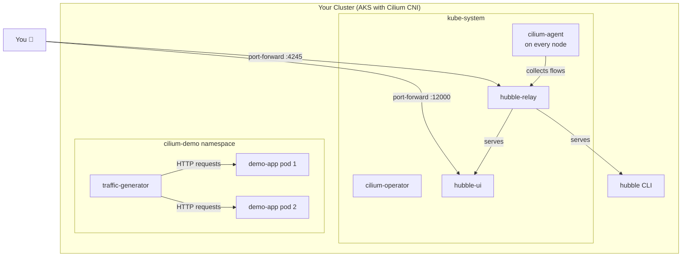
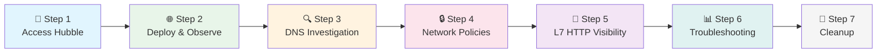
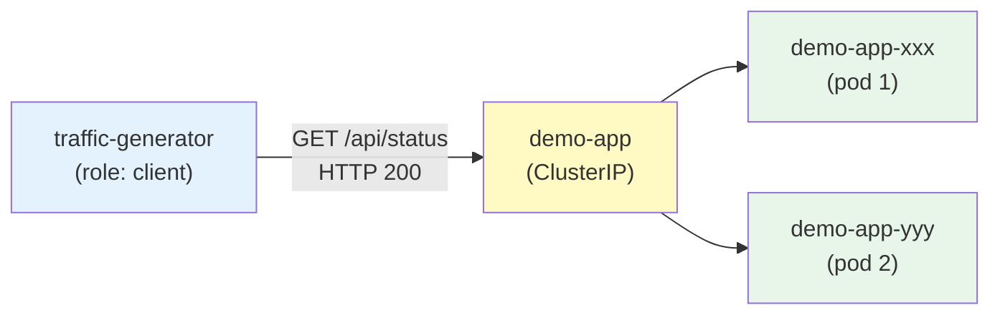
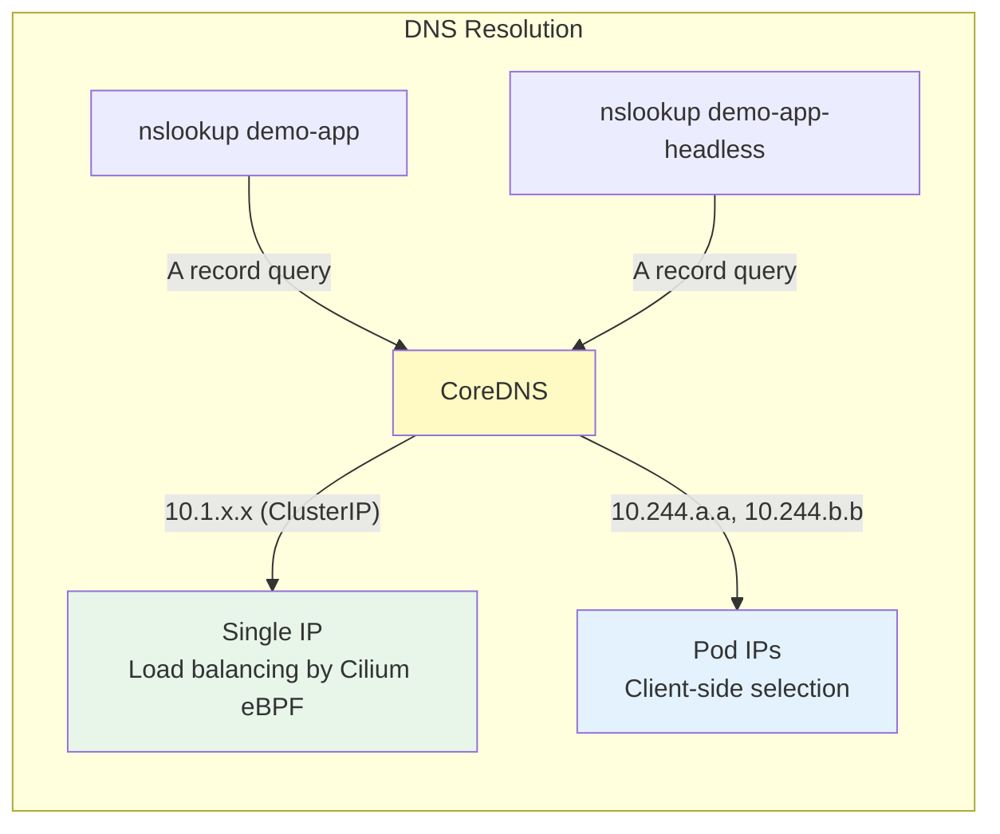
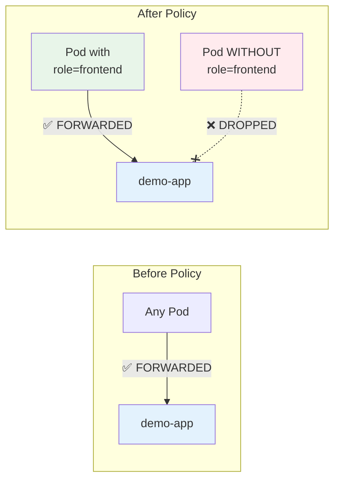
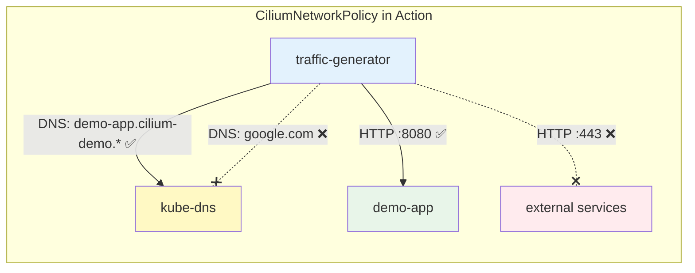

# Cilium & Hubble: See Your Kubernetes Network

Your pods talk to each other. But can you *see* what's happening? With Cilium and Hubble, you can observe every packet, every DNS query, every policy decision — and control exactly who talks to whom.

## Overview

### What is Cilium?

Cilium is an eBPF-based Container Network Interface (CNI) for Kubernetes. Instead of iptables rules, Cilium programs the Linux kernel directly using eBPF, providing:

- **High-performance networking** — packet processing in the kernel, not userspace
- **Identity-based security** — policies based on pod labels, not IP addresses
- **L7 visibility** — inspect HTTP, gRPC, DNS, and Kafka traffic
- **No kube-proxy** — eBPF replaces iptables for service load balancing

### What is Hubble?

Hubble is the observability layer built on top of Cilium. It gives you:

- **Flow logs** — every packet in and out of every pod
- **Service map** — visual graph of which services talk to each other
- **DNS visibility** — every DNS query and response
- **HTTP visibility** — method, path, response code for every request
- **Policy verdicts** — see what's allowed and what's dropped, and why

### Why Should You Care?

| Without Hubble | With Hubble |
|---------------|-------------|
| "The service is unreachable" | "DNS resolved, but the SYN packet was dropped by policy X" |
| "Something is slow" | "GET /api/status returns 200 in 2ms, POST /api/data returns 503 in 30s" |
| "Is our network secure?" | "Here's every flow, every policy decision, exportable for audit" |

### Architecture



### Tutorial Steps



### Prerequisites

- AKS cluster with Cilium as CNI (`--network-plugin cilium` or Azure CNI Powered by Cilium)
- Hubble deployed in the cluster (hubble-relay, hubble-ui services in kube-system)
- `hubble` CLI installed locally (`brew install hubble` or [install guide](https://docs.cilium.io/en/stable/gettingstarted/hubble_setup/))
- `kubectl` configured for your cluster
- Two terminal windows (one for observing, one for generating traffic)

Verify your cluster is ready:

```bash
# Check Cilium is running
kubectl get pods -n kube-system -l k8s-app=cilium
# NAME           READY   STATUS    RESTARTS   AGE
# cilium-xxxxx   1/1     Running   0          ...

# Check Hubble services exist
kubectl get svc -n kube-system | grep hubble
# hubble-peer      ClusterIP   ...   443/TCP
# hubble-relay     ClusterIP   ...   443/TCP
# hubble-ui        ClusterIP   ...   80/TCP
```

---

## 🔭 Step 1: Access Hubble (~5 minutes)

**"First, let's open our eyes to the network."**

No YAML needed for this step — just port-forwards and CLI commands.

### 1a. Open the Hubble UI

The Hubble UI gives you a real-time service map of your cluster. Port-forward to access it:

```bash
kubectl port-forward svc/hubble-ui -n kube-system 12000:80
```

Open [http://localhost:12000](http://localhost:12000) in your browser. You'll see a namespace picker and a service dependency graph. It may be empty for now — we'll generate traffic in Step 2.

### 1b. Connect the Hubble CLI

The `hubble` CLI connects to hubble-relay to query flow data. In a **separate terminal**:

```bash
# Port-forward to hubble-relay (run in background)
kubectl port-forward svc/hubble-relay -n kube-system 4245:443 &
HUBBLE_PF_PID=$!
echo "Hubble relay port-forward PID: $HUBBLE_PF_PID"
```

Test the connection:

```bash
# Check Hubble status
hubble status --server localhost:4245

# See the last 10 flows across the cluster
hubble observe --server localhost:4245 --last 10
```

You should see output like:

```
Healthcheck (via localhost:4245): Ok
Current/Max Flows: 8190/8190 (100.00%)
Flows/s: 42.13
Connected Nodes: 3/3
```

> 💡 **What you're seeing:** Every packet that enters or leaves any pod in the cluster is captured as a "flow." Hubble stores these flows in a ring buffer and lets you query them in real time. This is *not* sampling — it's every single packet.

### 1c. Explore Existing Traffic

Even before deploying our demo app, there's traffic flowing — CoreDNS queries, kube-system health checks, and more:

```bash
# Watch all traffic in kube-system (press Ctrl+C to stop)
hubble observe --server localhost:4245 -n kube-system --last 20

# See only DNS traffic
hubble observe --server localhost:4245 --type l7 --protocol DNS --last 10
```

---

## 🌐 Step 2: Deploy and Observe Traffic (~10 minutes)

**"Let's create some traffic to watch."**

### 2a. Deploy the Demo App

```bash
kubectl apply -f step-02-deploy.yaml
```

This creates:

| Resource | Name | Purpose |
|----------|------|---------|
| Namespace | `cilium-demo` | Isolated namespace for this tutorial |
| Deployment | `demo-app` (2 replicas) | Our demo web app with HTTP endpoints |
| Service | `demo-app` (ClusterIP) | Standard service — DNS returns ClusterIP |
| Service | `demo-app-headless` | Headless service — DNS returns pod IPs |
| Pod | `traffic-generator` | curl pod for sending requests |

Wait for everything to be ready:

```bash
kubectl wait --for=condition=ready pod --all -n cilium-demo --timeout=120s
kubectl get pods -n cilium-demo -o wide
```

### 2b. Generate Traffic

In **Terminal 1** — start watching flows:

```bash
hubble observe --server localhost:4245 -n cilium-demo --follow
```

In **Terminal 2** — generate some requests:

```bash
# Single request to verify connectivity
kubectl exec -n cilium-demo traffic-generator -- curl -s http://demo-app/api/status

# Continuous traffic (Ctrl+C to stop)
kubectl exec -n cilium-demo traffic-generator -- sh -c \
  'while true; do curl -s http://demo-app/api/status > /dev/null && echo "OK $(date +%T)"; sleep 0.5; done'
```

### 2c. What to Look For

Switch to **Terminal 1** where Hubble is running. You'll see flows like:

```
TIMESTAMP             SOURCE                         DESTINATION                    TYPE     VERDICT   SUMMARY
Jan  1 12:00:00.000   cilium-demo/traffic-generator   cilium-demo/demo-app-xxxxx    l3/l4    FORWARDED TCP Flags: SYN
Jan  1 12:00:00.001   cilium-demo/traffic-generator   cilium-demo/demo-app-xxxxx    l7       FORWARDED HTTP/1.1 GET http://demo-app/api/status => 200
```

Each line is a flow. The key columns:

| Column | Meaning |
|--------|---------|
| SOURCE | The pod sending the packet |
| DESTINATION | The pod receiving the packet |
| TYPE | `l3/l4` = IP/TCP level, `l7` = application level |
| VERDICT | `FORWARDED` = allowed, `DROPPED` = blocked by policy |
| SUMMARY | Protocol details (TCP flags, HTTP method/path/status) |

### 2d. View in Hubble UI

Go back to [http://localhost:12000](http://localhost:12000):

1. Select the **cilium-demo** namespace from the dropdown
2. You'll see a service map: `traffic-generator` → `demo-app`
3. Click on the arrow between them to see individual flows
4. Toggle the flow table at the bottom to see request details



> 💡 **How traffic flows:** `traffic-generator` sends a request to `demo-app` (the service name). DNS resolves this to the ClusterIP. Cilium's eBPF datapath load-balances the connection directly to one of the backend pods — no kube-proxy iptables involved. Hubble sees both the service-level and pod-level flows.

---

## 🔍 Step 3: DNS Investigation (~10 minutes)

**"Every service call starts with a DNS query. Let's see them."**

No extra YAML needed — just Hubble commands.

### 3a. Watch DNS Queries

```bash
# Watch all DNS queries in the namespace
hubble observe --server localhost:4245 -n cilium-demo --type l7 --protocol DNS --follow
```

In **Terminal 2**, trigger DNS lookups:

```bash
# Standard service lookup (returns ClusterIP)
kubectl exec -n cilium-demo traffic-generator -- nslookup demo-app.cilium-demo.svc.cluster.local

# Headless service lookup (returns individual pod IPs)
kubectl exec -n cilium-demo traffic-generator -- nslookup demo-app-headless.cilium-demo.svc.cluster.local
```

### 3b. Regular vs Headless DNS

In Hubble, you'll see the DNS queries and responses:

```
# Regular service → returns one ClusterIP
DNS Query demo-app.cilium-demo.svc.cluster.local. A
DNS Answer  demo-app.cilium-demo.svc.cluster.local. A 10.1.x.x

# Headless service → returns all pod IPs
DNS Query demo-app-headless.cilium-demo.svc.cluster.local. A
DNS Answer  demo-app-headless.cilium-demo.svc.cluster.local. A 10.244.x.x, 10.244.y.y
```



> 💡 **Why headless matters:** Our demo app uses headless services for its broadcast feature — it queries DNS for all pod IPs, then sends the same action to every replica. This is how "broadcastToAll" coordinates stress tests and probe changes across pods. Hubble lets you see exactly when and how these DNS lookups happen.

### 3c. DNS Failures

**🤔 "What happens when DNS fails? How would you know?"**

```bash
# Try a service that doesn't exist
kubectl exec -n cilium-demo traffic-generator -- nslookup non-existent.cilium-demo.svc.cluster.local

# Watch for DNS errors in Hubble
hubble observe --server localhost:4245 -n cilium-demo --type l7 --protocol DNS --last 20
```

You'll see an **NXDOMAIN** response — the DNS equivalent of "404 Not Found":

```
DNS Query  non-existent.cilium-demo.svc.cluster.local. A
DNS Answer RCode: Non-Existent Domain
```

> ⚠️ **Real-world tip:** DNS failures are one of the most common causes of service communication issues. In a microservices architecture, a typo in a service name or a missing service can cause cascading failures. Hubble makes these instantly visible — no more guessing why connections time out.

### 3d. Filtered DNS Analysis

```bash
# Only show DNS queries that returned errors
hubble observe --server localhost:4245 -n cilium-demo --type l7 --protocol DNS --verdict DROPPED --last 50

# Show DNS queries from a specific pod
hubble observe --server localhost:4245 --from-pod cilium-demo/traffic-generator --type l7 --protocol DNS --last 20
```

---

## 🔒 Step 4: Network Policies (~10 minutes)

**"Not all traffic should be allowed. Let's lock it down."**

### 4a. Verify Open Access (Before Policy)

Right now, any pod can reach any other pod. Let's prove it:

```bash
# traffic-generator (role=client) can reach demo-app via ClusterIP service (port 80→8080)
kubectl exec -n cilium-demo traffic-generator -- curl -s http://demo-app/api/status
# ✅ Returns JSON status

# Check the pod's current labels
kubectl get pod -n cilium-demo traffic-generator --show-labels
# ... role=client (NOT role=frontend)
```

### 4b. Apply the Network Policy

```bash
kubectl apply -f step-04-network-policy.yaml
```

This creates a standard Kubernetes NetworkPolicy:

```
┌──────────────────────────────────────────────────┐
│ NetworkPolicy: demo-app-ingress                  │
│                                                  │
│ Target:  pods with app=demo-app                  │
│ Action:  allow ingress ONLY from:                │
│          - pods with role=frontend                │
│          - on port 8080/TCP                      │
│                                                  │
│ Everything else → DENIED (implicit deny)         │
└──────────────────────────────────────────────────┘
```

### 4c. Test — Traffic is Now Blocked

```bash
# traffic-generator has role=client, NOT role=frontend → BLOCKED
kubectl exec -n cilium-demo traffic-generator -- curl -s --max-time 5 http://demo-app/api/status
# ❌ Connection timed out (exit code 28)
```

Watch the drops in Hubble:

```bash
hubble observe --server localhost:4245 -n cilium-demo --verdict DROPPED --follow
```

You'll see:

```
TIMESTAMP   SOURCE                          DESTINATION                  TYPE    VERDICT  SUMMARY
...         cilium-demo/traffic-generator   cilium-demo/demo-app-xxx    policy  DROPPED  TCP Flags: SYN
```

In the Hubble UI, dropped flows appear in **red** — a clear visual indicator that traffic is being blocked.

### 4d. Fix It — Add the Required Label

```bash
# Add the role=frontend label
kubectl label pod -n cilium-demo traffic-generator role=frontend --overwrite

# Verify the label
kubectl get pod -n cilium-demo traffic-generator --show-labels

# Try again → now allowed (wait ~10s for identity to propagate)
sleep 10
kubectl exec -n cilium-demo traffic-generator -- curl -s http://demo-app/api/status
# ✅ Returns JSON status
```

In Hubble, the flows change from **DROPPED** (red) to **FORWARDED** (green).

### 4e. Experiment: Remove the Label Again

```bash
# Remove the frontend label
kubectl label pod -n cilium-demo traffic-generator role-

# Traffic is blocked again (wait ~10s for identity propagation)
sleep 10
kubectl exec -n cilium-demo traffic-generator -- curl -s --max-time 5 http://demo-app/api/status
# ❌ Timed out

# Re-add it for the next steps
kubectl label pod -n cilium-demo traffic-generator role=frontend
```

> 💡 **Key insight:** Network policies are **additive** — they only *allow*. When you apply the first policy to a pod, all non-matching traffic is implicitly denied. This is the "default deny" behavior. Hubble shows you exactly which flows are dropped and which policy caused it.



---

## 🔬 Step 5: CiliumNetworkPolicy — Beyond Standard NetworkPolicy (~10 minutes)

**"Cilium can do things standard NetworkPolicies can't — like DNS-aware egress control."**

Standard Kubernetes NetworkPolicies work at L3/L4 (IP addresses and ports). CiliumNetworkPolicies add powerful features: identity-based selectors, DNS-aware rules, and on self-managed Cilium clusters, full L7 HTTP filtering.

> ⚠️ **AKS Note:** Azure CNI Powered by Cilium supports CiliumNetworkPolicy for L3/L4 and DNS rules, but does **not** support HTTP L7 rules (method/path filtering). HTTP L7 filtering requires a self-managed Cilium OSS installation. This step focuses on features that work on AKS.

### 5a. Check Prerequisites

```bash
# Verify the CiliumNetworkPolicy CRD exists
kubectl get crd ciliumnetworkpolicies.cilium.io
# If this returns an error, Cilium isn't installed — skip to Step 6
```

### 5b. Remove the Standard Policy, Apply CiliumNetworkPolicy

```bash
# Remove the standard NetworkPolicy
kubectl delete -f step-04-network-policy.yaml

# Apply CiliumNetworkPolicies (ingress + DNS-aware egress)
kubectl apply -f step-05-l7-visibility.yaml
```

This creates **two** CiliumNetworkPolicies:

**1. Ingress — `demo-app-cilium-ingress`** (same effect as Step 4, Cilium-native syntax):

```
┌──────────────────────────────────────────────────┐
│ CiliumNetworkPolicy: demo-app-cilium-ingress     │
│                                                  │
│ endpointSelector: app=demo-app                   │
│ Allow ingress from: role=frontend on port 8080   │
│ Everything else → DENIED                         │
└──────────────────────────────────────────────────┘
```

**2. Egress — `traffic-generator-egress`** (DNS-aware — a Cilium-only feature):

```
┌──────────────────────────────────────────────────┐
│ CiliumNetworkPolicy: traffic-generator-egress    │
│                                                  │
│ endpointSelector: app=traffic-generator          │
│ Allow egress:                                    │
│   - DNS to kube-dns (only *.cilium-demo.svc...)  │
│   - TCP to demo-app on port 8080                 │
│ Everything else → DENIED                         │
└──────────────────────────────────────────────────┘
```

### 5c. Test DNS-Aware Egress

Make sure traffic-generator has the `role=frontend` label (needed for ingress policy):

```bash
kubectl label pod -n cilium-demo traffic-generator role=frontend --overwrite
```

Wait for policy propagation:

```bash
sleep 10
```

Test allowed DNS and traffic:

```bash
# DNS lookup for *.cilium-demo.svc.cluster.local → ALLOWED
kubectl exec -n cilium-demo traffic-generator -- nslookup demo-app.cilium-demo.svc.cluster.local
# ✅ Returns ClusterIP

# HTTP to demo-app → ALLOWED (ingress + egress both permit)
kubectl exec -n cilium-demo traffic-generator -- curl -s --max-time 5 http://demo-app/api/status | head -c 80
# ✅ Returns JSON
```

Test blocked DNS:

```bash
# DNS lookup for external domain → BLOCKED by egress policy
kubectl exec -n cilium-demo traffic-generator -- nslookup google.com
# ❌ Timeout or REFUSED (only *.cilium-demo.svc.cluster.local is allowed)

# DNS lookup for another namespace → BLOCKED
kubectl exec -n cilium-demo traffic-generator -- nslookup kubernetes.default.svc.cluster.local
# ❌ Blocked (not matching *.cilium-demo.svc.cluster.local)
```

### 5d. Watch DNS Flows in Hubble

```bash
# Watch DNS-level flows — shows allowed and denied lookups
hubble observe --server localhost:4245 -n cilium-demo --type l7 --protocol DNS --follow
```

In another terminal, generate both allowed and blocked DNS:

```bash
# Allowed
kubectl exec -n cilium-demo traffic-generator -- nslookup demo-app.cilium-demo.svc.cluster.local

# Blocked
kubectl exec -n cilium-demo traffic-generator -- nslookup google.com 2>/dev/null || true
```

In Hubble you'll see which DNS queries are forwarded and which are dropped.

### 5e. Why CiliumNetworkPolicy?

| Feature | Standard NetworkPolicy | CiliumNetworkPolicy |
|---------|----------------------|-------------------|
| L3/L4 filtering | ✅ | ✅ |
| Identity-based (not IP) | ❌ | ✅ endpointSelector |
| DNS-aware egress | ❌ | ✅ matchPattern |
| FQDN-based egress | ❌ | ✅ toFQDNs |
| Explicit deny rules | ❌ | ✅ |
| HTTP L7 rules | ❌ | ✅ (Cilium OSS only) |

> 💡 **Why DNS-aware egress matters:** Standard NetworkPolicies can only filter by IP. But in Kubernetes, IPs change constantly. With CiliumNetworkPolicy, you can say "this pod can only resolve DNS names in its own namespace" — no IP addresses needed. Cilium tracks the DNS responses and enforces the policy at the FQDN level.



---

## 📊 Step 6: Traffic Analysis and Troubleshooting (~10 minutes)

**"Real-world debugging with Hubble."**

No YAML needed — this section is a reference for using Hubble to debug common issues.

### 6a. Useful Hubble Commands

#### Filter by Pod

```bash
# All traffic TO a specific pod
hubble observe --server localhost:4245 --to-pod cilium-demo/demo-app-xxxxx --last 20

# All traffic FROM a specific pod
hubble observe --server localhost:4245 --from-pod cilium-demo/traffic-generator --last 20

# Traffic between two specific pods
hubble observe --server localhost:4245 \
  --from-pod cilium-demo/traffic-generator \
  --to-pod cilium-demo/demo-app-xxxxx --last 20
```

#### Filter by Verdict

```bash
# Only dropped flows (policy violations)
hubble observe --server localhost:4245 -n cilium-demo --verdict DROPPED --last 50

# Only forwarded flows
hubble observe --server localhost:4245 -n cilium-demo --verdict FORWARDED --last 50
```

#### Filter by Protocol

```bash
# HTTP traffic only
hubble observe --server localhost:4245 -n cilium-demo --type l7 --protocol HTTP --last 20

# DNS queries only
hubble observe --server localhost:4245 -n cilium-demo --type l7 --protocol DNS --last 20

# TCP SYN packets (new connections)
hubble observe --server localhost:4245 -n cilium-demo --type trace --last 20
```

#### Filter by HTTP Status

```bash
# Server errors (5xx)
hubble observe --server localhost:4245 -n cilium-demo --http-status 500-599 --last 50

# Client errors (4xx)
hubble observe --server localhost:4245 -n cilium-demo --http-status 400-499 --last 50

# All non-success responses
hubble observe --server localhost:4245 -n cilium-demo --http-status 300-599 --last 50
```

#### Output Formats

```bash
# Compact one-liner per flow
hubble observe --server localhost:4245 -n cilium-demo -o compact --last 20

# JSON (for scripting/analysis)
hubble observe --server localhost:4245 -n cilium-demo -o json --last 100

# Dict format (verbose, human-readable)
hubble observe --server localhost:4245 -n cilium-demo -o dict --last 5

# Tab-separated (for piping to awk/cut)
hubble observe --server localhost:4245 -n cilium-demo -o tab --last 20
```

### 6b. Debugging Scenarios

#### Scenario: "My service is unreachable"

```bash
# Step 1: Is DNS working?
hubble observe --server localhost:4245 -n cilium-demo --type l7 --protocol DNS --last 20

# Step 2: Are connections being attempted?
hubble observe --server localhost:4245 --to-pod cilium-demo/demo-app-xxxxx --last 20

# Step 3: Are they being dropped by a policy?
hubble observe --server localhost:4245 -n cilium-demo --verdict DROPPED --last 20

# Step 4: What policy is dropping them?
# Look at the "SUMMARY" column — it shows the policy name
```

#### Scenario: "Requests are slow"

```bash
# Watch HTTP flows and look at latency
hubble observe --server localhost:4245 -n cilium-demo --type l7 --protocol HTTP -o json --last 100 | \
  grep -o '"latency_ns":[0-9]*' | sort -t: -k2 -n -r | head -10
```

#### Scenario: "DNS resolution is failing"

```bash
# Watch DNS specifically
hubble observe --server localhost:4245 -n cilium-demo --type l7 --protocol DNS --follow

# Generate a lookup and watch the response
kubectl exec -n cilium-demo traffic-generator -- nslookup demo-app.cilium-demo.svc.cluster.local

# Look for NXDOMAIN, SERVFAIL, or timeout responses
```

#### Scenario: "I applied a NetworkPolicy but traffic still flows"

```bash
# Check if the policy is applied correctly
kubectl get networkpolicies -n cilium-demo
kubectl describe networkpolicy demo-app-ingress -n cilium-demo

# Check Cilium's view of the policy
kubectl exec -n kube-system $(kubectl get pods -n kube-system -l k8s-app=cilium -o jsonpath='{.items[0].metadata.name}') \
  -- cilium-dbg endpoint list -o json | grep -A5 "policy-enabled"

# Watch for policy verdicts
hubble observe --server localhost:4245 -n cilium-demo --verdict DROPPED --follow
```

### 6c. Tracing a Request End-to-End

Follow a single request from client to server:

```bash
# Terminal 1: Watch all flows from traffic-generator
hubble observe --server localhost:4245 --from-pod cilium-demo/traffic-generator --follow

# Terminal 2: Make a single request
kubectl exec -n cilium-demo traffic-generator -- curl -s http://demo-app/api/status > /dev/null
```

In Terminal 1, you'll see the full journey:

```
1. DNS Query  → demo-app.cilium-demo.svc.cluster.local (to CoreDNS)
2. DNS Answer → 10.1.x.x (ClusterIP returned)
3. TCP SYN    → traffic-generator → demo-app-xxxxx (Cilium load-balanced to a pod)
4. TCP SYN-ACK ← demo-app-xxxxx → traffic-generator
5. HTTP GET   → /api/status (L7 flow if visibility is enabled)
6. HTTP 200   ← response
7. TCP FIN    → connection teardown
```

> 💡 **This is the superpower of Hubble.** In traditional networking, you'd need tcpdump on multiple nodes, correlating packet captures manually. Hubble gives you the full picture in one command.

---

## 🧹 Step 7: Cleanup (~1 minute)

Remove everything created during this tutorial:

```bash
# Delete the entire namespace (removes all resources)
kubectl delete namespace cilium-demo

# Or use the cleanup manifest
kubectl delete -f step-07-cleanup.yaml
```

Stop port-forwards:

```bash
# If you saved the PID
kill $HUBBLE_PF_PID 2>/dev/null

# Or find and stop all hubble port-forwards
# List port-forward processes and stop them by PID
ps aux | grep 'kubectl port-forward.*hubble' | grep -v grep
```

Verify cleanup:

```bash
# Namespace should be gone
kubectl get namespace cilium-demo
# Error from server (NotFound): namespaces "cilium-demo" not found ✅
```

---

## Quick Reference

### Hubble CLI Cheat Sheet

| Command | What it does |
|---------|-------------|
| `hubble status` | Check Hubble health and stats |
| `hubble observe --last N` | Show last N flows |
| `hubble observe --follow` | Live stream of flows |
| `hubble observe -n NAMESPACE` | Filter by namespace |
| `hubble observe --to-pod NS/POD` | Flows to a specific pod |
| `hubble observe --from-pod NS/POD` | Flows from a specific pod |
| `hubble observe --verdict DROPPED` | Only dropped flows |
| `hubble observe --type l7` | Only L7 (app-level) flows |
| `hubble observe --protocol HTTP` | Only HTTP flows |
| `hubble observe --protocol DNS` | Only DNS flows |
| `hubble observe --http-status 500-599` | Only 5xx errors |
| `hubble observe -o json` | JSON output for scripting |
| `hubble observe -o compact` | Compact one-liner format |

> 📝 All commands above assume `--server localhost:4245`. Set `HUBBLE_SERVER=localhost:4245` to avoid repeating it.

### CiliumNetworkPolicy vs NetworkPolicy

| Feature | Standard NetworkPolicy | CiliumNetworkPolicy |
|---------|-------------------|-------------------|
| L3/L4 filtering | ✅ IP + port | ✅ IP + port |
| Label-based selectors | ✅ podSelector | ✅ endpointSelector |
| Namespace selectors | ✅ namespaceSelector | ✅ fromEndpoints |
| DNS-aware egress | ❌ | ✅ matchPattern / toFQDNs |
| L7 HTTP rules | ❌ | ✅ method, path, headers (Cilium OSS) |
| L7 DNS rules | ❌ | ✅ match domain patterns |
| L7 Kafka rules | ❌ | ✅ topic, clientID |
| CIDR rules | ✅ | ✅ fromCIDR, toCIDR |
| Service-based rules | ❌ | ✅ toServices |
| Node-based rules | ❌ | ✅ fromNodes |
| Deny rules | ❌ (implicit only) | ✅ explicit deny |

**When to use which:**
- Use standard **NetworkPolicy** when you only need L3/L4 filtering and want portability across CNIs.
- Use **CiliumNetworkPolicy** when you need DNS-aware egress, identity-based selectors, or Cilium-specific features.
- For HTTP L7 rules (method/path filtering), you need self-managed Cilium OSS — AKS-managed Cilium does not support this.

### Common Debugging Scenarios

| Symptom | Hubble Command | What to Look For |
|---------|---------------|-----------------|
| Service unreachable | `--to-pod NS/POD --verdict DROPPED` | Policy drops on SYN packets |
| DNS not resolving | `--type l7 --protocol DNS` | NXDOMAIN or SERVFAIL responses |
| Intermittent 5xx | `--http-status 500-599` | Which pod is returning errors |
| Slow responses | `--type l7 --protocol HTTP -o json` | High latency_ns values |
| Policy not working | `--verdict DROPPED --follow` | Whether flows are actually being dropped |
| Connection resets | `--type trace` | TCP RST packets |

### Environment Variable Shortcut

Save typing by setting the Hubble server once:

```bash
export HUBBLE_SERVER=localhost:4245

# Now all commands work without --server flag
hubble status
hubble observe -n cilium-demo --last 10
hubble observe --verdict DROPPED --follow
```

---

## What's Next?

Now that you can see your network, try combining this with other tutorials:

- **[Bin Packing](../bin-packing/README.md):** Watch how pod scheduling creates new network flows
- **[QoS Classes](../qos/README.md):** Observe eviction events and their impact on service connectivity
- **[VPA](../vpa/README.md):** See how pod restarts during VPA updates affect in-flight requests

### Further Reading

- [Cilium Documentation](https://docs.cilium.io/)
- [Hubble Documentation](https://docs.cilium.io/en/stable/observability/)
- [CiliumNetworkPolicy Reference](https://docs.cilium.io/en/stable/security/policy/)
- [Network Policy Editor (visual)](https://editor.networkpolicy.io/)
