# Combined Autoscaling and QoS Demonstrations

## Overview

This directory contains comprehensive demonstrations that combine VPA (Vertical Pod Autoscaler), HPA (Horizontal Pod Autoscaler), and QoS (Quality of Service) classes. These examples show how to use these features together to create resilient, efficient Kubernetes applications.

## Theory: How Memory Pressure Triggers Cluster Autoscaler

Understanding the relationship between memory pressure, eviction, and cluster scaling is crucial for designing resilient applications.

```mermaid
flowchart TD
    subgraph "Initial State"
        A[Cluster Running<br/>All Nodes Healthy]
        A --> B[Pods Consuming Memory]
    end
    
    subgraph "Memory Pressure Develops"
        B --> C{Node Memory Usage<br/>> 90%?}
        C -->|No| B
        C -->|Yes| D[Node Memory Pressure]
        D --> E[Kubelet Marks Node:<br/>MemoryPressure=True]
    end
    
    subgraph "Eviction Process"
        E --> F[Kubelet Starts<br/>Eviction Manager]
        F --> G[Select Pods by QoS:<br/>BestEffort → Burstable → Guaranteed]
        G --> H[Evict Lowest Priority Pods]
        H --> I[Pod Status: Evicted]
    end
    
    subgraph "Rescheduling Attempt"
        I --> J[Deployment Controller<br/>Detects Pod Failure]
        J --> K[Create Replacement Pod]
        K --> L[Scheduler Attempts<br/>to Place Pod]
        L --> M{Available Node<br/>with Memory?}
    end
    
    subgraph "Cluster Autoscaler Triggered"
        M -->|No Suitable Node| N[Pod Status: Pending<br/>Reason: Insufficient Memory]
        N --> O[Cluster Autoscaler<br/>Monitors Pending Pods]
        O --> P{Pod Unschedulable<br/>for > 30s?}
        P -->|No| O
        P -->|Yes| Q[Autoscaler Evaluates<br/>Node Group Capacity]
        
        Q --> R{Can Add Node<br/>Within Limits?}
        R -->|No: Max Nodes Reached| S[Pod Remains Pending<br/>Alert Required]
        R -->|Yes| T[Provision New Node<br/>via Cloud Provider]
        
        T --> U[New Node Joins Cluster]
        U --> V[Node Reports Ready]
        V --> W[Scheduler Places<br/>Pending Pods on New Node]
        W --> X[Pods Start Successfully]
    end
    
    subgraph "Successful Scheduling"
        M -->|Yes: Node Found| Y[Pod Scheduled<br/>on Existing Node]
        Y --> X
    end
    
    subgraph "Preventing Future Pressure"
        X --> Z{Monitor Memory Trends}
        Z --> AA{Memory Usage<br/>Consistently High?}
        AA -->|Yes| AB[Consider:<br/>- Increase requests with VPA<br/>- Scale out with HPA<br/>- Add more nodes]
        AA -->|No| AC[System Stable]
    end
```



**How Memory Pressure Leads to Scale-Out:**

1. **High Memory Usage** → Pods consume most available memory on nodes
2. **Memory Pressure** → Kubelet detects memory below threshold
3. **Eviction** → Low-priority pods evicted to free memory
4. **Rescheduling** → Evicted pods need new placement
5. **No Capacity** → No existing node has sufficient memory
6. **Pending Pods** → Pods stuck in Pending state
7. **Autoscaler Triggers** → Cluster Autoscaler detects unschedulable pods
8. **New Node Added** → Cloud provider provisions additional node
9. **Pods Scheduled** → Pending pods placed on new node

### Combining OOMKill, Eviction, and Autoscaling

This diagram shows how these mechanisms work together in a complex scenario.

```mermaid
flowchart TD
    subgraph "Scenario Start"
        A[Production Workload<br/>Multiple Pods on Node]
        A --> B[Memory Leak in Application]
    end
    
    subgraph "Stage 1: OOMKill"
        B --> C[Pod Memory Usage<br/>Approaches Limit]
        C --> D{Memory Usage ><br/>Container Limit?}
        D -->|Yes| E[Linux OOM Killer<br/>Kills Container Process]
        E --> F[Container Status: OOMKilled<br/>Exit Code 137]
        F --> G[Kubelet Restarts Container]
        G --> H[Container Restarts on Same Node]
        H --> I{Memory Leak<br/>Still Present?}
        I -->|Yes| C
        I -->|No| J[Pod Running Stable]
    end
    
    subgraph "Stage 2: CrashLoopBackOff"
        C --> K[Restart Count Increases<br/>1, 2, 3, 4, 5...]
        K --> L[Pod Status:<br/>CrashLoopBackOff]
        L --> M[Backoff Delay:<br/>10s → 20s → 40s → 80s → 160s → 300s]
        M --> N{Node Has Enough<br/>Memory for Restart?}
        N -->|Yes| O[Keep Attempting Restarts<br/>on Same Node]
        O --> C
    end
    
    subgraph "Stage 3: Node Memory Pressure"
        N -->|No| P[Node Total Memory Usage<br/>> 90%]
        P --> Q[Multiple Pods Consuming Memory]
        Q --> R[Node Memory Available<br/>< 100Mi Threshold]
        R --> S[Kubelet Detects<br/>MemoryPressure=True]
    end
    
    subgraph "Stage 4: Eviction"
        S --> T[Kubelet Eviction Manager<br/>Selects Victims]
        T --> U{Evaluate Pods by QoS}
        U -->|1st Priority| V[BestEffort Pods<br/>No resource requests]
        U -->|2nd Priority| W[Burstable Pods<br/>Exceeding requests]
        U -->|3rd Priority| X[Burstable Pods<br/>Within requests]
        U -->|Last Resort| Y[Guaranteed Pods<br/>Requests == Limits]
        
        V --> Z[Evict BestEffort Pods]
        W --> AA[Evict Burstable Pods]
        X --> AA
        Y --> AB[Evict Guaranteed Pods<br/>if Necessary]
        
        Z --> AC[Pods Evicted<br/>Status: Failed/Evicted]
        AA --> AC
        AB --> AC
    end
    
    subgraph "Stage 5: Rescheduling"
        AC --> AD[ReplicaSet/Deployment<br/>Controller Notices Missing Pod]
        AD --> AE[Create New Pod Instance]
        AE --> AF[Scheduler Evaluates Placement]
        AF --> AG{Find Node with<br/>Available Memory?}
    end
    
    subgraph "Stage 6: HPA Scales Out"
        L --> AH[HPA Monitors Metrics]
        AH --> AI{CPU/Memory Utilization<br/>> Target?}
        AI -->|Yes| AJ[HPA Increases Replicas]
        AJ --> AK[Deploy Additional Pods]
        AK --> AL[More Pods = More Memory Demand]
        AL --> P
    end
    
    subgraph "Stage 7: Cluster Autoscaler"
        AG -->|No Available Node| AM[Pods Status: Pending<br/>Insufficient Memory]
        AM --> AN[Cluster Autoscaler<br/>Polls for Pending Pods]
        AN --> AO{Pending > 30s?}
        AO -->|Yes| AP[Calculate Required Capacity]
        AP --> AQ{Within Node Group<br/>Max Limits?}
        
        AQ -->|No| AR[Alert: Cannot Scale<br/>Manual Intervention Needed]
        AQ -->|Yes| AS[Request New Node<br/>from Cloud Provider]
        
        AS --> AT[Cloud Provider<br/>Provisions VM]
        AT --> AU[New Node Boots<br/>Joins Cluster]
        AU --> AV[Node Registers<br/>Status: Ready]
        AV --> AW[Available Capacity<br/>Published]
    end
    
    subgraph "Stage 8: Resolution"
        AW --> AX[Scheduler Places<br/>Pending Pods]
        AG -->|Yes: Found Node| AX
        AX --> AY[Pods Start on<br/>Nodes with Memory]
        AY --> AZ{Memory Leak<br/>Fixed?}
        
        AZ -->|No| BA[Cycle Continues<br/>More OOMKills]
        AZ -->|Yes| BB[System Stabilizes]
        
        BB --> BC[VPA Recommendations<br/>Adjust Memory Requests]
        BC --> BD[Right-sized Pods<br/>Reduced Pressure]
        BD --> BE[Cluster Healthy]
    end
    
    subgraph "Lessons Learned"
        BF["Prevention Strategy:<br/>1. VPA to right-size memory<br/>2. HPA for horizontal scaling<br/>3. Guaranteed QoS for critical pods<br/>4. Memory limits to prevent runaway<br/>5. Cluster autoscaler for capacity<br/>6. Proper monitoring and alerts"]
    end
```



**Key Takeaways:**

1. **OOMKill** happens when containers exceed their memory limits
2. **CrashLoopBackOff** occurs when containers repeatedly fail to start
3. **Eviction** removes pods when nodes have memory pressure
4. **HPA** can worsen pressure by adding more replicas
5. **Cluster Autoscaler** adds nodes when pods can't be scheduled
6. **VPA** helps prevent issues by right-sizing memory requests

**Real-World Example:**

```
Timeline of events:
00:00 - Application deployed with 256Mi memory limit
00:15 - Memory leak causes gradual memory growth
00:30 - Container hits 256Mi limit → OOMKilled
00:31 - Kubelet restarts container on same node
00:45 - Container OOMKilled again (leak still present)
01:00 - Pod in CrashLoopBackOff (3 restarts)
01:15 - Node memory usage reaches 92% (pressure threshold)
01:16 - Kubelet evicts BestEffort pods to free memory
01:17 - Evicted pods need rescheduling
01:18 - No nodes have sufficient memory → Pods Pending
01:20 - Cluster Autoscaler detects pending pods for 30s+
01:25 - New node provisioned by cloud provider
01:30 - Pods scheduled on new node
01:35 - VPA recommends increasing memory to 512Mi
01:40 - Deploy with VPA recommendations
01:45 - System stable with appropriate resources
```

## Key Concepts Integration

### 1. HPA + Guaranteed QoS
- **Use Case:** Critical, CPU-bound workloads
- **Strategy:** Scale replicas horizontally based on CPU utilization
- **QoS:** Guaranteed (requests == limits) for highest eviction priority
- **Example:** Frontend web servers, API gateways

### 2. VPA + Burstable QoS
- **Use Case:** Memory-intensive workloads with variable usage patterns
- **Strategy:** Adjust memory requests vertically based on actual usage
- **QoS:** Burstable (requests < limits) for flexibility
- **Example:** Backend services, data processors

### 3. BestEffort QoS
- **Use Case:** Non-critical, batch workloads
- **Strategy:** No autoscaling, runs with available resources
- **QoS:** BestEffort (no requests/limits) for lowest priority
- **Example:** Background jobs, batch processing

## Quick Start

```bash
# Deploy complete demonstration
kubectl apply -f k8s/combined/step-03-complete-demo.yaml

# View all pods with their QoS classes
kubectl get pods -n autoscaling-demo -o custom-columns=\
'NAME:.metadata.name,QOS:.status.qosClass,PRIORITY:.spec.priorityClassName'

# Check autoscaling resources
kubectl get hpa,vpa -n autoscaling-demo

# Cleanup
kubectl delete -f k8s/combined/step-03-complete-demo.yaml
```

## Demonstrations

### Step 1: HPA with Guaranteed QoS

Deploy a critical frontend service that scales horizontally based on CPU load while maintaining guaranteed resources.

```bash
kubectl apply -f k8s/combined/step-01-hpa-with-guaranteed-qos.yaml
```

**Features:**
- Guaranteed QoS (requests == limits)
- HPA with CPU target of 60%
- Fast scale-up (100% increase or 2 pods per 30s)
- Conservative scale-down (50% decrease per 60s, 120s stabilization)
- Min 2 replicas, max 10 replicas

**Testing:**
```bash
# Port-forward to service
kubectl port-forward -n autoscaling-demo svc/frontend-guaranteed 8080:80

# Generate CPU load
curl -X POST http://localhost:8080/api/stress/cpu \
  -H "Content-Type: application/json" \
  -d '{"minutes": 5, "threads": 8}'

# Watch HPA scaling
kubectl get hpa -n autoscaling-demo -w
```

### Step 2: VPA with Burstable QoS

Deploy a backend service that adjusts memory requests based on usage while allowing bursts.

```bash
kubectl apply -f k8s/combined/step-02-vpa-with-burstable-qos.yaml
```

**Features:**
- Burstable QoS (requests < limits)
- VPA controls memory resources only
- Auto update mode (recreates pods when needed)
- Min 128Mi, max 2Gi memory
- 3 replicas for redundancy during VPA updates

**Testing:**
```bash
# Port-forward to service
kubectl port-forward -n autoscaling-demo svc/backend-burstable 8080:80

# Generate memory load
curl -X POST http://localhost:8080/api/stress/memory \
  -H "Content-Type: application/json" \
  -d '{"minutes": 10, "targetMegabytes": 600}'

# Check VPA recommendations
kubectl describe vpa -n autoscaling-demo backend-burstable-vpa
```

### Step 3: Complete Demo (All Together)

Deploy all three workload types demonstrating different QoS classes with appropriate autoscaling strategies.

```bash
kubectl apply -f k8s/combined/step-03-complete-demo.yaml
```

**Architecture:**
```
┌─────────────────────────────────────────────────────────────┐
│                    Autoscaling Demo                          │
├─────────────────────────────────────────────────────────────┤
│                                                               │
│  Critical Frontend (Guaranteed + HPA)                        │
│  ├─ QoS: Guaranteed (500m CPU = 500m, 512Mi = 512Mi)       │
│  ├─ Priority: High (1000000)                                 │
│  ├─ Autoscaling: HPA CPU-based (60% target)                 │
│  └─ Replicas: 2-10                                           │
│                                                               │
│  Standard Backend (Burstable + VPA)                          │
│  ├─ QoS: Burstable (200m-1 CPU, 256Mi-1Gi)                 │
│  ├─ Priority: Medium (500000)                                │
│  ├─ Autoscaling: VPA memory-based                           │
│  └─ Replicas: 3 (fixed)                                      │
│                                                               │
│  Batch Worker (BestEffort, no autoscaling)                   │
│  ├─ QoS: BestEffort (no requests/limits)                    │
│  ├─ Priority: Low (100000)                                   │
│  ├─ Autoscaling: None                                        │
│  └─ Replicas: 2 (fixed)                                      │
│                                                               │
└─────────────────────────────────────────────────────────────┘
```

**View all resources:**
```bash
# List all deployments with QoS
kubectl get deployments -n autoscaling-demo -o custom-columns=\
'NAME:.metadata.name,REPLICAS:.spec.replicas,QOS:.metadata.labels.qos,TIER:.metadata.labels.tier'

# View autoscaling configurations
kubectl get hpa,vpa -n autoscaling-demo

# Check priority classes
kubectl get priorityclass
```

**Testing Eviction Priority:**
```bash
# Generate memory pressure on all tiers
# BestEffort pods will be evicted first

# Port-forward to each service (in separate terminals)
kubectl port-forward -n autoscaling-demo svc/critical-frontend 8081:80 &
kubectl port-forward -n autoscaling-demo svc/standard-backend 8082:80 &
kubectl port-forward -n autoscaling-demo svc/batch-worker 8083:80 &

# Apply memory stress to all
curl -X POST http://localhost:8083/api/stress/memory \
  -H "Content-Type: application/json" \
  -d '{"minutes": 10, "targetMegabytes": 500}'  # BestEffort

curl -X POST http://localhost:8082/api/stress/memory \
  -H "Content-Type: application/json" \
  -d '{"minutes": 10, "targetMegabytes": 700}'  # Burstable

curl -X POST http://localhost:8081/api/stress/memory \
  -H "Content-Type: application/json" \
  -d '{"minutes": 10, "targetMegabytes": 400}'  # Guaranteed

# Monitor evictions
kubectl get pods -n autoscaling-demo -w
kubectl get events -n autoscaling-demo --sort-by='.lastTimestamp' | grep -i evict
```

### Step 4: Cleanup

```bash
kubectl delete -f k8s/combined/step-03-complete-demo.yaml
```

## Best Practices

### 1. **Never use VPA + HPA on the same resource**

❌ **Bad:**
```yaml
# Both targeting CPU on same deployment
HPA: cpu target 60%
VPA: controlledResources: [cpu, memory]
```

✅ **Good:**
```yaml
# HPA for CPU, VPA for memory
HPA: cpu target 60%
VPA: controlledResources: [memory]
```

Or separate entirely:
```yaml
# Different deployments
frontend: HPA only (CPU-bound)
backend: VPA only (memory-bound)
```

### 2. **Match QoS to workload criticality**

```yaml
# Critical services → Guaranteed
critical-api:
  priorityClassName: high-priority
  resources:
    requests: {cpu: 1, memory: 1Gi}
    limits: {cpu: 1, memory: 1Gi}

# Standard services → Burstable
standard-app:
  priorityClassName: medium-priority
  resources:
    requests: {cpu: 200m, memory: 256Mi}
    limits: {cpu: 2, memory: 2Gi}

# Batch jobs → BestEffort
batch-job:
  priorityClassName: low-priority
  resources: {}
```

### 3. **Use appropriate HPA behavior**

```yaml
# Fast scale-up for responsive services
behavior:
  scaleUp:
    stabilizationWindowSeconds: 30
    policies:
      - type: Percent
        value: 100  # Double replicas
        periodSeconds: 30

# Slow scale-down to prevent flapping
  scaleDown:
    stabilizationWindowSeconds: 300  # 5 minute observation
    policies:
      - type: Percent
        value: 50  # Reduce by half
        periodSeconds: 60
```

### 4. **Set VPA bounds appropriately**

```yaml
resourcePolicy:
  containerPolicies:
    - containerName: app
      minAllowed:
        memory: "256Mi"  # Prevent too-small requests
      maxAllowed:
        memory: "2Gi"    # Prevent runaway growth
```

### 5. **Use PodDisruptionBudgets with autoscaling**

```yaml
apiVersion: policy/v1
kind: PodDisruptionBudget
metadata:
  name: frontend-pdb
spec:
  minAvailable: 1  # Always keep at least 1 replica
  selector:
    matchLabels:
      app: critical-frontend
```

## Monitoring

### View Autoscaling Status

```bash
# HPA status
kubectl get hpa -n autoscaling-demo -w

# VPA recommendations
kubectl describe vpa -n autoscaling-demo

# Resource usage
kubectl top pods -n autoscaling-demo

# Events
kubectl get events -n autoscaling-demo --sort-by='.lastTimestamp'
```

### Key Metrics to Monitor

1. **HPA:**
   - Current replicas vs desired replicas
   - Current CPU/memory utilization vs target
   - Scale up/down events

2. **VPA:**
   - Current requests vs recommendations
   - Recommendation confidence
   - Pod restart frequency

3. **QoS:**
   - Eviction events by QoS class
   - Node memory pressure
   - OOMKilled events

## Troubleshooting

### HPA Not Scaling

```bash
# Check metrics server
kubectl get pods -n kube-system -l k8s-app=metrics-server

# Verify resource requests are set
kubectl describe deployment -n autoscaling-demo | grep -A 5 "Requests:"

# Check HPA status
kubectl describe hpa -n autoscaling-demo
```

### VPA Not Updating Pods

```bash
# Check VPA status
kubectl describe vpa -n autoscaling-demo

# Verify updateMode is not "Off"
kubectl get vpa -n autoscaling-demo -o yaml | grep updateMode

# Check for conflicting HPA
kubectl get hpa -n autoscaling-demo
```

### Unexpected Evictions

```bash
# Check node conditions
kubectl describe nodes | grep -A 5 "Conditions:"

# View eviction events
kubectl get events --all-namespaces --field-selector reason=Evicted

# Check resource pressure
kubectl top nodes
```

## Additional Resources

- [HPA Documentation](https://kubernetes.io/docs/tasks/run-application/horizontal-pod-autoscale/)
- [VPA Documentation](https://github.com/kubernetes/autoscaler/tree/master/vertical-pod-autoscaler)
- [QoS Classes](https://kubernetes.io/docs/tasks/configure-pod-container/quality-service-pod/)
- [Resource Management Best Practices](https://kubernetes.io/docs/concepts/configuration/manage-resources-containers/)
