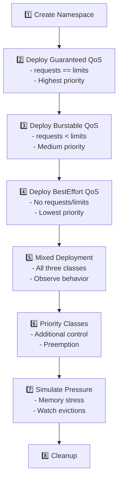

# Quality of Service (QoS) and Eviction Priority Tutorial

## Overview

This tutorial demonstrates Kubernetes Quality of Service (QoS) classes and how they determine pod eviction priority when nodes experience resource pressure. Understanding QoS is critical for designing resilient applications that handle resource constraints gracefully.

## Prerequisites

- Kubernetes cluster with sufficient resources
- `kubectl` access to the cluster
- The k8s-demo-app image available in your registry
- Ability to create resource pressure (or use the stress endpoints)

## QoS Classes

Kubernetes assigns one of three QoS classes to every pod based on resource requests and limits:

### 1. **Guaranteed** (Highest Priority)
- **Criteria:** All containers have CPU and memory requests **equal** to limits
- **Eviction:** Evicted **last** under memory pressure
- **Use Case:** Critical services, databases, stateful applications

### 2. **Burstable** (Medium Priority)
- **Criteria:** At least one container has CPU or memory request, but requests ≠ limits
- **Eviction:** Evicted **second**, after BestEffort but before Guaranteed
- **Use Case:** Standard web applications, API services with variable load

### 3. **BestEffort** (Lowest Priority)
- **Criteria:** No CPU or memory requests or limits specified
- **Eviction:** Evicted **first** under memory pressure
- **Use Case:** Batch jobs, non-critical background tasks, development workloads

## Eviction Priority

When a node runs out of memory, the kubelet evicts pods in this order:

1. **BestEffort pods** (lowest priority)
2. **Burstable pods** exceeding requests (by usage percentage)
3. **Burstable pods** within requests
4. **Guaranteed pods** (highest priority, evicted last)

Within the same QoS class, pods using more memory relative to their requests are evicted first.

## Lab Flow



## Step-by-Step Guide

### 1. Deploy Guaranteed QoS (10 min)

Deploy pods with Guaranteed QoS class:

```bash
kubectl apply -f k8s/qos/step-01-guaranteed-qos.yaml
```

Verify the QoS class:

```bash
kubectl get pods -n qos-demo -l qos-class=guaranteed
kubectl describe pod -n qos-demo -l qos-class=guaranteed | grep "QoS Class"
```

**Expected Output:**
```
QoS Class:       Guaranteed
```

**Key Characteristics:**
- CPU request: 500m, CPU limit: 500m (equal)
- Memory request: 512Mi, Memory limit: 512Mi (equal)

### 2. Deploy Burstable QoS (10 min)

Deploy pods with Burstable QoS class:

```bash
kubectl apply -f k8s/qos/step-02-burstable-qos.yaml
```

Verify the QoS class:

```bash
kubectl get pods -n qos-demo -l qos-class=burstable
kubectl describe pod -n qos-demo -l qos-class=burstable | grep "QoS Class"
```

**Expected Output:**
```
QoS Class:       Burstable
```

**Key Characteristics:**
- CPU request: 200m, CPU limit: 1 (not equal)
- Memory request: 256Mi, Memory limit: 1Gi (not equal)

### 3. Deploy BestEffort QoS (10 min)

Deploy pods with BestEffort QoS class:

```bash
kubectl apply -f k8s/qos/step-03-besteffort-qos.yaml
```

Verify the QoS class:

```bash
kubectl get pods -n qos-demo -l qos-class=besteffort
kubectl describe pod -n qos-demo -l qos-class=besteffort | grep "QoS Class"
```

**Expected Output:**
```
QoS Class:       BestEffort
```

**Key Characteristics:**
- No CPU or memory requests
- No CPU or memory limits

### 4. Mixed QoS Deployment (15 min)

Deploy all three QoS classes simultaneously to observe their interaction:

```bash
kubectl apply -f k8s/qos/step-04-mixed-qos-eviction-demo.yaml
```

List all pods with their QoS classes:

```bash
kubectl get pods -n qos-demo -o custom-columns=\
NAME:.metadata.name,\
QOS:.status.qosClass,\
CPU_REQ:.spec.containers[0].resources.requests.cpu,\
MEM_REQ:.spec.containers[0].resources.requests.memory,\
CPU_LIM:.spec.containers[0].resources.limits.cpu,\
MEM_LIM:.spec.containers[0].resources.limits.memory
```

**Expected Output:**
```
NAME                           QOS          CPU_REQ   MEM_REQ   CPU_LIM   MEM_LIM
besteffort-qos-xxx            BestEffort   <none>    <none>    <none>    <none>
burstable-qos-xxx             Burstable    200m      256Mi     1         1Gi
guaranteed-qos-xxx            Guaranteed   500m      512Mi     500m      512Mi
```

### 5. Priority Classes (15 min)

Deploy pods with PriorityClasses for additional eviction control:

```bash
kubectl apply -f k8s/qos/step-05-priority-classes.yaml
```

View the priority classes:

```bash
kubectl get priorityclass
```

Check pod priorities:

```bash
kubectl get pods -n qos-demo -o custom-columns=\
NAME:.metadata.name,\
PRIORITY:.spec.priorityClassName,\
QOS:.status.qosClass,\
VALUE:.spec.priority
```

**Understanding Priority:**
- **High Priority (1000000) + Guaranteed QoS** = Maximum protection
- **Low Priority (100000) + BestEffort QoS** = First to be evicted/preempted

### 6. Simulate Resource Pressure (25 min)

Generate memory pressure to observe eviction behavior:

```bash
# Port-forward to each service
kubectl port-forward -n qos-demo svc/besteffort-qos 8081:80 &
kubectl port-forward -n qos-demo svc/burstable-qos 8082:80 &
kubectl port-forward -n qos-demo svc/guaranteed-qos 8083:80 &
```

Trigger memory stress on all pods:

```bash
# BestEffort pods - will consume unbounded memory
curl -X POST http://localhost:8081/api/stress/memory \
  -H "Content-Type: application/json" \
  -d '{"minutes": 10, "targetMegabytes": 800}'

# Burstable pods - will try to burst beyond requests
curl -X POST http://localhost:8082/api/stress/memory \
  -H "Content-Type: application/json" \
  -d '{"minutes": 10, "targetMegabytes": 600}'

# Guaranteed pods - stay within limits
curl -X POST http://localhost:8083/api/stress/memory \
  -H "Content-Type: application/json" \
  -d '{"minutes": 10, "targetMegabytes": 400}'
```

**Monitor Evictions:**

Watch for pod evictions and OOMKilled events:

```bash
# Watch pod status
kubectl get pods -n qos-demo -w

# Check eviction events
kubectl get events -n qos-demo --sort-by='.lastTimestamp' | grep -i evict

# Check for OOM kills
kubectl get events -n qos-demo --sort-by='.lastTimestamp' | grep -i oom
```

**Expected Behavior:**
1. BestEffort pods evicted first (or OOMKilled)
2. Burstable pods evicted second if pressure continues
3. Guaranteed pods remain running (evicted last resort)

### 7. Analyze Node Conditions (10 min)

Check node memory pressure and eviction thresholds:

```bash
# View node conditions
kubectl describe nodes | grep -A 10 "Conditions:"

# Check for MemoryPressure condition
kubectl get nodes -o custom-columns=\
NAME:.metadata.name,\
MEMORY_PRESSURE:.status.conditions[?(@.type==\"MemoryPressure\")].status

# View kubelet eviction thresholds
kubectl get --raw "/api/v1/nodes/<node-name>/proxy/configz" | grep -i eviction
```

### 8. Cleanup (5 min)

Remove all QoS demo resources:

```bash
kubectl delete -f k8s/qos/step-05-priority-classes.yaml
kubectl delete -f k8s/qos/step-04-mixed-qos-eviction-demo.yaml
kubectl delete namespace qos-demo
```

## Key Concepts

### Resource Accounting

```yaml
# Guaranteed: requests == limits for ALL resources
resources:
  requests:
    cpu: "500m"
    memory: "512Mi"
  limits:
    cpu: "500m"      # Must equal request
    memory: "512Mi"  # Must equal request

# Burstable: requests < limits (or only requests specified)
resources:
  requests:
    cpu: "200m"
    memory: "256Mi"
  limits:
    cpu: "1"         # Greater than request
    memory: "1Gi"    # Greater than request

# BestEffort: no requests or limits
resources: {}
```

### Eviction Signals

The kubelet monitors these signals to trigger evictions:

- `memory.available` - Available memory on the node
- `nodefs.available` - Available disk space on node filesystem
- `nodefs.inodesFree` - Available inodes on node filesystem
- `imagefs.available` - Available disk space on image filesystem

### Eviction Thresholds

Default soft eviction thresholds:
- `memory.available < 100Mi`
- `nodefs.available < 10%`

Hard eviction happens immediately, soft eviction has grace periods.

## Best Practices

### 1. **Critical Workloads → Guaranteed QoS**
```yaml
# Always use Guaranteed for:
# - Databases
# - State stores
# - Critical API services

resources:
  requests:
    memory: "2Gi"
    cpu: "1"
  limits:
    memory: "2Gi"
    cpu: "1"
```

### 2. **Standard Services → Burstable QoS**
```yaml
# Use Burstable for:
# - Web applications
# - API services
# - Worker processes

resources:
  requests:
    memory: "512Mi"
    cpu: "500m"
  limits:
    memory: "1Gi"
    cpu: "2"
```

### 3. **Batch Jobs → BestEffort QoS**
```yaml
# Use BestEffort only for:
# - Development environments
# - Non-critical batch jobs
# - Background tasks that can be interrupted

resources: {}
```

### 4. **Combine with Priority Classes**
```yaml
# Critical production workload
spec:
  priorityClassName: high-priority
  containers:
  - name: app
    resources:
      requests:
        memory: "1Gi"
        cpu: "500m"
      limits:
        memory: "1Gi"
        cpu: "500m"
```

### 5. **Use Pod Disruption Budgets (PDBs)**
```yaml
apiVersion: policy/v1
kind: PodDisruptionBudget
metadata:
  name: critical-app-pdb
spec:
  minAvailable: 1
  selector:
    matchLabels:
      app: critical-app
```

## Troubleshooting

### Pod Evicted Unexpectedly

```bash
# Check pod events for eviction reason
kubectl describe pod <pod-name> -n <namespace>

# Look for these reasons:
# - Evicted: Node was under memory pressure
# - OOMKilled: Container exceeded memory limit
# - NodeNotReady: Node became unready
```

### Understanding Eviction Events

```bash
# View all eviction events
kubectl get events --all-namespaces --field-selector reason=Evicted

# Detailed event information
kubectl get events -n <namespace> -o json | jq '.items[] | select(.reason=="Evicted")'
```

### Checking Resource Usage

```bash
# Node resource usage
kubectl top nodes

# Pod resource usage
kubectl top pods -n qos-demo

# Container resource usage (detailed)
kubectl describe pod <pod-name> -n qos-demo | grep -A 5 "Containers:"
```

## Common Scenarios

### Scenario 1: Out of Memory (OOM)
- **Guaranteed Pod:** Killed if exceeds limit, restarted by kubelet
- **Burstable Pod:** Evicted or killed if exceeds limit or node has pressure
- **BestEffort Pod:** First to be evicted when node has memory pressure

### Scenario 2: Node Disk Pressure
- Same eviction order applies (BestEffort → Burstable → Guaranteed)
- Check disk usage: `kubectl describe node | grep -A 5 "Allocatable:"`

### Scenario 3: CPU Throttling
- CPU limits cause throttling, not eviction
- Monitor: `kubectl top pods` and check CPU usage vs limits
- BestEffort pods can use all available CPU (no limit)

## Additional Resources

- [Kubernetes QoS Classes](https://kubernetes.io/docs/tasks/configure-pod-container/quality-service-pod/)
- [Node-pressure Eviction](https://kubernetes.io/docs/concepts/scheduling-eviction/node-pressure-eviction/)
- [Pod Priority and Preemption](https://kubernetes.io/docs/concepts/scheduling-eviction/pod-priority-preemption/)
- [Resource Management](https://kubernetes.io/docs/concepts/configuration/manage-resources-containers/)
