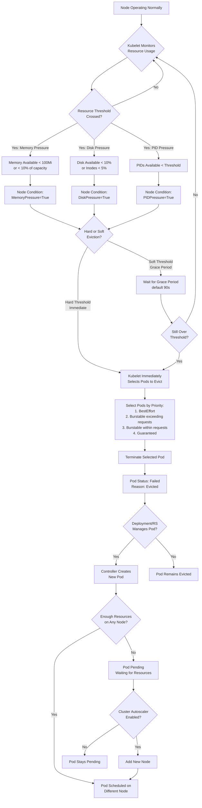
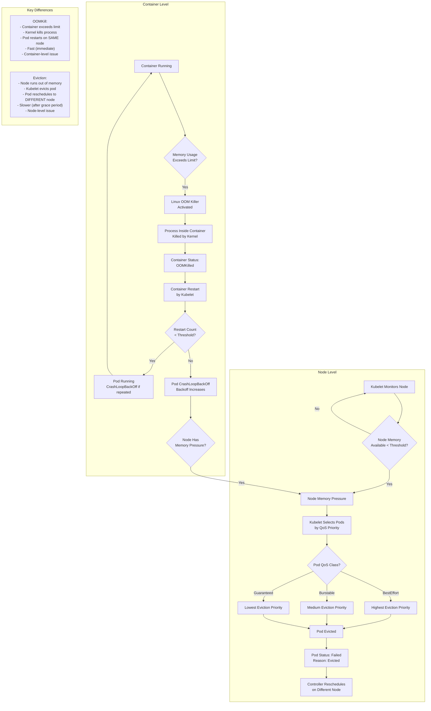
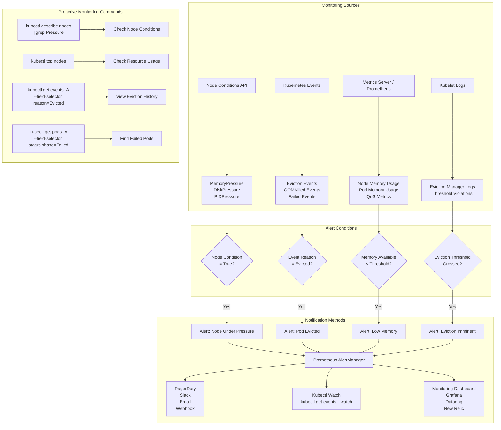
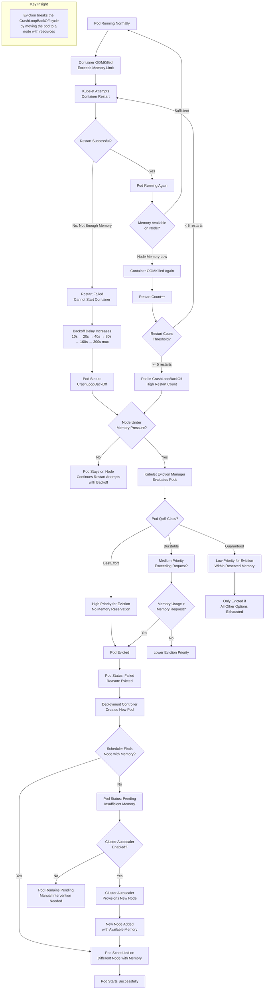
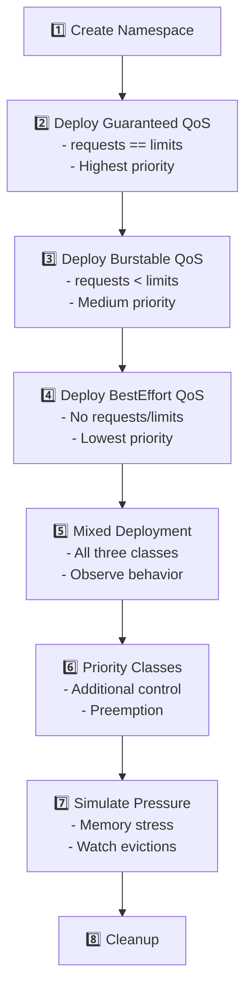
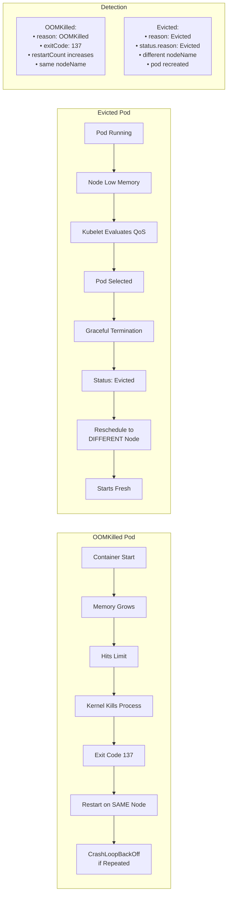

# Quality of Service (QoS) and Eviction Priority Tutorial

## Overview

This tutorial demonstrates Kubernetes Quality of Service (QoS) classes and how they determine pod eviction priority when nodes experience resource pressure. Understanding QoS is critical for designing resilient applications that handle resource constraints gracefully.

## Prerequisites

- Kubernetes cluster with sufficient resources
- `kubectl` access to the cluster
- The k8s-demo-app image available in your registry
- Ability to create resource pressure (or use the stress endpoints)

## QoS Classes

Kubernetes assigns one of three QoS classes to every pod based on resource requests and limits:

### 1. **Guaranteed** (Highest Priority)
- **Criteria:** All containers have CPU and memory requests **equal** to limits
- **Eviction:** Evicted **last** under memory pressure
- **Use Case:** Critical services, databases, stateful applications

### 2. **Burstable** (Medium Priority)
- **Criteria:** At least one container has CPU or memory request, but requests ≠ limits
- **Eviction:** Evicted **second**, after BestEffort but before Guaranteed
- **Use Case:** Standard web applications, API services with variable load

### 3. **BestEffort** (Lowest Priority)
- **Criteria:** No CPU or memory requests or limits specified
- **Eviction:** Evicted **first** under memory pressure
- **Use Case:** Batch jobs, non-critical background tasks, development workloads

## Eviction Priority

When a node runs out of memory, the kubelet evicts pods in this order:

1. **BestEffort pods** (lowest priority)
2. **Burstable pods** exceeding requests (by usage percentage)
3. **Burstable pods** within requests
4. **Guaranteed pods** (highest priority, evicted last)

Within the same QoS class, pods using more memory relative to their requests are evicted first.

## Theory: How Kubernetes Eviction Works

### When and Why Kubernetes Evicts Pods

Kubernetes evicts pods when nodes experience resource pressure to protect node stability and prevent system-wide failures.



**Key Eviction Triggers:**
- **Memory Pressure:** `memory.available < 100Mi` (hard) or `memory.available < 10%` (soft)
- **Disk Pressure:** `nodefs.available < 10%` or `imagefs.available < 15%`
- **PID Pressure:** Available PIDs below threshold
- **Inode Pressure:** `nodefs.inodesFree < 5%`

### OOMKill vs Eviction: Understanding the Difference

Both OOMKill and eviction terminate pods, but they occur at different stages and for different reasons.



**Critical Differences:**

| Aspect | OOMKill | Eviction |
|--------|---------|----------|
| **Trigger** | Container exceeds memory limit | Node memory pressure |
| **Level** | Container/cgroup level | Node level |
| **Actor** | Linux kernel OOM killer | Kubelet |
| **Speed** | Immediate | After grace period (soft) or immediate (hard) |
| **Pod Location** | Restarts on same node | Reschedules to different node |
| **Status Reason** | `OOMKilled` | `Evicted` |
| **Exit Code** | 137 (128 + 9 SIGKILL) | Container stopped gracefully |

### Getting Notified of Potential Eviction

Monitoring and alerting on eviction indicators helps prevent service disruption.



**Key Monitoring Queries:**

```bash
# Check node conditions for pressure
kubectl describe nodes | grep -A 5 "Conditions:"

# Watch for eviction events in real-time
kubectl get events -A --watch --field-selector reason=Evicted

# Check recent evictions
kubectl get events -A --sort-by='.lastTimestamp' | grep -i evict

# Monitor node memory available
kubectl top nodes

# Check pods close to their limits
kubectl top pods -A --containers
```

**Prometheus Alerting Example:**

```yaml
# Alert when node has memory pressure
- alert: NodeMemoryPressure
  expr: kube_node_status_condition{condition="MemoryPressure",status="true"} == 1
  for: 5m
  annotations:
    summary: "Node {{ $labels.node }} has memory pressure"

# Alert when pods are being evicted
- alert: PodEvicted
  expr: increase(kube_pod_status_reason{reason="Evicted"}[5m]) > 0
  annotations:
    summary: "Pod {{ $labels.pod }} evicted in {{ $labels.namespace }}"
```

### How to Trigger Eviction Manually

Understanding manual eviction helps with testing, maintenance, and troubleshooting.

```mermaid
flowchart TD
    subgraph "Manual Eviction Methods"
        A[Administrator Decision] --> B{Eviction Method?}
        
        B -->|kubectl delete| C[kubectl delete pod POD_NAME]
        C --> D[Immediate Deletion<br/>Default Grace: 30s]
        D --> E[Pod Terminated]
        
        B -->|kubectl drain| F[kubectl drain NODE_NAME<br/>--ignore-daemonsets]
        F --> G[Evict All Pods from Node<br/>Respect PodDisruptionBudgets]
        G --> H[Node Marked Unschedulable]
        H --> I[Pods Rescheduled<br/>to Other Nodes]
        
        B -->|Eviction API| J[kubectl create -f eviction.yaml]
        J --> K["apiVersion: policy/v1<br/>kind: Eviction<br/>metadata:<br/>  name: POD_NAME"]
        K --> L[Respects PodDisruptionBudgets]
        L --> M[Graceful Pod Eviction]
        
        B -->|Memory Pressure| N[Artificially Create<br/>Memory Pressure]
        N --> O[Deploy Memory Hog Pod:<br/>stress --vm 1 --vm-bytes 8G]
        O --> P[Node Memory < Threshold]
        P --> Q[Kubelet Triggers<br/>Automatic Eviction]
        
        B -->|Taint Node| R[kubectl taint nodes NODE_NAME<br/>key=value:NoExecute]
        R --> S[Pods Without Toleration<br/>Evicted Immediately]
    end
    
    subgraph "Testing Eviction Behavior"
        T[Create Test Namespace] --> U[Deploy Mixed QoS Pods]
        U --> V[Generate Memory Pressure]
        V --> W[Monitor Eviction Order]
        W --> X[Verify BestEffort<br/>Evicted First]
        X --> Y[Verify Burstable<br/>Evicted Second]
        Y --> Z[Verify Guaranteed<br/>Evicted Last]
    end
    
    subgraph "Safety Considerations"
        AA[Check PodDisruptionBudgets] --> AB{PDB Allows<br/>Eviction?}
        AB -->|No| AC[Eviction Blocked<br/>Until PDB Satisfied]
        AB -->|Yes| AD[Proceed with Eviction]
        
        AE[Check Critical Pods] --> AF{System Pods<br/>or DaemonSets?}
        AF -->|Yes| AG[Use --ignore-daemonsets<br/>flag]
        AF -->|No| AD
    end
```



**Manual Eviction Commands:**

```bash
# 1. Simple pod deletion (most common)
kubectl delete pod POD_NAME -n NAMESPACE

# 2. Drain a node (for maintenance)
kubectl drain NODE_NAME --ignore-daemonsets --delete-emptydir-data

# 3. Use Eviction API (respects PDBs)
kubectl create -f - <<EOF
apiVersion: policy/v1
kind: Eviction
metadata:
  name: POD_NAME
  namespace: NAMESPACE
EOF

# 4. Simulate memory pressure (automatic eviction)
kubectl run memory-hog --image=polinux/stress --restart=Never -- \
  stress --vm 1 --vm-bytes 8G --vm-hang 300

# 5. Taint node to evict pods
kubectl taint nodes NODE_NAME evict=true:NoExecute

# 6. Force delete stuck pod (last resort)
kubectl delete pod POD_NAME -n NAMESPACE --force --grace-period=0
```

### How Container Restart Failures Lead to Eviction

When containers repeatedly fail to restart due to insufficient memory, eviction helps reschedule the pod.



**Why Eviction Helps in CrashLoopBackOff:**

1. **Problem:** Pod stuck in CrashLoopBackOff on a node without enough memory
2. **Without Eviction:** Pod keeps trying to restart on the same node, failing repeatedly
3. **With Eviction:** 
   - Kubelet evicts the failing pod from the memory-starved node
   - Controller reschedules pod to a different node with available memory
   - Pod has a chance to start successfully

**Monitoring CrashLoopBackOff and Evictions:**

```bash
# Find pods in CrashLoopBackOff
kubectl get pods -A | grep -i crashloop

# Check restart counts (high count indicates issues)
kubectl get pods -A -o custom-columns=\
'NAME:.metadata.name,RESTARTS:.status.containerStatuses[0].restartCount,STATUS:.status.phase'

# View OOMKilled events
kubectl get events -A --sort-by='.lastTimestamp' | grep -i oom

# Check pod memory limits vs node available memory
kubectl describe pod POD_NAME | grep -A 5 "Limits:"
kubectl describe node NODE_NAME | grep -A 5 "Allocatable:"
```

---

## Practical Tutorial: Hands-On Lab

Now that you understand the theory, let's apply it in practice with step-by-step labs.

## Lab Flow



## Step-by-Step Guide

### 1. Deploy Guaranteed QoS (10 min)

Deploy pods with Guaranteed QoS class:

```bash
kubectl apply -f k8s/qos/step-01-guaranteed-qos.yaml
```

Verify the QoS class:

```bash
kubectl get pods -n qos-demo -l qos-class=guaranteed
kubectl describe pod -n qos-demo -l qos-class=guaranteed | grep "QoS Class"
```

**Expected Output:**
```
QoS Class:       Guaranteed
```

**Key Characteristics:**
- CPU request: 500m, CPU limit: 500m (equal)
- Memory request: 512Mi, Memory limit: 512Mi (equal)

### 2. Deploy Burstable QoS (10 min)

Deploy pods with Burstable QoS class:

```bash
kubectl apply -f k8s/qos/step-02-burstable-qos.yaml
```

Verify the QoS class:

```bash
kubectl get pods -n qos-demo -l qos-class=burstable
kubectl describe pod -n qos-demo -l qos-class=burstable | grep "QoS Class"
```

**Expected Output:**
```
QoS Class:       Burstable
```

**Key Characteristics:**
- CPU request: 200m, CPU limit: 1 (not equal)
- Memory request: 256Mi, Memory limit: 1Gi (not equal)

### 3. Deploy BestEffort QoS (10 min)

Deploy pods with BestEffort QoS class:

```bash
kubectl apply -f k8s/qos/step-03-besteffort-qos.yaml
```

Verify the QoS class:

```bash
kubectl get pods -n qos-demo -l qos-class=besteffort
kubectl describe pod -n qos-demo -l qos-class=besteffort | grep "QoS Class"
```

**Expected Output:**
```
QoS Class:       BestEffort
```

**Key Characteristics:**
- No CPU or memory requests
- No CPU or memory limits

### 4. Mixed QoS Deployment (15 min)

Deploy all three QoS classes simultaneously to observe their interaction:

```bash
kubectl apply -f k8s/qos/step-04-mixed-qos-eviction-demo.yaml
```

List all pods with their QoS classes:

```bash
kubectl get pods -n qos-demo -o custom-columns=\
'NAME:.metadata.name,QOS:.status.qosClass,CPU_REQ:.spec.containers[0].resources.requests.cpu,MEM_REQ:.spec.containers[0].resources.requests.memory,CPU_LIM:.spec.containers[0].resources.limits.cpu,MEM_LIM:.spec.containers[0].resources.limits.memory'
```

**Expected Output:**
```
NAME                           QOS          CPU_REQ   MEM_REQ   CPU_LIM   MEM_LIM
besteffort-qos-xxx            BestEffort   <none>    <none>    <none>    <none>
burstable-qos-xxx             Burstable    200m      256Mi     1         1Gi
guaranteed-qos-xxx            Guaranteed   500m      512Mi     500m      512Mi
```

### 5. Priority Classes (15 min)

Deploy pods with PriorityClasses for additional eviction control:

```bash
kubectl apply -f k8s/qos/step-05-priority-classes.yaml
```

View the priority classes:

```bash
kubectl get priorityclass
```

Check pod priorities:

```bash
kubectl get pods -n qos-demo -o custom-columns=\
'NAME:.metadata.name,PRIORITY:.spec.priorityClassName,QOS:.status.qosClass,VALUE:.spec.priority'
```

**Understanding Priority:**
- **High Priority (1000000) + Guaranteed QoS** = Maximum protection
- **Low Priority (100000) + BestEffort QoS** = First to be evicted/preempted

### 6. Simulate Resource Pressure (25 min)

Generate memory pressure to observe eviction behavior:

```bash
# Port-forward to each service
kubectl port-forward -n qos-demo svc/besteffort-qos 8081:80 &
kubectl port-forward -n qos-demo svc/burstable-qos 8082:80 &
kubectl port-forward -n qos-demo svc/guaranteed-qos 8083:80 &
```

Trigger memory stress on all pods:

```bash
# BestEffort pods - will consume unbounded memory
curl -X POST http://localhost:8081/api/stress/memory \
  -H "Content-Type: application/json" \
  -d '{"minutes": 10, "targetMegabytes": 800}'

# Burstable pods - will try to burst beyond requests
curl -X POST http://localhost:8082/api/stress/memory \
  -H "Content-Type: application/json" \
  -d '{"minutes": 10, "targetMegabytes": 600}'

# Guaranteed pods - stay within limits
curl -X POST http://localhost:8083/api/stress/memory \
  -H "Content-Type: application/json" \
  -d '{"minutes": 10, "targetMegabytes": 400}'
```

**Monitor Evictions:**

Watch for pod evictions and OOMKilled events:

```bash
# Watch pod status
kubectl get pods -n qos-demo -w

# Check eviction events
kubectl get events -n qos-demo --sort-by='.lastTimestamp' | grep -i evict

# Check for OOM kills
kubectl get events -n qos-demo --sort-by='.lastTimestamp' | grep -i oom
```

**Expected Behavior:**
1. BestEffort pods evicted first (or OOMKilled)
2. Burstable pods evicted second if pressure continues
3. Guaranteed pods remain running (evicted last resort)

### 7. Analyze Node Conditions (10 min)

Check node memory pressure and eviction thresholds:

```bash
# View node conditions
kubectl describe nodes | grep -A 10 "Conditions:"

# Check for MemoryPressure condition
kubectl get nodes -o custom-columns=\
'NAME:.metadata.name,MEMORY_PRESSURE:.status.conditions[?(@.type=="MemoryPressure")].status'

# View kubelet eviction thresholds
kubectl get --raw "/api/v1/nodes/<node-name>/proxy/configz" | grep -i eviction
```

### 8. Cleanup (5 min)

Remove all QoS demo resources:

```bash
kubectl delete -f k8s/qos/step-05-priority-classes.yaml
kubectl delete -f k8s/qos/step-04-mixed-qos-eviction-demo.yaml
kubectl delete namespace qos-demo
```

## Key Concepts

### Resource Accounting

```yaml
# Guaranteed: requests == limits for ALL resources
resources:
  requests:
    cpu: "500m"
    memory: "512Mi"
  limits:
    cpu: "500m"      # Must equal request
    memory: "512Mi"  # Must equal request

# Burstable: requests < limits (or only requests specified)
resources:
  requests:
    cpu: "200m"
    memory: "256Mi"
  limits:
    cpu: "1"         # Greater than request
    memory: "1Gi"    # Greater than request

# BestEffort: no requests or limits
resources: {}
```

### Eviction Signals

The kubelet monitors these signals to trigger evictions:

- `memory.available` - Available memory on the node
- `nodefs.available` - Available disk space on node filesystem
- `nodefs.inodesFree` - Available inodes on node filesystem
- `imagefs.available` - Available disk space on image filesystem

### Eviction Thresholds

Default soft eviction thresholds:
- `memory.available < 100Mi`
- `nodefs.available < 10%`

Hard eviction happens immediately, soft eviction has grace periods.

## Best Practices

### 1. **Critical Workloads → Guaranteed QoS**
```yaml
# Always use Guaranteed for:
# - Databases
# - State stores
# - Critical API services

resources:
  requests:
    memory: "2Gi"
    cpu: "1"
  limits:
    memory: "2Gi"
    cpu: "1"
```

### 2. **Standard Services → Burstable QoS**
```yaml
# Use Burstable for:
# - Web applications
# - API services
# - Worker processes

resources:
  requests:
    memory: "512Mi"
    cpu: "500m"
  limits:
    memory: "1Gi"
    cpu: "2"
```

### 3. **Batch Jobs → BestEffort QoS**
```yaml
# Use BestEffort only for:
# - Development environments
# - Non-critical batch jobs
# - Background tasks that can be interrupted

resources: {}
```

### 4. **Combine with Priority Classes**
```yaml
# Critical production workload
spec:
  priorityClassName: high-priority
  containers:
  - name: app
    resources:
      requests:
        memory: "1Gi"
        cpu: "500m"
      limits:
        memory: "1Gi"
        cpu: "500m"
```

### 5. **Use Pod Disruption Budgets (PDBs)**
```yaml
apiVersion: policy/v1
kind: PodDisruptionBudget
metadata:
  name: critical-app-pdb
spec:
  minAvailable: 1
  selector:
    matchLabels:
      app: critical-app
```

## Troubleshooting

### Pod Evicted Unexpectedly

```bash
# Check pod events for eviction reason
kubectl describe pod <pod-name> -n <namespace>

# Look for these reasons:
# - Evicted: Node was under memory pressure
# - OOMKilled: Container exceeded memory limit
# - NodeNotReady: Node became unready
```

### Understanding Eviction Events

```bash
# View all eviction events
kubectl get events --all-namespaces --field-selector reason=Evicted

# Detailed event information
kubectl get events -n <namespace> -o json | jq '.items[] | select(.reason=="Evicted")'
```

### Checking Resource Usage

```bash
# Node resource usage
kubectl top nodes

# Pod resource usage
kubectl top pods -n qos-demo

# Container resource usage (detailed)
kubectl describe pod <pod-name> -n qos-demo | grep -A 5 "Containers:"
```

## Common Scenarios

### Scenario 1: Out of Memory (OOM)
- **Guaranteed Pod:** Killed if exceeds limit, restarted by kubelet
- **Burstable Pod:** Evicted or killed if exceeds limit or node has pressure
- **BestEffort Pod:** First to be evicted when node has memory pressure

### Scenario 2: Node Disk Pressure
- Same eviction order applies (BestEffort → Burstable → Guaranteed)
- Check disk usage: `kubectl describe node | grep -A 5 "Allocatable:"`

### Scenario 3: CPU Throttling
- CPU limits cause throttling, not eviction
- Monitor: `kubectl top pods` and check CPU usage vs limits
- BestEffort pods can use all available CPU (no limit)

## Testing Guide: Simulating OOMKill and Eviction

This section provides practical methods to simulate OOMKill and eviction scenarios for testing and learning.

### How to Fake/Trigger OOMKill

OOMKill occurs when a container exceeds its memory limit. Here are several methods to simulate this:

```mermaid
flowchart TD
    subgraph "Method 1: Stress Tool"
        A[Deploy Pod with Memory Limit] --> B[Use stress command]
        B --> C[stress --vm 1<br/>--vm-bytes 512M<br/>--vm-hang 300]
        C --> D[Container Consumes Memory]
        D --> E{Memory > Limit?}
        E -->|Yes| F[OOMKilled]
    end
    
    subgraph "Method 2: Application Stress"
        G[Use Demo App] --> H[POST /api/stress/memory]
        H --> I[Set targetMegabytes<br/>> container limit]
        I --> J[App Allocates Memory]
        J --> K[Holds Memory for Duration]
        K --> E
    end
    
    subgraph "Method 3: Memory Leak Simulation"
        L[Deploy Python Script] --> M[Continuously Append<br/>to Array]
        M --> N[Memory Usage Grows]
        N --> O[Eventually Hits Limit]
        O --> E
    end
    
    subgraph "Method 4: Shell Script"
        P[Run in Container] --> Q[dd if=/dev/zero<br/>of=/dev/null<br/>| while :; do :; done &]
        Q --> R[Fork Processes<br/>Consume Memory]
        R --> E
    end
    
    F --> S[Exit Code 137]
    S --> T[Pod Restarts]
    T --> U[Check Events:<br/>Reason: OOMKilled]
```

**Method 1: Using stress tool (Recommended)**

```yaml
apiVersion: v1
kind: Pod
metadata:
  name: oom-test-stress
  namespace: qos-demo
spec:
  containers:
  - name: stress
    image: polinux/stress
    command: ["stress"]
    args:
      - "--vm"
      - "1"              # Number of memory workers
      - "--vm-bytes"
      - "256Mi"          # Amount to allocate (exceed limit)
      - "--vm-hang"
      - "300"            # Hold for 5 minutes
    resources:
      limits:
        memory: "128Mi"  # Lower than --vm-bytes to trigger OOM
      requests:
        memory: "64Mi"
  restartPolicy: Always
```

Deploy and observe:

```bash
# Deploy the stress pod
kubectl apply -f oom-test-stress.yaml

# Watch the pod (will see OOMKilled and restarts)
kubectl get pods -n qos-demo -w

# Check events
kubectl describe pod oom-test-stress -n qos-demo | grep -A 10 "Events:"

# View logs before OOM
kubectl logs oom-test-stress -n qos-demo --previous

# Check restart count
kubectl get pod oom-test-stress -n qos-demo -o jsonpath='{.status.containerStatuses[0].restartCount}'
```

**Method 2: Using k8s-demo-app (Recommended for Interactive Testing)**

The k8s-demo-app has built-in memory stress endpoints that make it easy to simulate OOMKill scenarios.

```yaml
apiVersion: v1
kind: Pod
metadata:
  name: oom-test-demoapp
  namespace: qos-demo
  labels:
    app: oom-test-demoapp
spec:
  containers:
  - name: demo-app
    image: k8sdemoanbo.azurecr.io/k8s-demo-app:latest  # Update with your registry
    imagePullPolicy: Always
    ports:
    - containerPort: 8080
      protocol: TCP
    resources:
      limits:
        memory: "512Mi"  # App will be OOMKilled when exceeding this
        cpu: "500m"
      requests:
        memory: "256Mi"
        cpu: "200m"
    env:
    - name: ASPNETCORE_URLS
      value: "http://+:8080"
  restartPolicy: Always
---
apiVersion: v1
kind: Service
metadata:
  name: oom-test-demoapp
  namespace: qos-demo
spec:
  selector:
    app: oom-test-demoapp
  ports:
  - protocol: TCP
    port: 80
    targetPort: 8080
  type: ClusterIP
```

Deploy and test:

```bash
# Deploy the demo app pod (or use the manifest above)
kubectl apply -f k8s/qos/oom-test-demoapp.yaml

# Wait for pod to be ready
kubectl wait --for=condition=ready pod/oom-test-demoapp -n qos-demo --timeout=60s

# Port-forward to access the API
kubectl port-forward -n qos-demo pod/oom-test-demoapp 8080:8080 &

# Trigger memory stress exceeding the container limit (512Mi)
# Request 600Mi to trigger OOMKill
curl -X POST http://localhost:8080/api/stress/memory \
  -H "Content-Type: application/json" \
  -d '{"minutes": 5, "targetMegabytes": 600}'

# Monitor the pod (will see OOMKilled and restarts)
kubectl get pods -n qos-demo -w

# Check for OOMKilled event
kubectl get events -n qos-demo --sort-by='.lastTimestamp' | grep -i oom

# Check restart count
kubectl get pod oom-test-demoapp -n qos-demo -o jsonpath='{.status.containerStatuses[0].restartCount}'

# View the demo app dashboard to see real-time memory usage
# Open http://localhost:8080 in your browser before triggering stress
```

**Advantages of using k8s-demo-app:**
- Real-time dashboard showing memory usage and pod status
- Can cancel stress test early via `DELETE /api/stress/memory`
- Supports `broadcastToAll` parameter to trigger OOMKill across multiple replicas
- Visual feedback of resource consumption before OOMKill
- Built-in health probes to observe probe failures during stress

**Method 3: Python memory leak simulation**

```yaml
apiVersion: v1
kind: Pod
metadata:
  name: oom-test-python
  namespace: qos-demo
spec:
  containers:
  - name: memory-leak
    image: python:3.11-slim
    command: ["python3", "-c"]
    args:
      - |
        import time
        data = []
        while True:
            # Append 10MB chunks every second
            data.append(' ' * 10 * 1024 * 1024)
            print(f'Allocated {len(data) * 10}MB')
            time.sleep(1)
    resources:
      limits:
        memory: "200Mi"
      requests:
        memory: "100Mi"
  restartPolicy: Always
```

**Method 4: Shell-based memory bomb**

> ⚠️ **WARNING:** This command creates an aggressive memory consumption loop that will quickly consume all available memory within the container. Use only in test environments with proper resource limits set. The pod will be OOMKilled when it hits the memory limit.

```bash
# Run directly in a pod with low memory limits
# Each iteration creates a 10MB string and concatenates it to the growing variable
kubectl run oom-bomb --image=busybox --restart=Never \
  --limits='memory=64Mi' --requests='memory=32Mi' \
  -- /bin/sh -c 'x=""; while true; do x="$x$(dd if=/dev/zero bs=1M count=10 2>/dev/null)"; sleep 0.1; done'

# Watch it get OOMKilled (should happen within seconds)
kubectl get pod oom-bomb -w

# Check the reason
kubectl describe pod oom-bomb | grep -i oom

# Cleanup after testing
kubectl delete pod oom-bomb
```

### Observing OOMKill vs Eviction

To demonstrate the difference between OOMKill and eviction, run this scenario:

```yaml
apiVersion: v1
kind: Namespace
metadata:
  name: oom-vs-eviction-demo
---
# Pod 1: Will be OOMKilled (exceeds limit)
apiVersion: v1
kind: Pod
metadata:
  name: will-oom
  namespace: oom-vs-eviction-demo
  labels:
    test: oomkill
spec:
  containers:
  - name: app
    image: polinux/stress
    command: ["stress", "--vm", "1", "--vm-bytes", "256M", "--vm-hang", "600"]
    resources:
      limits:
        memory: "128Mi"  # Will OOM when trying to allocate 256Mi
      requests:
        memory: "64Mi"
  restartPolicy: Always
---
# Pod 2: BestEffort - will be evicted under node pressure
apiVersion: v1
kind: Pod
metadata:
  name: will-evict
  namespace: oom-vs-eviction-demo
  labels:
    test: eviction
spec:
  containers:
  - name: app
    image: nginx:alpine
  restartPolicy: Always
---
# Pod 3: Creates node memory pressure
apiVersion: v1
kind: Pod
metadata:
  name: pressure-creator
  namespace: oom-vs-eviction-demo
spec:
  containers:
  - name: stress
    image: polinux/stress
    command: ["stress", "--vm", "4", "--vm-bytes", "2G", "--vm-hang", "600"]
    resources:
      limits:
        memory: "8Gi"
      requests:
        memory: "4Gi"
  restartPolicy: Never
```

**Testing Steps:**

```bash
# 1. Apply the test scenario
kubectl apply -f oom-vs-eviction-test.yaml

# 2. Monitor all pods
kubectl get pods -n oom-vs-eviction-demo -w

# 3. In another terminal, watch events
kubectl get events -n oom-vs-eviction-demo --watch

# 4. Check pod statuses and reasons
kubectl get pods -n oom-vs-eviction-demo -o custom-columns=\
'NAME:.metadata.name,STATUS:.status.phase,REASON:.status.reason,RESTARTS:.status.containerStatuses[0].restartCount'

# 5. View detailed events
kubectl describe pod will-oom -n oom-vs-eviction-demo | grep -i oom
kubectl describe pod will-evict -n oom-vs-eviction-demo | grep -i evict

# 6. Check node conditions
kubectl describe nodes | grep -A 5 "Conditions:"

# 7. Cleanup
kubectl delete namespace oom-vs-eviction-demo
```

**Expected Results:**

| Pod | Behavior | Reason | Restart Location | Status Message |
|-----|----------|--------|------------------|----------------|
| `will-oom` | OOMKilled | Exceeds memory limit | Same node | Exit Code 137, OOMKilled |
| `will-evict` | Evicted | Node memory pressure | Different node | Failed, Reason: Evicted |
| `pressure-creator` | Runs | Creates pressure | N/A | Running or Completed |

### Monitoring and Verification

**Real-time Monitoring Commands:**

```bash
# Terminal 1: Watch pods
watch -n 1 'kubectl get pods -n oom-vs-eviction-demo -o custom-columns=\
NAME:.metadata.name,STATUS:.status.phase,RESTARTS:.status.containerStatuses[0].restartCount,\
NODE:.spec.nodeName,REASON:.status.reason'

# Terminal 2: Watch events
kubectl get events -n oom-vs-eviction-demo --watch --field-selector type=Warning

# Terminal 3: Monitor node memory
watch -n 1 'kubectl top nodes'

# Terminal 4: Monitor pod memory
watch -n 1 'kubectl top pods -n oom-vs-eviction-demo'
```

**Post-Test Analysis:**

```bash
# Find all OOMKilled events (note: some clusters may use 'OOMKilling' or 'OOMKilled')
kubectl get events -A -o json | jq '.items[] | select(.reason == "OOMKilling" or .reason == "OOMKilled") | {pod: .involvedObject.name, time: .lastTimestamp, reason: .reason, message: .message}'

# Find all eviction events
kubectl get events -A --field-selector reason=Evicted -o json | \
  jq '.items[] | {pod: .involvedObject.name, time: .lastTimestamp, message: .message}'

# Check container exit codes
kubectl get pods -n oom-vs-eviction-demo -o json | \
  jq '.items[] | {name: .metadata.name, exitCode: .status.containerStatuses[0].lastState.terminated.exitCode, reason: .status.containerStatuses[0].lastState.terminated.reason}'

# Compare OOMKilled vs Evicted
kubectl get events -n oom-vs-eviction-demo --sort-by='.lastTimestamp' | \
  grep -E "OOM|Evict" | \
  awk '{print $1, $2, $5, $6, $7}'
```

### Key Differences to Observe



## Additional Resources

- [Kubernetes QoS Classes](https://kubernetes.io/docs/tasks/configure-pod-container/quality-service-pod/)
- [Node-pressure Eviction](https://kubernetes.io/docs/concepts/scheduling-eviction/node-pressure-eviction/)
- [Pod Priority and Preemption](https://kubernetes.io/docs/concepts/scheduling-eviction/pod-priority-preemption/)
- [Resource Management](https://kubernetes.io/docs/concepts/configuration/manage-resources-containers/)
