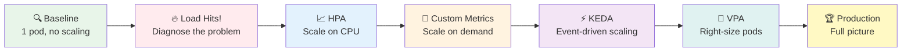
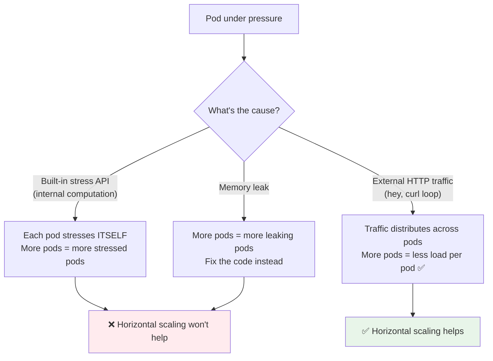
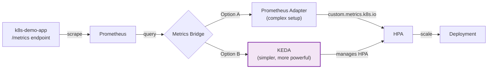
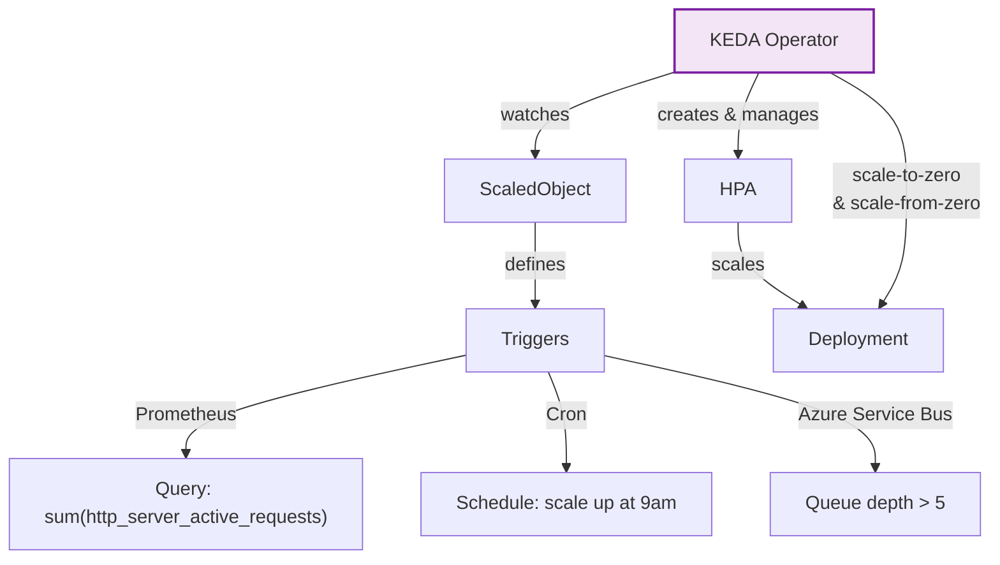
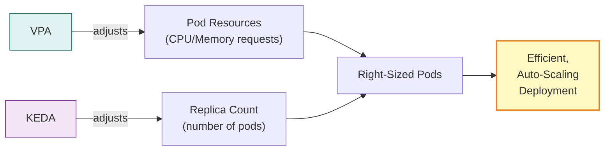
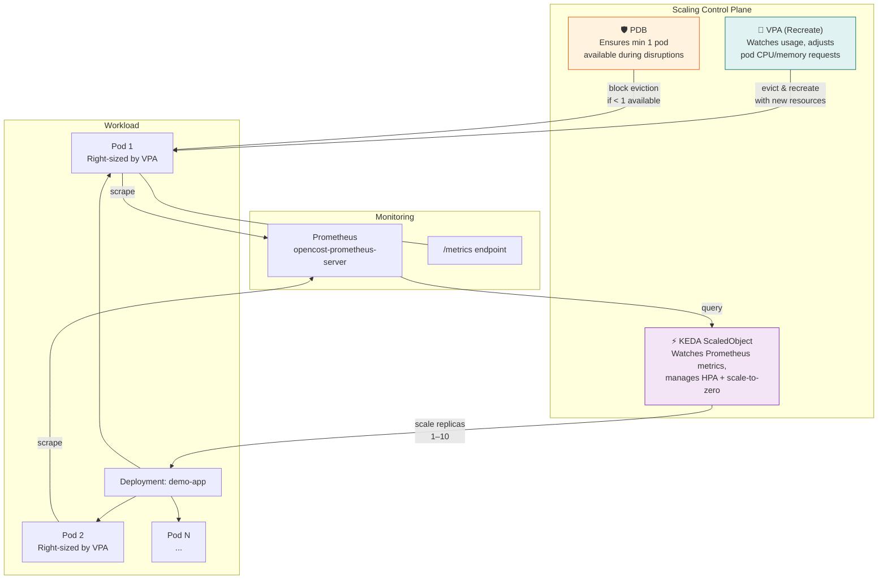
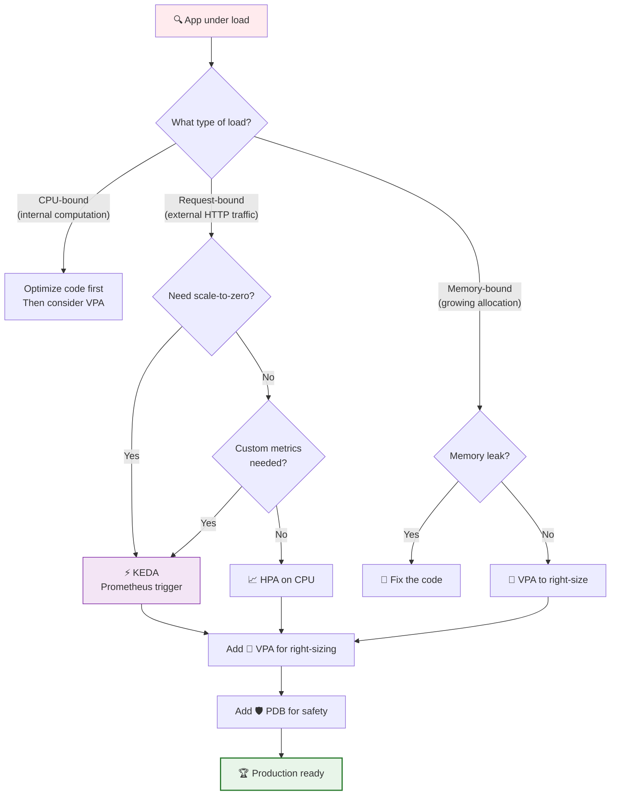

# The Scaling Journey: From Problem to Solution

## A hands-on tutorial about Kubernetes autoscaling — HPA, KEDA, and VPA

> **Time:** 2–3 hours (self-paced) or 90 minutes (instructor-led, skip deep-dives)
>
> **Level:** Intermediate — you should be comfortable with `kubectl`, Deployments, and Services

---

## Overview

Your app is deployed. One pod, happily serving traffic. Then the traffic doubles. Then it doubles again. Your single pod is drowning — response times spike, users complain, and you're staring at a dashboard wondering what to do.

**This tutorial takes you from that moment of crisis to a production-ready autoscaling setup.** Along the way, you'll learn to ask the right questions before reaching for the right tools.

Here's the journey:



**The key insight:** scaling isn't just about "add more pods." It's about understanding *why* your system is under pressure, *what* metric to scale on, *when* to scale, and *how big* each pod should be.

---

## Prerequisites

### Required

| Tool | Purpose | Install |
|------|---------|---------|
| `kubectl` | Cluster management | [kubernetes.io/docs/tasks/tools](https://kubernetes.io/docs/tasks/tools/) |
| Metrics Server | `kubectl top` support | Usually pre-installed on AKS/EKS/GKE |
| Helm 3 | Installing KEDA (Step 5) | `brew install helm` or [helm.sh](https://helm.sh/) |

### Already in Cluster

| Component | Location | Purpose |
|-----------|----------|---------|
| Prometheus | `opencost-prometheus-server.opencost.svc.cluster.local:80` | Metric storage for custom metric scaling |
| k8s-demo-app image | `k8sdemoanbo.azurecr.io/k8s-demo-app:latest` | Our demo application |

### Optional but Recommended

| Tool | Purpose | Install |
|------|---------|---------|
| `hey` | HTTP load generation | `brew install hey` or `go install github.com/rakyll/hey@latest` |
| `k9s` | Terminal cluster dashboard | `brew install k9s` |
| `watch` | Repeat commands | `brew install watch` (macOS) |

### Verify Your Environment

```bash
# All of these should succeed
kubectl cluster-info
kubectl top nodes
kubectl get --raw "/apis/metrics.k8s.io/v1beta1/nodes" | head -c 200
```

> 💡 **No metrics-server?** On AKS: `az aks enable-addons -a monitoring -n <cluster> -g <rg>`. On minikube: `minikube addons enable metrics-server`.

---

## The Journey

---

### 🔍 Step 1: The Baseline (15 min)

**Situation:** You've just deployed your app. Everything is calm. Before anything goes wrong, let's understand what "normal" looks like.

> 🎤 **Presenter note:** This step seems boring, but it's critical. You can't diagnose a problem if you don't know what healthy looks like. Spend time here — it pays off in every later step.

#### Deploy

```bash
kubectl apply -f k8s/scaling-journey/step-01-baseline.yaml
```

#### Verify

```bash
# Wait for the pod to be ready
kubectl wait --for=condition=Ready pod -l app=demo-app -n scaling-demo --timeout=120s

# Check the deployment
kubectl get all -n scaling-demo
```

**Expected output:**

```
NAME                            READY   STATUS    RESTARTS   AGE
pod/demo-app-xxxxxxxxxx-xxxxx   1/1     Running   0          30s

NAME               TYPE        CLUSTER-IP     EXTERNAL-IP   PORT(S)   AGE
service/demo-app   ClusterIP   10.0.xxx.xxx   <none>        80/TCP    30s

NAME                       READY   UP-TO-DATE   AVAILABLE   AGE
deployment.apps/demo-app   1/1     1            1           30s
```

#### Explore the Baseline

**Terminal 1 — Port forward:**

```bash
kubectl port-forward svc/demo-app 8080:80 -n scaling-demo
```

**Terminal 2 — Observe:**

```bash
# Check resource usage
kubectl top pod -n scaling-demo

# Check the app's own metrics
curl -s http://localhost:8080/metrics | grep -E "^(http_|process_|k8s_demo)"

# Check the dashboard
open http://localhost:8080
```

> 💡 **What to look for on the dashboard:**
> - QoS class should be **Burstable** (requests < limits)
> - CPU and memory usage should be low (idle baseline)
> - All three probes (startup, readiness, liveness) should show healthy
> - Stress indicators should be inactive

**Record your baseline:**

| Metric | Value (idle) |
|--------|-------------|
| CPU usage (`kubectl top`) | ~1–5m |
| Memory usage (`kubectl top`) | ~30–50Mi |
| `http_server_active_requests` | 0 |
| `http_requests_total` | Low (just health checks) |
| `process_cpu_seconds_total` | Slowly increasing |

🤔 **Ask yourself:** *"If traffic doubles right now, what happens to this single pod?"*

**Answer:** It handles it — until it doesn't. There's no autoscaling, no redundancy, and no safety net. The pod either copes or users start seeing errors. Let's find out what happens.

**Takeaway:** A baseline isn't just a number — it's your reference point for every scaling decision that follows. You now know what "idle" looks like for CPU, memory, and request count.

---

### 🔥 Step 2: Load Hits! (20 min)

**Situation:** *"Your app is getting traffic. Users are complaining about latency. Something needs to happen — but what?"*

Before you scale, you need to **diagnose**. The cause of the load determines the solution.

> 🎤 **Presenter note:** This is the most important step in the tutorial. Resist the urge to jump to HPA. Spend time understanding WHY the system is stressed. In real incidents, misdiagnosing the cause leads to scaling solutions that don't help.

#### Generate Load — Method 1: Built-in Stress API (CPU-bound)

The app has built-in stress endpoints. This simulates **internal** CPU load (like heavy computation):

```bash
# Generate CPU stress: 4 threads for 5 minutes
curl -X POST http://localhost:8080/api/stress/cpu \
  -H "Content-Type: application/json" \
  -d '{"minutes": 5, "threads": 4}'
```

**Response:**

```json
{
  "isActive": true,
  "type": "cpu",
  "startedAt": "2024-01-15T10:30:00Z",
  "duration": "00:05:00",
  "threads": 4,
  "currentCpuPercent": 0
}
```

#### Generate Load — Method 2: Gradual Ramp (CPU-bound)

Use the `rampSeconds` parameter for a gradual increase — great for watching scaling react in real time:

```bash
# Ramp up over 2 minutes, then sustain for 5 minutes total
curl -X POST http://localhost:8080/api/stress/cpu \
  -H "Content-Type: application/json" \
  -d '{"minutes": 5, "threads": 8, "rampSeconds": 120}'
```

> 💡 **Why ramp?** It mimics real-world traffic growth and lets you watch autoscalers react gradually instead of seeing a sudden spike.

#### Generate Load — Method 3: External HTTP Traffic with `hey`

This simulates **real user traffic** — external requests hitting your service:

```bash
# 10,000 requests, 50 concurrent connections
hey -n 10000 -c 50 http://localhost:8080/api/status
```

#### Generate Load — Method 4: Simple Sustained Load with `curl`

No extra tools needed:

```bash
# Sustained traffic (Ctrl+C to stop)
while true; do curl -s http://localhost:8080/api/status > /dev/null; done
```

#### Generate Load — Method 5: Memory Pressure

```bash
# Allocate 400MB for 3 minutes
curl -X POST http://localhost:8080/api/stress/memory \
  -H "Content-Type: application/json" \
  -d '{"minutes": 3, "targetMegabytes": 400}'
```

#### Load Generation Reference

| Method | Command | Simulates | Realistic Traffic? | Best For |
|--------|---------|-----------|-------------------|----------|
| Built-in CPU stress | `POST /api/stress/cpu` | Heavy computation | ❌ Internal only | CPU-based HPA demos |
| Built-in ramp | `POST /api/stress/cpu` + `rampSeconds` | Gradual CPU increase | ❌ Internal only | Watching autoscaler react |
| `hey` | `hey -n 10000 -c 50 URL` | HTTP traffic flood | ✅ Yes | Request-based scaling |
| `curl` loop | `while true; do curl …; done` | Sustained requests | 🟡 Somewhat | Quick tests, no install |
| Built-in memory | `POST /api/stress/memory` | Memory pressure | ❌ Internal only | VPA, OOM demos |
| `k6` | `k6 run script.js` | Complex patterns | ✅ Yes | Production load testing |

#### Diagnose: What Kind of Load Is This?

**While load is running, open a new terminal:**

```bash
# CPU usage — is it spiking?
kubectl top pod -n scaling-demo

# Detailed metrics from the app
curl -s http://localhost:8080/metrics | grep -E "process_cpu|active_requests|memory_bytes"
```

🤔 **Ask yourself:** *"Is this pod CPU-bound, memory-bound, or request-bound?"*

Here's how to tell:

| Symptom | Check | Diagnosis |
|---------|-------|-----------|
| CPU near limit (e.g., 950m/1000m) | `kubectl top pod` | **CPU-bound** |
| Memory climbing toward limit | `kubectl top pod` + `process_resident_memory_bytes` | **Memory-bound** |
| `http_server_active_requests` high | `curl /metrics` | **Request-bound** |
| `process_cpu_seconds_total` rising fast | `curl /metrics` twice, compare | **CPU-bound** (confirmed) |

🤔 **Now the critical question:** *"Will adding more pods actually help?"*



> 🎤 **Key talking point:** *"This is why you diagnose before you scale. If your pod is CPU-bound from internal computation, adding replicas just gives you MORE pods doing heavy computation. But if it's request-bound from external traffic, adding replicas distributes the load and actually helps."*

#### Stop the Stress

```bash
# Stop CPU stress
curl -X DELETE http://localhost:8080/api/stress/cpu

# Stop memory stress
curl -X DELETE http://localhost:8080/api/stress/memory
```

**Takeaway:** The *cause* of load determines the *solution*. CPU-bound internal work → optimize code or scale vertically. Request-bound external traffic → scale horizontally. Memory pressure → right-size with VPA or fix leaks. Always diagnose first.

---

### 📈 Step 3: Horizontal Scaling with HPA (20 min)

**Situation:** *"You've diagnosed the problem: external traffic is growing. More pods will help. Let's automate that with HPA."*

The Horizontal Pod Autoscaler watches a metric (usually CPU) and adjusts replica count automatically.

> 🎤 **Presenter note:** HPA on CPU is the "obvious first answer" everyone reaches for. It works — but it has sharp edges. Let the audience see it work, then show them why it's not enough.

#### Deploy HPA

```bash
kubectl apply -f k8s/scaling-journey/step-03-hpa-cpu.yaml
```

#### Verify

```bash
# Check HPA is configured
kubectl get hpa -n scaling-demo

# Watch HPA in real time (keep this running)
kubectl get hpa -n scaling-demo -w
```

**Expected output:**

```
NAME       REFERENCE             TARGETS   MINPODS   MAXPODS   REPLICAS   AGE
demo-app   Deployment/demo-app   3%/60%    1         6         1          10s
```

> 💡 **Reading HPA output:** `3%/60%` means current CPU is 3%, target is 60%. HPA will scale up when current exceeds target.

#### Generate Load and Watch Scaling

**Terminal 1 — Watch HPA:**

```bash
watch -n 2 'kubectl get hpa -n scaling-demo && echo "---" && kubectl get pods -n scaling-demo'
```

**Terminal 2 — Generate CPU load:**

```bash
# Use the ramp for a dramatic demo
curl -X POST http://localhost:8080/api/stress/cpu \
  -H "Content-Type: application/json" \
  -d '{"minutes": 5, "threads": 4, "rampSeconds": 60}'
```

**Terminal 3 — Watch resource usage:**

```bash
watch -n 5 kubectl top pod -n scaling-demo
```

#### What to Observe

| Time | What Happens | Why |
|------|-------------|-----|
| 0–30s | CPU rising, replicas = 1 | Load is ramping up |
| 30–60s | HPA shows CPU > 60% | Metrics server reports high usage |
| 60–90s | Replicas increase to 2–3 | HPA scales up (15s evaluation + 30s stabilization) |
| 90–180s | More replicas appear | HPA continues scaling toward target |
| After load stops | Replicas stay high for ~5 min | Default `scaleDown.stabilizationWindowSeconds` is 300s |
| ~5 min after load | Replicas scale back to 1 | Cooldown complete |

> ⚠️ **Important timing:** HPA evaluates every 15 seconds by default. It won't react instantly. The `stabilizationWindowSeconds` prevents flapping by keeping replicas high for 5 minutes after load drops.

#### Understanding the HPA Algorithm

```
desiredReplicas = ceil(currentReplicas × (currentMetric / targetMetric))
```

Example: 1 replica at 90% CPU, target 60%:

```
desiredReplicas = ceil(1 × (90 / 60)) = ceil(1.5) = 2
```

With 2 replicas at 80% CPU average:

```
desiredReplicas = ceil(2 × (80 / 60)) = ceil(2.67) = 3
```

#### Stop the Load

```bash
curl -X DELETE http://localhost:8080/api/stress/cpu
```

Watch the HPA. Replicas stay elevated for ~5 minutes, then scale back down.

🤔 **Ask yourself:** *"We scaled on CPU. But is CPU really the best metric for a web app?"*

Consider:
- CPU-based scaling is **reactive** — CPU must spike *before* scaling happens
- For web apps, **request count** is often better — you can scale *before* CPU saturates
- What if your app is I/O-bound? CPU stays low but requests queue up

**Takeaway:** HPA on CPU works, but it's a blunt instrument. CPU is a *symptom*, not a *cause*. For web apps, scaling on actual demand (request rate, queue depth) is smarter. That's what we'll do next.

---

### 🎯 Step 4: Smarter Scaling with Custom Metrics (25 min)

**Situation:** *"CPU-based scaling helped, but it's reactive. Your app exposes `http_server_active_requests` via `/metrics`. Can we scale on actual demand instead?"*

Our app already publishes Prometheus metrics. The challenge is getting Kubernetes to use them for scaling decisions.

> 🎤 **Presenter note:** This step bridges "basic HPA" to "KEDA." Show the complexity of the Prometheus Adapter approach, then reveal KEDA as the simpler alternative. The contrast makes KEDA's value obvious.

#### How Custom Metrics Work



#### Our App's Metrics

The k8s-demo-app exposes these metrics at `GET /metrics` in Prometheus text format:

```bash
curl -s http://localhost:8080/metrics
```

**Key metrics for scaling:**

```
# Active HTTP connections right now (gauge)
http_server_active_requests 3

# Total requests served (counter)
http_requests_total 14523

# CPU stress active (gauge: 0 or 1)
k8s_demo_stress_cpu_active 0

# Process CPU time (counter, seconds)
process_cpu_seconds_total 45.23
```

> 💡 **Why `http_server_active_requests`?** It's a *leading* indicator. When active requests climb, you need more pods — even if CPU hasn't spiked yet. CPU is a *lagging* indicator that only rises after requests queue up.

#### Ensure Prometheus Is Scraping Our App

For Prometheus to scrape our pods, we need either a `ServiceMonitor` or pod annotations. The step-04 manifest includes annotations:

```yaml
annotations:
  prometheus.io/scrape: "true"
  prometheus.io/port: "8080"
  prometheus.io/path: "/metrics"
```

#### Deploy Custom Metrics HPA

```bash
kubectl apply -f k8s/scaling-journey/step-04-hpa-custom-metrics.yaml
```

#### Verify Prometheus Is Scraping

```bash
# Port-forward to Prometheus
kubectl port-forward svc/opencost-prometheus-server 9090:80 -n opencost &

# Query our metric (give Prometheus a minute to scrape)
curl -s "http://localhost:9090/api/v1/query?query=http_server_active_requests" | python3 -m json.tool
```

**Expected:** You should see a result with the current value of `http_server_active_requests` from your pod(s).

> ⚠️ **If Prometheus returns empty results:** Verify the pod annotations are correct, check that the Prometheus `scrape_configs` include annotation-based discovery, and ensure the `/metrics` endpoint is reachable on port 8080.

#### Option A: Prometheus Adapter (Traditional Approach)

The Prometheus Adapter registers a custom metrics API that HPA can query. This is the traditional approach:

```bash
# Install Prometheus Adapter (for reference)
helm repo add prometheus-community https://prometheus-community.github.io/helm-charts
helm repo update
helm install prometheus-adapter prometheus-community/prometheus-adapter \
  --namespace monitoring --create-namespace \
  --set prometheus.url=http://opencost-prometheus-server.opencost.svc.cluster.local \
  --set prometheus.port=80
```

Configuration requires writing adapter rules to map Prometheus queries to Kubernetes custom metrics — this is where complexity lives. You need to define:
- Which metrics to expose
- How to associate them with Kubernetes objects
- How to aggregate across pods

**This is powerful but complex.** There's a better way.

#### Option B: KEDA (Modern Approach) — Preview

KEDA can query Prometheus directly and create an HPA for you — no adapter needed:

```yaml
# Preview of what Step 5 will look like
apiVersion: keda.sh/v1alpha1
kind: ScaledObject
metadata:
  name: demo-app-scaledobject
spec:
  scaleTargetRef:
    name: demo-app
  triggers:
    - type: prometheus
      metadata:
        serverAddress: http://opencost-prometheus-server.opencost.svc.cluster.local:80
        query: sum(http_server_active_requests)
        threshold: "10"
```

No adapter installation. No metric mapping rules. Just a Prometheus query and a threshold.

🤔 **Ask yourself:** *"What if my load comes from a message queue, not HTTP? What if I want scale-to-zero when there's no traffic at all?"*

- HPA can't scale to zero — `minReplicas` must be ≥ 1
- HPA needs a custom metrics adapter for non-CPU/memory metrics
- What about scaling on Azure Service Bus queue depth? Or cron schedules? Or external events?

**Takeaway:** Custom metrics are the right idea — scale on demand, not symptoms. But the traditional Prometheus Adapter setup is complex, and HPA has inherent limitations (no scale-to-zero, limited metric sources). KEDA solves both problems.

---

### ⚡ Step 5: Event-Driven Scaling with KEDA (30 min)

**Situation:** *"You want to scale on actual demand, support scale-to-zero, and not wrestle with Prometheus Adapter configuration. Enter KEDA."*

[KEDA](https://keda.sh/) (Kubernetes Event-Driven Autoscaling) is a lightweight component that extends Kubernetes with event-driven scaling. It supports 60+ scalers — Prometheus, Azure Service Bus, AWS SQS, Kafka, cron, and many more.

> 🎤 **Presenter note:** KEDA is the "aha!" moment of the tutorial. After the complexity of Step 4, KEDA feels like magic. Emphasize: KEDA doesn't replace HPA — it creates and manages HPAs for you, with superpowers (scale-to-zero, external metrics, multiple triggers).

#### Install KEDA

```bash
# Add the KEDA Helm repo
helm repo add kedacore https://kedacore.github.io/charts
helm repo update

# Install KEDA into its own namespace
helm install keda kedacore/keda \
  --namespace keda \
  --create-namespace \
  --wait
```

#### Verify KEDA Installation

```bash
# Check KEDA pods are running
kubectl get pods -n keda

# Check KEDA CRDs are installed
kubectl get crd | grep keda
```

**Expected output:**

```
NAME                                      READY   STATUS    AGE
keda-admission-webhooks-xxxxxxxxx-xxxxx   1/1     Running   30s
keda-operator-xxxxxxxxx-xxxxx             1/1     Running   30s
keda-operator-metrics-apiserver-xxx       1/1     Running   30s

scaledjobs.keda.sh                              2024-01-15T10:00:00Z
scaledobjects.keda.sh                           2024-01-15T10:00:00Z
triggerauthentications.keda.sh                  2024-01-15T10:00:00Z
clustertriggerauthentications.keda.sh           2024-01-15T10:00:00Z
```

#### Remove the Old HPA

KEDA manages its own HPA. Having two HPAs on the same deployment causes conflicts:

```bash
# Remove the manual HPA from Step 3/4
kubectl delete hpa demo-app -n scaling-demo --ignore-not-found
```

#### Deploy KEDA ScaledObject

```bash
kubectl apply -f k8s/scaling-journey/step-05-keda.yaml
```

#### Verify

```bash
# Check the ScaledObject
kubectl get scaledobject -n scaling-demo

# Check that KEDA created an HPA
kubectl get hpa -n scaling-demo

# Watch the ScaledObject status
kubectl describe scaledobject demo-app-scaledobject -n scaling-demo
```

**Expected output:**

```
NAME                      SCALETARGETKIND      SCALETARGETNAME   MIN   MAX   TRIGGERS     ...   READY   ACTIVE   AGE
demo-app-scaledobject     apps/v1.Deployment   demo-app          0     10    prometheus         True    False    30s
```

> 💡 **Notice `MIN: 0`!** This is something HPA alone can't do. When there's no traffic, KEDA scales the deployment to zero replicas. When a request arrives (or the Prometheus metric rises), KEDA scales back up.

#### Demonstrate: Scale to Zero

```bash
# Make sure no stress is running
curl -X DELETE http://localhost:8080/api/stress/cpu 2>/dev/null
curl -X DELETE http://localhost:8080/api/stress/memory 2>/dev/null
```

Wait 5 minutes (the `cooldownPeriod`). Watch the pod count:

```bash
watch -n 5 kubectl get pods -n scaling-demo
```

**Expected:** After the cooldown, KEDA scales to 0 replicas. No pods running. Zero cost.

```
No resources found in scaling-demo namespace.
```

> 🎤 **Talking point:** *"Zero pods. Zero compute cost. The moment traffic arrives, KEDA spins up a pod. This is perfect for dev/staging environments, batch processing, or low-traffic services."*

#### Demonstrate: Rapid Scale-Up from Zero

```bash
# Generate external traffic — KEDA will detect it via Prometheus
hey -n 5000 -c 30 http://localhost:8080/api/status
```

> ⚠️ **Note:** When scaled to zero, the first requests will fail (no pods to serve them). In production, use `minReplicaCount: 1` for user-facing services, and reserve scale-to-zero for async workers and batch jobs.

Watch KEDA react:

```bash
# Terminal 1: Watch pods appear
watch -n 2 kubectl get pods -n scaling-demo

# Terminal 2: Watch HPA
watch -n 2 kubectl get hpa -n scaling-demo
```

#### KEDA vs HPA: Side by Side

| Feature | HPA (alone) | KEDA |
|---------|-------------|------|
| Scale on CPU/Memory | ✅ Built-in | ✅ Via triggers |
| Scale on custom metrics | ⚠️ Needs Prometheus Adapter | ✅ Native Prometheus trigger |
| Scale to zero | ❌ Minimum 1 replica | ✅ `minReplicaCount: 0` |
| Scale on queue depth | ❌ Not possible | ✅ Azure Service Bus, SQS, Kafka, etc. |
| Scale on cron schedule | ❌ Not possible | ✅ Cron trigger |
| Multiple triggers | ❌ Single metric type | ✅ Combine multiple triggers |
| Setup complexity | 🟢 Simple for CPU | 🟢 Simple for everything |
| External event sources | ❌ Kubernetes metrics only | ✅ 60+ scalers |

#### KEDA Architecture



🤔 **Ask yourself:** *"My pods scale horizontally now — the right NUMBER of pods at the right TIME. But are they the right SIZE?"*

Think about it: you requested 100m CPU and 128Mi memory in Step 1. What if each pod actually needs 400m CPU and 256Mi? You're either:
- **Under-requesting:** Pods get throttled or OOMKilled
- **Over-requesting:** Wasting cluster resources (and money)

**Takeaway:** KEDA solves *when* and *how many* pods. But not *how big* each pod should be. That's VPA's job.

---

### 📏 Step 6: Right-Sizing with VPA (25 min)

**Situation:** *"Your pods scale beautifully. But you requested 100m CPU and they consistently use 400m. You're flying blind on resource sizing."*

The Vertical Pod Autoscaler (VPA) watches actual resource usage over time and recommends — or automatically sets — the right `requests` and `limits` for your pods.

> 🎤 **Presenter note:** VPA is the unsung hero of Kubernetes cost optimization. Most teams guess at resource requests. VPA replaces guessing with data. Start with "Off" mode (recommendation only) — it's zero-risk and immediately valuable.

#### VPA Modes

| Mode | What It Does | Risk Level | Use Case |
|------|-------------|------------|----------|
| **Off** | Recommendations only, no changes | 🟢 Zero risk | First step: understand your workloads |
| **Initial** | Sets resources on new pods only | 🟢 Low risk | New deployments |
| **Recreate** | Restarts pods to apply new resources | 🟡 Medium risk | Stateless workloads |
| **Auto** | Same as Recreate (in-place coming soon) | 🟡 Medium risk | Production with PDBs |

#### Deploy VPA in Off Mode (Observe First)

```bash
kubectl apply -f k8s/scaling-journey/step-06-vpa.yaml
```

#### Verify

```bash
kubectl get vpa -n scaling-demo
```

**Expected output:**

```
NAME           MODE   CPU    MEM       PROVIDED   AGE
demo-app-vpa   Off    100m   128Mi     True       30s
```

#### Generate Realistic Load for VPA

VPA needs usage data to make recommendations. Run a sustained workload:

```bash
# CPU stress to establish usage patterns
curl -X POST http://localhost:8080/api/stress/cpu \
  -H "Content-Type: application/json" \
  -d '{"minutes": 5, "threads": 2}'

# In parallel, generate HTTP traffic
hey -n 20000 -c 20 -q 50 http://localhost:8080/api/status
```

#### Check VPA Recommendations

After a few minutes of load data:

```bash
kubectl describe vpa demo-app-vpa -n scaling-demo
```

**Expected output (recommendation section):**

```
Recommendation:
  Container Recommendations:
    Container Name:  demo-app
    Lower Bound:
      Cpu:     100m
      Memory:  128Mi
    Target:
      Cpu:     350m
      Memory:  200Mi
    Uncapped Target:
      Cpu:     350m
      Memory:  200Mi
    Upper Bound:
      Cpu:     1
      Memory:  512Mi
```

> 💡 **Reading VPA recommendations:**
> - **Target:** What VPA recommends (use this for requests)
> - **Lower Bound:** Minimum safe value
> - **Upper Bound:** Maximum observed need
> - **Uncapped Target:** What VPA would recommend without min/max constraints

#### See the Gap

Compare what you requested vs what VPA recommends:

| Resource | Requested (Step 1) | VPA Target | Gap |
|----------|-------------------|------------|-----|
| CPU | 100m | ~350m | **3.5× under-provisioned** |
| Memory | 128Mi | ~200Mi | **1.6× under-provisioned** |

> 🎤 **Talking point:** *"You requested 100m CPU but actually need 350m. In a cluster with 100 pods, that's the difference between needing 10 CPUs vs 35 CPUs. VPA turns guessing into science."*

#### Switch to Recreate Mode

Now let VPA actually right-size the pods. Update the VPA mode:

```bash
# The step-06 manifest includes a Recreate mode variant.
# Apply it by patching:
kubectl patch vpa demo-app-vpa -n scaling-demo \
  --type='json' \
  -p='[{"op": "replace", "path": "/spec/updatePolicy/updateMode", "value": "Recreate"}]'
```

Watch what happens:

```bash
# Watch pods — VPA will evict and recreate them with new resources
watch -n 2 kubectl get pods -n scaling-demo -o wide
```

**Expected:** VPA evicts the existing pod and creates a new one with updated resource requests matching the recommendation.

Verify the new resources:

```bash
kubectl get pod -n scaling-demo -o jsonpath='{range .items[*]}{.metadata.name}{"\t"}{.spec.containers[0].resources}{"\n"}{end}'
```

🤔 **Ask yourself:** *"Can you use VPA and KEDA together?"*

**YES!** They're complementary:



| Component | Controls | Metric |
|-----------|----------|--------|
| VPA | Size of each pod (vertical) | Historical usage |
| KEDA | Number of pods (horizontal) | Current demand |

> ⚠️ **Warning:** Don't use VPA and a CPU/memory-based HPA on the same deployment. VPA changes the requests, which changes the percentage utilization, which confuses HPA. KEDA with a Prometheus trigger (non-CPU metric) avoids this conflict entirely.

#### Stop the Load

```bash
curl -X DELETE http://localhost:8080/api/stress/cpu
```

**Takeaway:** VPA ensures each pod is the *right size*. KEDA ensures the *right number* of pods. Together, they're a complete autoscaling solution — you're scaling in two dimensions.

---

### 🏆 Step 7: The Full Picture (20 min)

**Situation:** *"You've learned each tool. Now let's put them together into a production-ready autoscaling setup."*

This step deploys everything at once: VPA for right-sizing, KEDA for horizontal scaling, and a PodDisruptionBudget for safe operations.

> 🎤 **Presenter note:** This is the capstone. Walk through the YAML together, explaining each component and how they interact. The audience should understand WHY each piece exists, not just WHAT it does.

#### Deploy the Full Stack

```bash
# Clean up previous steps
kubectl delete scaledobject demo-app-scaledobject -n scaling-demo --ignore-not-found
kubectl delete vpa demo-app-vpa -n scaling-demo --ignore-not-found
kubectl delete hpa demo-app -n scaling-demo --ignore-not-found

# Deploy the production setup
kubectl apply -f k8s/scaling-journey/step-07-production.yaml
```

#### Verify All Components

```bash
# Everything should be present
echo "=== Deployment ==="
kubectl get deployment demo-app -n scaling-demo

echo -e "\n=== KEDA ScaledObject ==="
kubectl get scaledobject -n scaling-demo

echo -e "\n=== VPA ==="
kubectl get vpa -n scaling-demo

echo -e "\n=== PDB ==="
kubectl get pdb -n scaling-demo

echo -e "\n=== HPA (created by KEDA) ==="
kubectl get hpa -n scaling-demo
```

**Expected output:**

```
=== Deployment ===
NAME       READY   UP-TO-DATE   AVAILABLE   AGE
demo-app   1/1     1            1           10s

=== KEDA ScaledObject ===
NAME                      SCALETARGETKIND      SCALETARGETNAME   MIN   MAX   TRIGGERS     READY   ACTIVE
demo-app-scaledobject     apps/v1.Deployment   demo-app          1     10    prometheus   True    False

=== VPA ===
NAME           MODE        CPU    MEM       PROVIDED   AGE
demo-app-vpa   Recreate    100m   128Mi     True       10s

=== PDB ===
NAME       MIN AVAILABLE   MAX UNAVAILABLE   ALLOWED DISRUPTIONS   AGE
demo-app   1              N/A               0                     10s

=== HPA (created by KEDA) ===
NAME                              REFERENCE             TARGETS     MINPODS   MAXPODS   REPLICAS
keda-hpa-demo-app-scaledobject    Deployment/demo-app   0/10 (avg)  1         10        1
```

#### How the Components Interact



#### The Full Flow in Action

**Demonstrate the complete cycle:**

**Terminal 1 — Watch everything:**

```bash
watch -n 3 'echo "=== Pods ===" && kubectl get pods -n scaling-demo -o wide && echo -e "\n=== HPA ===" && kubectl get hpa -n scaling-demo && echo -e "\n=== VPA ===" && kubectl describe vpa demo-app-vpa -n scaling-demo | grep -A 10 "Container Recommendations"'
```

**Terminal 2 — Port forward:**

```bash
kubectl port-forward svc/demo-app 8080:80 -n scaling-demo
```

**Terminal 3 — Generate sustained load:**

```bash
# Ramp up CPU stress
curl -X POST http://localhost:8080/api/stress/cpu \
  -H "Content-Type: application/json" \
  -d '{"minutes": 10, "threads": 4, "rampSeconds": 120}'

# Also generate HTTP traffic in parallel
hey -n 50000 -c 30 -q 100 http://localhost:8080/api/status
```

#### What to Observe

1. **KEDA detects rising `http_server_active_requests`** → scales up replicas
2. **VPA observes actual CPU/memory usage** → updates recommendations
3. **VPA evicts a pod to right-size it** → PDB ensures at least 1 pod stays running
4. **New pods start with VPA-recommended resources** → better resource efficiency
5. **KEDA scales down when load drops** → cost savings

> 🎤 **Talking point:** *"Notice how each component does one thing well. KEDA doesn't care about pod size. VPA doesn't care about pod count. The PDB doesn't care about metrics. But together, they give you a robust, self-tuning system."*

#### Production Best Practices

| Practice | Why | Implementation |
|----------|-----|----------------|
| Set `minReplicaCount: 1` for user-facing services | Avoid cold-start latency | KEDA ScaledObject config |
| Use `minReplicaCount: 0` for async workers | Save cost when idle | KEDA ScaledObject config |
| VPA in `Off` mode first | Understand before acting | Deploy VPA, wait, read recommendations |
| Set VPA `minAllowed` / `maxAllowed` | Prevent extreme recommendations | VPA resource policy |
| Always use PDBs with VPA Recreate mode | Prevent downtime during pod eviction | `minAvailable: 1` |
| Don't use VPA + CPU-based HPA together | They conflict on CPU metric | Use KEDA with Prometheus trigger instead |
| Set `stabilizationWindowSeconds` | Prevent scaling flapping | HPA behavior config (KEDA `advanced`) |
| Use Prometheus alerts alongside scaling | Know when scaling can't keep up | Alertmanager rules |

#### Stop the Load

```bash
curl -X DELETE http://localhost:8080/api/stress/cpu
```

**Takeaway:** Production autoscaling isn't one tool — it's an orchestra. VPA right-sizes pods. KEDA scales the fleet. PDBs protect availability. Together, they give you a system that adapts to demand automatically and efficiently.

---

### 🧹 Step 8: Cleanup (5 min)

#### Remove Tutorial Resources

```bash
# Delete the scaling-demo namespace (removes all resources in it)
kubectl delete namespace scaling-demo
```

#### Optionally Remove KEDA

If you installed KEDA just for this tutorial:

```bash
helm uninstall keda -n keda
kubectl delete namespace keda
kubectl delete crd scaledjobs.keda.sh scaledobjects.keda.sh \
  triggerauthentications.keda.sh clustertriggerauthentications.keda.sh \
  --ignore-not-found
```

#### Verify Cleanup

```bash
kubectl get namespace scaling-demo 2>&1 | grep -q "not found" && echo "✅ scaling-demo removed" || echo "❌ still exists"
kubectl get pods -n keda 2>&1 | grep -q "not found" && echo "✅ KEDA removed" || echo "ℹ️  KEDA still installed"
```

---

## Key Decisions Flowchart

When you encounter a scaling problem, use this decision tree:



---

## Comparing HPA vs KEDA vs VPA

| | HPA | KEDA | VPA |
|---|---|---|---|
| **What it scales** | Replica count (horizontal) | Replica count (horizontal) | Pod resources (vertical) |
| **Metrics source** | Metrics Server, custom metrics API | 60+ scalers (Prometheus, queues, cron, etc.) | Historical pod usage |
| **Scale-to-zero** | ❌ No (min 1) | ✅ Yes | N/A |
| **Setup complexity** | 🟢 Simple for CPU/memory | 🟢 Simple with Helm | 🟢 Simple |
| **Custom metrics** | ⚠️ Needs adapter | ✅ Native support | N/A |
| **Response speed** | 15s evaluation interval | Configurable (default 30s) | Minutes to hours |
| **Pod disruption** | None (adds/removes pods) | None (adds/removes pods) | Yes (evicts pods in Recreate mode) |
| **Best for** | Simple CPU/memory scaling | Event-driven, complex scaling | Resource optimization |
| **Conflicts with** | VPA on same metric | Nothing (manages HPA) | HPA on CPU/memory |
| **Production-ready** | ✅ Built-in | ✅ CNCF project | ✅ Widely used |

### When to Use What

| Scenario | Recommendation |
|----------|---------------|
| Simple web app, CPU-driven load | HPA on CPU (start here) |
| Web app with Prometheus metrics | KEDA with Prometheus trigger |
| Background workers / queue consumers | KEDA with queue trigger |
| Dev/staging environments (cost saving) | KEDA with scale-to-zero |
| Unknown resource requirements | VPA in Off mode first |
| Any production workload | VPA + KEDA + PDB |

---

## Troubleshooting

### HPA Issues

| Problem | Diagnosis | Solution |
|---------|-----------|----------|
| HPA shows `<unknown>/60%` | Metrics Server not reporting | Check `kubectl top pod` works; install metrics-server |
| HPA not scaling up | CPU below target | Verify target %; generate more load |
| HPA slow to scale down | Stabilization window | Default is 300s; adjust `behavior.scaleDown.stabilizationWindowSeconds` |
| HPA scaling too aggressively | No stabilization | Add `behavior.scaleUp.stabilizationWindowSeconds` |

### KEDA Issues

| Problem | Diagnosis | Solution |
|---------|-----------|----------|
| ScaledObject not ready | KEDA can't reach trigger source | Check `kubectl describe scaledobject`; verify Prometheus URL |
| Not scaling to zero | `minReplicaCount` > 0 or active triggers | Check ScaledObject config; verify metric is actually 0 |
| Slow scale-up from zero | Cold start + polling interval | Reduce `pollingInterval`; consider `minReplicaCount: 1` |
| KEDA and existing HPA conflict | Two HPAs on same deployment | Delete manual HPA before creating ScaledObject |

### VPA Issues

| Problem | Diagnosis | Solution |
|---------|-----------|----------|
| No recommendations | Not enough usage data | Generate load; wait 5+ minutes |
| Recommendations too high | Upper bound unconstrained | Set `maxAllowed` in VPA resource policy |
| Pods constantly restarting | VPA in Recreate mode, aggressive updates | Set `minChange` or use `Off` mode, add PDB |
| VPA + HPA conflict | Both adjusting CPU | Use KEDA (Prometheus trigger) instead of CPU-based HPA |

### Prometheus Issues

| Problem | Diagnosis | Solution |
|---------|-----------|----------|
| No metrics from app | Prometheus not scraping | Check pod annotations; verify Prometheus `scrape_configs` |
| Metric not found in Prometheus | Wrong metric name or not exposed | `curl /metrics` to verify; check metric name exactly |
| Stale metrics | Long scrape interval | Check Prometheus scrape interval (default 30s–60s) |

---

## 🎤 Presenter Quick Reference

### Recommended Demo Flow (90 min)

| Step | Time | Key Point |
|------|------|-----------|
| 1. Baseline | 10 min | Establish what "normal" looks like |
| 2. Load Hits | 15 min | Diagnose before you scale (use `hey` for external traffic) |
| 3. HPA | 15 min | CPU scaling works but is reactive |
| 4. Custom Metrics | 10 min | Show the idea, skip Prometheus Adapter details |
| 5. KEDA | 20 min | The main event — scale-to-zero + Prometheus trigger |
| 6. VPA | 10 min | Show Off mode recommendations, skip Recreate demo |
| 7. Production | 10 min | Walk through the YAML, show all components |

### Terminal Setup

| Terminal | Purpose | Command |
|----------|---------|---------|
| 1 | Port forward | `kubectl port-forward svc/demo-app 8080:80 -n scaling-demo` |
| 2 | Watch pods + HPA | `watch -n 3 'kubectl get pods,hpa -n scaling-demo'` |
| 3 | Generate load | `hey` / `curl` commands |
| 4 | k9s (optional) | `k9s -n scaling-demo` |

### Key Talking Points

1. **"Diagnose before you scale"** — The cause determines the solution
2. **"CPU is a symptom, not a cause"** — Scale on demand, not symptoms
3. **"KEDA doesn't replace HPA, it manages it"** — KEDA creates HPAs for you
4. **"VPA and KEDA are complementary"** — Vertical size + horizontal count
5. **"Start with VPA Off mode"** — Zero-risk way to understand your workloads

---

## Related Tutorials

| Tutorial | Path | What You'll Learn |
|----------|------|-------------------|
| **QoS Classes** | `k8s/qos/` | How Kubernetes prioritizes pods during resource pressure — understand eviction before you scale |
| **Bin Packing** | `k8s/bin-packing/` | Cost optimization through efficient node utilization — the "other side" of scaling |
| **VPA Deep Dive** | `k8s/vpa/` | All VPA modes in detail — Off, Initial, Auto, Recreate, and bounded policies |
| **HPA Tutorial** | `k8s/hpa/` | HPA fundamentals and advanced behavior configuration |

---

## Additional Resources

- [Kubernetes HPA Documentation](https://kubernetes.io/docs/tasks/run-application/horizontal-pod-autoscale/)
- [KEDA Official Documentation](https://keda.sh/docs/)
- [VPA GitHub Repository](https://github.com/kubernetes/autoscaler/tree/master/vertical-pod-autoscaler)
- [Prometheus Operator / ServiceMonitor](https://prometheus-operator.dev/)
- [KEDA Scalers Catalog](https://keda.sh/docs/scalers/) — all 60+ supported event sources
