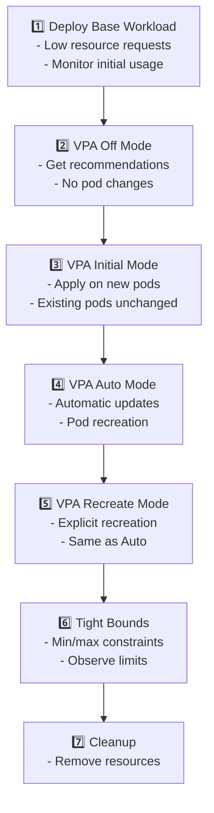

# Vertical Pod Autoscaler (VPA) Interactive Tutorial

## Overview

This tutorial demonstrates how Vertical Pod Autoscaler (VPA) automatically adjusts CPU and memory resource requests for pods based on actual usage patterns. VPA helps optimize resource utilization and ensures pods have the resources they need.

## Prerequisites

- Kubernetes cluster with VPA installed
- `kubectl` access to the cluster
- Metrics server running in the cluster
- The k8s-demo-app image available in your registry

## VPA Modes

VPA supports different update modes that control how recommendations are applied:

1. **Off** - Only provides recommendations without making changes
2. **Initial** - Sets resources at pod creation time only
3. **Auto/Recreate** - Automatically updates resources by recreating pods

## Lab Flow



## Step-by-Step Guide

### 1. Deploy Base Workload (10 min)

Deploy the demo app with intentionally low resource requests to see VPA recommendations:

```bash
kubectl apply -f k8s/vpa/step-01-base-workload.yaml
kubectl get pods -n vpa-demo -l app=k8s-demo-app-vpa -w
```

**Expected State:**
- 2 replicas running
- CPU request: 100m
- Memory request: 128Mi

### 2. VPA in "Off" Mode (15 min)

Apply VPA in "Off" mode to get recommendations without modifying pods:

```bash
kubectl apply -f k8s/vpa/step-02-vpa-off-mode.yaml
```

Wait a few minutes for VPA to collect metrics, then check recommendations:

```bash
kubectl describe vpa k8s-demo-app-vpa -n vpa-demo
```

**Key Observations:**
- VPA provides recommendations in the status section
- No pods are modified or restarted
- Recommendations update as usage patterns change

Generate some load to see updated recommendations:

```bash
# Port-forward to the service
kubectl port-forward svc/k8s-demo-app-vpa 8080:80 -n vpa-demo

# In another terminal, trigger CPU load
curl -X POST http://localhost:8080/api/stress/cpu -H "Content-Type: application/json" -d '{"minutes": 5, "threads": 4}'
```

### 3. VPA in "Initial" Mode (15 min)

Switch to "Initial" mode which applies recommendations only to new pods:

```bash
kubectl apply -f k8s/vpa/step-03-vpa-initial-mode.yaml
```

**Testing:**
- Existing pods keep their original resource requests
- Delete a pod to see VPA set resources on the new replica:

```bash
kubectl get pods -n vpa-demo -l app=k8s-demo-app-vpa
kubectl delete pod <pod-name> -n vpa-demo
kubectl describe pod <new-pod-name> -n vpa-demo | grep -A 5 "Requests:"
```

### 4. VPA in "Auto" Mode (20 min)

Enable automatic updates with "Auto" mode:

```bash
kubectl apply -f k8s/vpa/step-04-vpa-auto-mode.yaml
```

**Key Observations:**
- VPA monitors resource usage continuously
- When recommendations differ significantly from current requests, VPA evicts and recreates pods
- Check events to see VPA actions:

```bash
kubectl get events -n vpa-demo --sort-by='.lastTimestamp' | grep -i vpa
kubectl describe vpa k8s-demo-app-vpa -n vpa-demo
```

Monitor pod restarts:

```bash
kubectl get pods -n vpa-demo -l app=k8s-demo-app-vpa -w
```

### 5. VPA in "Recreate" Mode (10 min)

"Recreate" mode is functionally identical to "Auto":

```bash
kubectl apply -f k8s/vpa/step-05-vpa-recreate-mode.yaml
kubectl describe vpa k8s-demo-app-vpa -n vpa-demo
```

### 6. VPA with Tight Bounds (20 min)

Deploy VPA with strict min/max resource constraints:

```bash
kubectl apply -f k8s/vpa/step-06-vpa-tight-bounds.yaml
```

**Expected Behavior:**
- VPA recommendations are capped by minAllowed and maxAllowed
- Resources won't go below 200m CPU / 256Mi memory
- Resources won't exceed 500m CPU / 512Mi memory

Check that bounds are enforced:

```bash
kubectl describe vpa k8s-demo-app-vpa -n vpa-demo | grep -A 10 "Resource Policy"
kubectl describe pod -n vpa-demo | grep -A 5 "Requests:"
```

### 7. Cleanup (5 min)

Remove all VPA demo resources:

```bash
kubectl delete -f k8s/vpa/step-07-cleanup.yaml
```

## Key Concepts

### Resource Recommendations

VPA provides three types of recommendations:

- **Target** - The recommended resource value
- **Lower Bound** - Minimum recommended value
- **Upper Bound** - Maximum recommended value
- **Uncapped Target** - Recommendation without considering bounds

### When VPA Recreates Pods

VPA recreates pods when:
- Current requests are significantly different from recommendations
- The pod has been running long enough to establish a usage pattern
- UpdateMode is "Auto" or "Recreate"

### VPA vs HPA

**Important:** VPA and HPA should not both target CPU/memory on the same deployment, as they can conflict:
- VPA adjusts resource requests (vertical scaling)
- HPA adjusts replica count (horizontal scaling)

**Best Practice:** Use HPA for CPU, VPA for memory, or separate them to different workloads.

## Common Use Cases

1. **Initial Right-Sizing** - Use "Off" mode to get recommendations before setting production values
2. **New Workloads** - Use "Initial" mode for new deployments where usage patterns are unknown
3. **Established Workloads** - Use "Auto" mode for continuous optimization of stable services
4. **Constrained Resources** - Use tight bounds to prevent runaway resource consumption

## Troubleshooting

### VPA Not Providing Recommendations

```bash
# Check VPA status
kubectl get vpa -n vpa-demo
kubectl describe vpa k8s-demo-app-vpa -n vpa-demo

# Check metrics server
kubectl get pods -n kube-system -l k8s-app=metrics-server

# Verify pod has been running long enough (typically 24h for accurate recommendations)
kubectl get pods -o wide
```

### Pods Not Being Updated

- Ensure UpdateMode is "Auto" or "Recreate"
- Check that resource changes are significant enough (VPA has thresholds)
- Review VPA events: `kubectl get events | grep -i vpa`

## Additional Resources

- [Kubernetes VPA Documentation](https://github.com/kubernetes/autoscaler/tree/master/vertical-pod-autoscaler)
- [VPA Recommendation Algorithm](https://github.com/kubernetes/design-proposals-archive/blob/main/autoscaling/vertical-pod-autoscaler.md)
- [Best Practices for VPA](https://cloud.google.com/kubernetes-engine/docs/concepts/verticalpodautoscaler)
